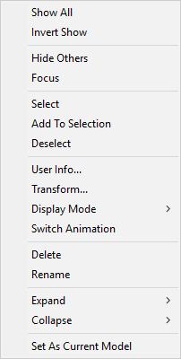
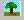
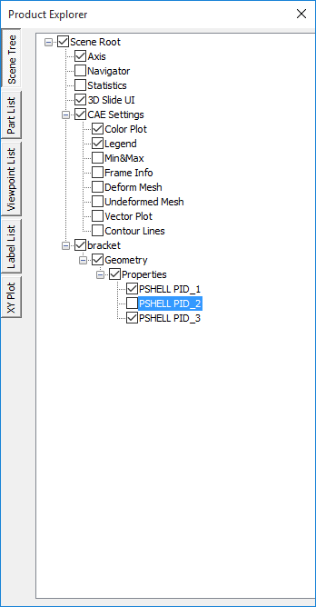
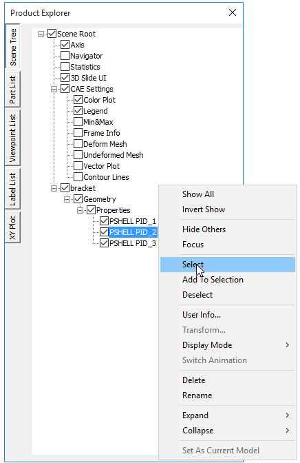
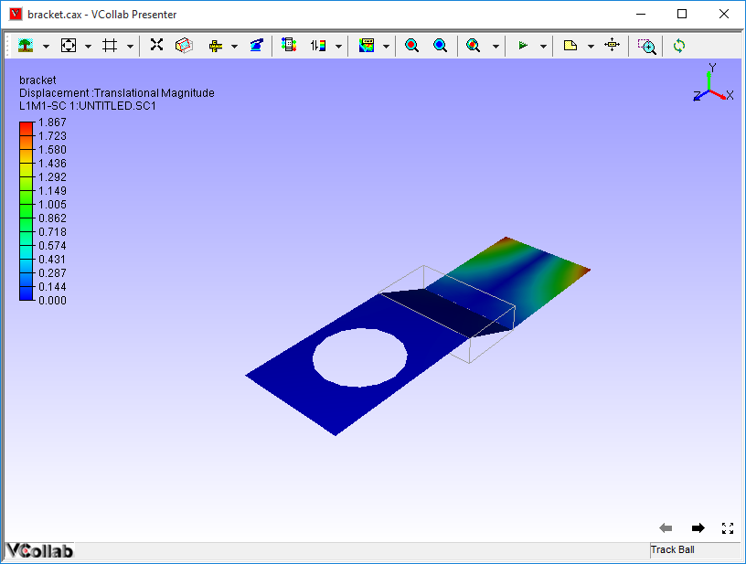
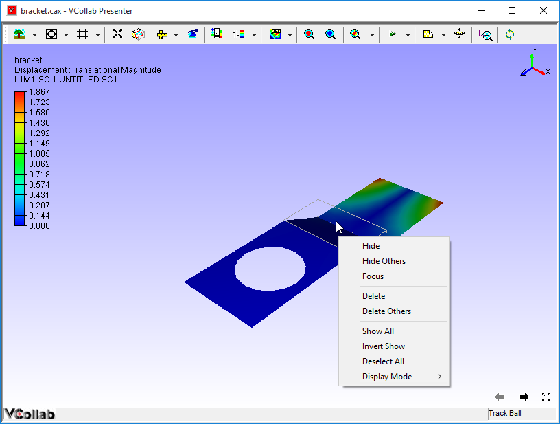
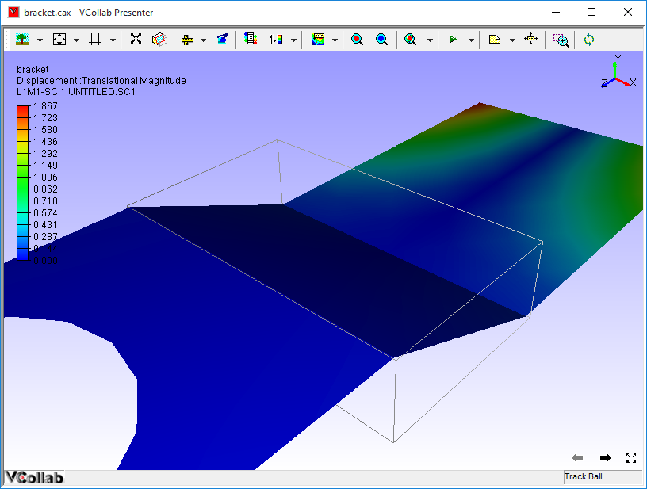

Scene Tree
==========

**Scene Tree** found under Product explorer helps users to

-  Know the product tree.

-  Show/hide a part or group of parts.

-  Highlight a part or group of parts.

-  Collapse and expand the Product tree visibility.

**Context menu for Scene Tree**

|image0|

 +--------------------------+----------------------------------------------------------------------------------+
 | **Show All**             |     Shows all parts independent of selection                                     |
 +--------------------------+----------------------------------------------------------------------------------+
 | **Invert Show**          |    Hides visible parts and Shows invisible parts                                 |
 +--------------------------+----------------------------------------------------------------------------------+
 | **Hide others**          |      Hides all parts except current selection                                    |
 +--------------------------+----------------------------------------------------------------------------------+
 | **Focus**                |      Sets focus on the selected part or group                                    |
 +--------------------------+----------------------------------------------------------------------------------+
 | **Select**               |      Selects the part by highlighting its bounding box                           |
 +--------------------------+----------------------------------------------------------------------------------+
 | **AddtoSelection**       |      Adds to the selection list by highlighting parts bounding box               |
 +--------------------------+----------------------------------------------------------------------------------+
 | **Deselect**             |     Deselects current selection                                                  |
 +--------------------------+----------------------------------------------------------------------------------+
 | **User Info**            |     Lets users add information to the part selected.                             |
 +--------------------------+----------------------------------------------------------------------------------+
 | **Transform**            |     Allows users to apply any transformation to the group node. Not applicable   |
 |                          |     for leaf node or individual part.                                            |
 +--------------------------+----------------------------------------------------------------------------------+
 | **Display Mode**         |    Applies one of the following display modes to the current selection.          |
 |                          |                                                                                  |
 |                          |    +-----------------+---------------------------------------------------------+ |
 |                          |    | Shaded          |  Smooth shade                                           | |
 |                          |    +-----------------+---------------------------------------------------------+ |
 |                          |    | Shaded Mesh     |  Smooth shade with mesh                                 | |
 |                          |    +-----------------+---------------------------------------------------------+ |
 |                          |    | Wireframe       |  Model as edges                                         | |
 |                          |    +-----------------+---------------------------------------------------------+ |                
 |                          |    | HiddenLine      |  Wireframe in which, hidden lines removed               | |   
 |                          |    +-----------------+---------------------------------------------------------+ |
 |                          |    | Point           |  Model as points                                        | |
 |                          |    +-----------------+---------------------------------------------------------+ |
 |                          |    | Transparent     |  Semi-transparent Model                                 | |
 |                          |    +-----------------+---------------------------------------------------------+ |
 |                          |    | Set Random Color| Model parts with random colors                          | |
 |                          |    +-----------------+---------------------------------------------------------+ |
 |                          |    | Set Color       | Allows user to define a color to the part selected      | |               
 |                          |    +-----------------+---------------------------------------------------------+ |
 |                          |                                                                                  |
 +--------------------------+----------------------------------------------------------------------------------+
 | **Switch Animation**     |    Switch into animation mode. Shows a part per frame as in the product tree.    |
 |                          |    Click the option again to stop the animation.                                 |
 +--------------------------+----------------------------------------------------------------------------------+
 | **Rename**               |     Rename the group or part name.                                               |
 +--------------------------+----------------------------------------------------------------------------------+
 | **Delete**               |     Deletes selected part or group of parts from the scene and product tree      |
 +--------------------------+----------------------------------------------------------------------------------+
 | **Expand**               |     Allows user to expand the group to levels, All, Level 1, Level 2 and Level 3.|
 +--------------------------+----------------------------------------------------------------------------------+
 | **Collapse**             |     Allows user to collapse the group to level, All /Level 1/ Level 2/ Level 3.  |
 +--------------------------+----------------------------------------------------------------------------------+              
 | **Set As Current Model** |    Allows user to set this model as Current CAE Model.                           |
 +--------------------------+----------------------------------------------------------------------------------+          
 | **Exclude Section**      |    Allows user to exclude the selected parts from cut-section.                   |
 +--------------------------+----------------------------------------------------------------------------------+

**Steps to view Product Tree**

-  Right click in the Viewer Window, to open the Viewer Context menu

-  Select **Product Explorer** option from context menu or click

       |image1|

-  The Product Explorer panel opens as shown below.

    |image2|

The various fields that appear in the Scene Tree Tab are explained below

+-------------------+---------------------------------------------------------------------------------+
| **Axis**          |     Shows/Hides the axis triad at the top right corner.                         |
+===================+=================================================================================+
| **Navigator**     |     Shows/Hides the navigator in the right part of viewer                       |
+-------------------+---------------------------------------------------------------------------------+
| **Statistics**    |     Shows/Hides graphical or rendering statistics in the bottom right corner.   |
+-------------------+---------------------------------------------------------------------------------+
| **3D Slide UI**   |     Shows/Hides viewpoint slide UI in the bottom right corner.                  |
+-------------------+---------------------------------------------------------------------------------+

    User can switch on or off any CAE property listed in the following
    table,

+-----------------------+------------------------------------------------------------------------------+
| **Color Plot**        |     Applies color plot to the Model or Removes it.                           |
+=======================+==============================================================================+
| **Legend**            |     Shows/Hides the Color Palette.                                           |
+-----------------------+------------------------------------------------------------------------------+
| **Min&Max**           |     Shows/Hides Min and Max values and its attached IDs in the label.        |
+-----------------------+------------------------------------------------------------------------------+
| **Reverse Legend**    |     Reverses legend palette values.                                          |
+-----------------------+------------------------------------------------------------------------------+
| **Frame Info**        |     Shows/Hides frame information in the bottom left corner of the viewer.   |
+-----------------------+------------------------------------------------------------------------------+
| **Deform Mesh**       |     Applies or Removes deformation.                                          |
+-----------------------+------------------------------------------------------------------------------+
| **Undeformed Mesh**   |     Shows /Hides Undeformed mesh.                                            |
+-----------------------+------------------------------------------------------------------------------+
| **Vector Plot**       |     Shows/Hides Vector Plot                                                  |
+-----------------------+------------------------------------------------------------------------------+
| **Contour Lines**     |     Shows/Hides Contour Lines.                                               |
+-----------------------+------------------------------------------------------------------------------+

**Steps to show / hide parts**

-  Uncheck an object check box below the parts in the product tree.

|image3|

-  Notice that the unchecked part gets hidden in the viewer as shown
   below.

|image4|

-  Check it again to show the hidden part.

**Steps to highlight a part**

-  Expand the product tree in product explorer.

-  Click on a part in the product tree.

-  Right click on the same part, which drops down a menu as below.

|image5|

-  Click **Highlight** and notice that part is highlighted as shown
   below.

|image6|

**Steps to focus on a part or group of parts**

-  Select a part or group of parts in the product tree or in viewer or
   double clicking the part.

|image7|

-  Right click and Select **Focus** option from the context menu.

|image8|

    The part or group of parts is focused.

**How to exclude parts from cut section clipping?**

- Load a cax file
- Switch on section plane.
- Click a part name in product explore, which is clipped by section plane.
- Open context menu using right mouse click inside product explorer panel.
- Click 'Exclude Section'
- The selected part is visible now and not clipped by section plane.
- Repeat the step for other required parts.
- Click or uncheck the option 'Exclude Section' again to include the part again.
.. note::
 - To exclude or include, this function is applied for only one selected part in the product explorer.

   

.. |image2| image:: Images/Presenter_product_explorer.png

.. |image4| image:: Images/Presenter_window_hidden_parts.png

