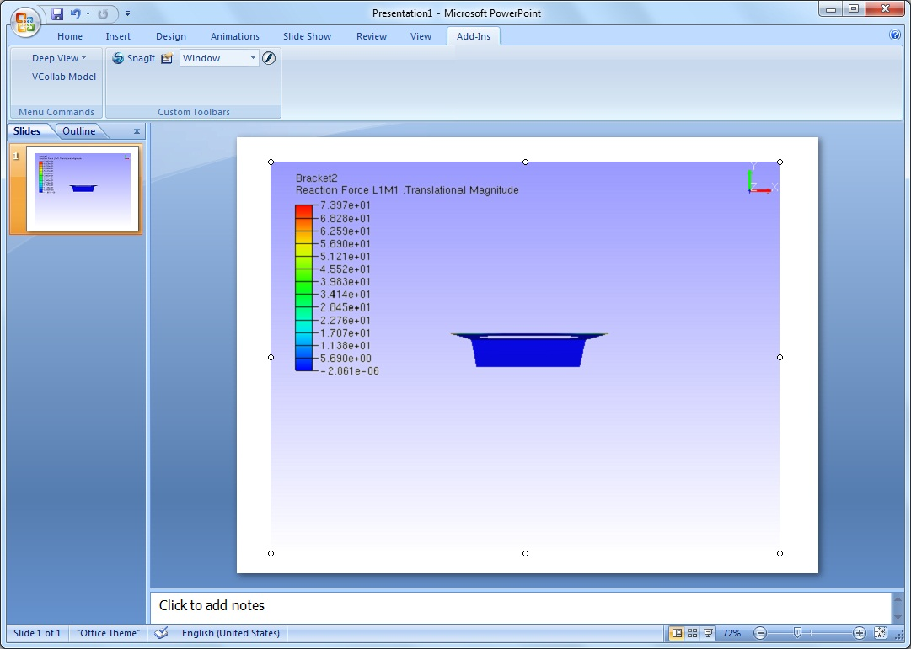

Set As Image
=============

The **Set As Image** option helps the user to set the current view as
default display image for the embedded presenter control.

While embedding presenter control in any Microsoft office tools,
embedded control in which the CAX model is loaded, displays the first
user defined view point or standard view of the loaded model.

To change this display view, users can use this option. This command
sets the current view as a control display image in offline mode.

This command is applicable, only for embedded presenter control objects
in Microsoft office applications.

**Steps to set current view as object image**

-  Embed VCollab control into PowerPoint or any other Microsoft office
   tools.

-  Load a CAX model, using the File menu.

-  Click outside the presenter control.

-  Control becomes an object which displays the standard front view of
   the model.

|image0|

-  Click **VCollab Control Object \| Edit** to get into the viewer.

-  Transform the model. (either a rotation or translation or both)

-  Click outside the control window.

-  Still the control displays standard front view of the model in
   offline mode as above.

-  Click **VCollab Control Object \| Edit** to get into the viewer
   again.

-  Transform the model to get the required view.

-  Right click to open the context menu.

-  Select **Set as Image**.

|image1|

-  Click outside the control window and notice the change.

|image2|

-  User defined view is set as an image to the object or control.

-  Save the presentation.

Note: While reopening the presenter in active mode, view position of the
captured image is applied, but not its view states.

.. |image1| image:: Images/PPT_addin_activate.jpg

.. |image2| image:: Images/PPT_Interact_VCollab.jpg
