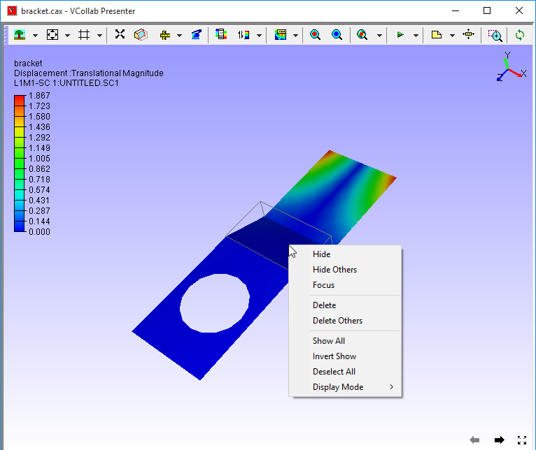

Show/ Hide
==========

The Show/Hide sub menu found in the context menu of VCollab Presenter
allows the users to choose what parts to show, hide or delete among
other things.

**Context Menu - Show/Hide**

|image0|

The various options available under Show/Hide menu are explained below

+--------------------------------+-------------------------------------------------------+
| **Hide**                       | hides currently selected part                         |
+--------------------------------+-------------------------------------------------------+
| **Hide Other Parts**           | hides all parts except current selection              |
+--------------------------------+-------------------------------------------------------+
| **Show All Parts**             | displays all parts independent of selection.          |
+--------------------------------+-------------------------------------------------------+
| **Invert Visible Parts**       | hides visible parts and shows invisible parts         |
+--------------------------------+-------------------------------------------------------+
| **Deselect All Parts**         | removes all selections.                               |
+--------------------------------+-------------------------------------------------------+
| **Delete All Visible Parts**   | deletes all visible parts.                            |
+--------------------------------+-------------------------------------------------------+
| **Delete All Hidden Parts**    | deletes all hidden parts.                             |
+--------------------------------+-------------------------------------------------------+
| **Axis**                       | Displays Axis triad in the viewer top right corner.   |
+--------------------------------+-------------------------------------------------------+
| **Origin**                     | Displays Origin Triad in the scene.                   |
+--------------------------------+-------------------------------------------------------+
| **Full Screen**                | Enables full screen mode to the viewer.               |
+--------------------------------+-------------------------------------------------------+
| **Properties**                 | Enable Part Properties query mode.                    |
+--------------------------------+-------------------------------------------------------+

**Steps to use Show/Hide options**

-  Load a **model**.

-  Select a part by **double clicking** on the model.

   |image1|

   |image2|

-  Select **Show/Hide \| Hide** option in the context menu. Current
   selected part is hidden.

   |image3|

-  Select **Show/Hide \| Hide Others** .

   All parts are hidden except current selection.

   |image4|

-  Select **Invert Show** option.

-  All hidden parts are displayed and all visible parts are hidden.

   |image5|

-  Select **Show All**'.

-  All parts, independent of any type of selection are shown.

   |image6|

 -  Click **Deselect All** option to clear any type of selection on model parts.              

 **Properties**                                                                              
                                                                                             
 This option displays part properties and other user information during mouse over actions.   
                                                                                             
 Users can add more information in the property label.                                        
                                                                                             
 **Part Properties Display**                                                                
                                                                                             
 -  Click **Display Mode -> Properties** to change mouse mode to properties display.         
                                                                                              
 -  Move the mouse over any part.                                                             
                                                                                              
 -  The part name and other properties if available are displayed.                            
                                                                                              
 -  Click on a part to fix the label as an annotation to the part.   

    |image7|

**Steps to Add Information**

1. Using **Edit Notes** option

   -  Click on any part

   -  A permanent label is annotated with the same information to the
      part.

   -  Double click the label to open **Edit Notes** dialog.

   -  Edit the text and Click **OK**.

      |image8|

      |image9|

Using **User Info** option.

-  Double click a part in the model.

-  Locate and select the selected part in the product explorer window.

-  Select **User Info** from the context menu.

   |image10|

   |image11|

-  Enter additional information in the **User Info** dialog box.

-  Click **OK**.

-  Click **Display -> Properties**.

-  Move the mouse over any part.

-  The part name and other properties if available are displayed.

   |image12|

.. |image2| image:: Images/Statusbar.png

.. |image3| image:: Images/Presenter_hide_updated.png

.. |image4| image:: Images/Presenter_hide_other.png

.. |image6| image:: Images/Presenter_showall.png

.. |image8| image:: Images/Presenter_edit_notes.png

.. |image9| image:: Images/Presenter_note_updated.png

.. |image10| image:: Images/Presenter_user_info.png

