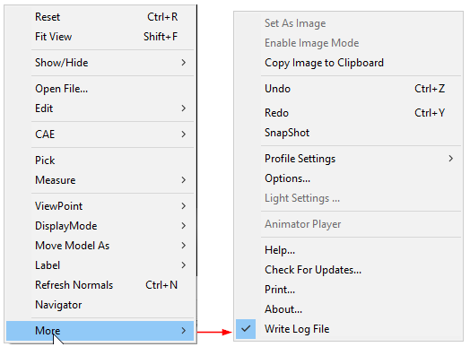

Undo/Redo
==========

VCollab Presenter creates user defined views and named views into a
list. VCollab uses this list to redo and undo operations. VCollab is
able to redo and undo 100 operations at maximum.

**Undo and Redo options in the Context Menu**

|image0|

There are three operations

1. Push a view into the view array. The last pushed view is the current
   view in the array. (Shortcut key - Ctrl + W)

2. Undo operation. (Shortcut key - Ctrl +Z).

3. Redo operation. (Shortcut key - Ctrl +Y).

