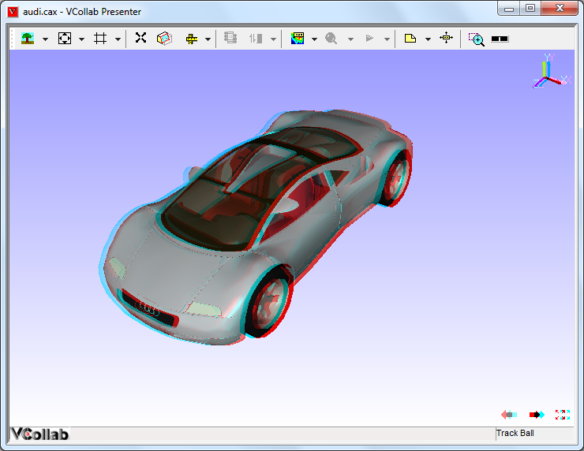
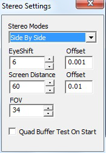
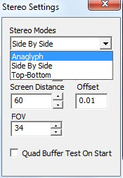

Stereo
======

This option is used to enhance 3-Dimensional perception of an image and is enabled only when you have a graphic card that supports stereo mode.

Besides the graphics card you will need synchronized monitors or special glasses to alternate the view between frames.

**Types**

#. Quad Buffer Stereo
#. Anaglyph

**Top-Bottom and Left-Right**

    Top-Bottom and Left-Right are used in gaming hardware that supports passive stereo. Compared to Active stereo it is an economical solution but with half of resolution loss.

    To use 3D TV/Monitor in side by side mode is very simple, just connect 3d monitor and set side by side option in VCollab Pro and in TV/monitor.

    *Hardware Requirements:*

    #. Passive circular polarized stereo monitor.
    #. Circular polarized stereo eye ware.

**Anaglyph Stereo**

-  This is low cost stereo solution along with color loss.
-  User needs Anaglyph stereo glasses to view the 3-Dimensional model.
-  Pressing down the key 'A' toggles between enabling and disabling Anaglyph stereo mode.

**Required Hardware**

 Red-Blue or Red-Green or Red-Cyan passive color glasses.

**Anaglyph Stereo Image**

 |image0|

**Quad Buffer Stereo**

-  This is the recommended mode for engineering solutions with full resolution.
-  User needs *Active Shutter glasses* to view 3-Dimensional model.
-  User can increase or decrease eye shift value.
-  Pressing 'Q' key down toggles between enabling and disabling Quad buffer stereo.

    **Note:** If environment variable VCOLLAB_FORCE_STEREO is set as TRUE, It will not check for stereo while starting VCollab Pro. It assumes GPU has Quad Buffer stereo.

    **Warning:** If GPU doesn't have QuadBuffer in OpenGL driver, setting the above environment variable will lead to application crash on start. Removing that environment variable will avoid crash.

    Hardware Required :

    #. OpenGL Quad Buffer Supported Stereo Card.

       For More Hardware Vendor specific Info
       http://www.nvidia.com/object/quadro_stereo_technology.html
       http://www.nvidia.com/object/quadro_pro_graphics_boards.html
       Other than nVidia, AMD also makes 3 pin din stereo cards.

       -  ATI Radeon|reg| HD 5000 series GPUs
       -  AMD Radeon|reg| HD 6000 series GPUs
       -  AMD Radeon|reg| HD 7000 series GPUs
       -  AMD A-Series APUs

    #. 120Hz Supported Monitor/Projector Here it is listed some monitors
       http://www.pymolwiki.org/index.php/Stereo_3D_Display_Options
       http://www.blurbusters.com/faq/120hz-monitors/
    #. LCD Shutter Stereo Glass And Stereo Emitter. 3D Stereo Emitter that to be connected externally with the gpu.       http://www.nvidia.com/object/product-geforce-3d-vision2-wireless-glasses-kit-us.html

.. |reg| unicode:: U+000AE .. REGISTERED SIGN

**Stereo Settings**

 |image1|

 +-----------------------------------+-----------------------------------+
 | **Stereo Modes**                  | Sets specified stereo mode        |
 +-----------------------------------+-----------------------------------+
 | **Eye Shift**                     | Approximate distance between      |
 |                                   | viewers eye ball in centimeters.  |
 +-----------------------------------+-----------------------------------+
 | **Screen Distance**               | Approximate distance between      |
 |                                   | viewer and screen in              |
 |                                   | centimeters.                      |
 +-----------------------------------+-----------------------------------+
 | **FOV**                           | Viewing angle 50 to 70 degree is  |
 |                                   | recommended.                      |
 +-----------------------------------+-----------------------------------+
 | **Quad Buffer Test On Start**     | If checked, On next session of    |
 |                                   | VCollabPro execution, it will     |
 |                                   | test GPU for Quad Buffer Support. |
 |                                   | If GPU supports Quad buffer, Then |
 |                                   | VCollab Stereo mode lists Quad    |
 |                                   | Buffer Stereo mode along with     |
 |                                   | othere stereo modes.              |
 +-----------------------------------+-----------------------------------+

**Note:**

 This version of VCollab Pro supports only single channel stereo. Some 3D DLP (Digital Light Processing) projectors does not support single channel Stereo 3D. It expects Left and right images on two independent windows, and connects them with 2 output cable from GPU. But now current version of VCollab outputs left and right images in same window.

**Stereo Modes**

-  Active

   -  Quad Buffer

-  Passive

   -  Side By Side (Left-Right)
   -  Top-Bottom
   -  Anaglyph

 |image2|

 +-----------------------------------+-----------------------------------+
 | **Anaglyph**                      | Passive stereo for red and cyan   |
 |                                   | glass glasses is required.        |
 |                                   |                                   |
 |                                   | It can be viewed in any monitor.  |
 +-----------------------------------+-----------------------------------+
 | **Side By Side**                  | Passive Stereo in Left Right      |
 |                                   | format. Passive stereo glasses    |
 |                                   | and 3D monitor/3D TV are          |
 |                                   | required.                         |
 +-----------------------------------+-----------------------------------+
 | **Top - Bottom**                  | Passive Stereo in Top-Bottom      |
 |                                   | format. Passive stereo glasses    |
 |                                   | and 3D monitor/3D TV are          |
 |                                   | required.                         |
 +-----------------------------------+-----------------------------------+
 | **Quad Buffer**                   | Active Stereo. Requires OpenGL    |
 |                                   | Quad buffer supported graphics    |
 |                                   | card, active stereo glasses with  |
 |                                   | emitter. Also requires 120hz      |
 |                                   | refresh rate supported display    |
 |                                   | system (monitor/projector)        |
 +-----------------------------------+-----------------------------------+

-  Click 'Edit \| Stereo Settings'.

-  It pops up 'Stereo Settings' dialog.

-  Edit or utilize the arrow buttons to increase or decrease the eye shift values.

-  User can use the keys '+' to increase and '-' to decrease the eye shift values.

**Stereo Support in Desktop**

 +-----------------+-----------------+-----------------+-----------------+
 |                 | Quad Buffer     | Side by Side /  | Anaglyph        |
 |                 |                 | Top-Bottom      |                 |
 +-----------------+-----------------+-----------------+-----------------+
 | Special GPU     | Required with   | Not required    | Not required    |
 |                 | quad buffer     |                 |                 |
 |                 | support         |                 |                 |
 +-----------------+-----------------+-----------------+-----------------+
 | Refresh Rate of | 120Hz           | 60Hz(regular)   | 60Hz(regular)   |
 | Monitor         |                 |                 |                 |
 +-----------------+-----------------+-----------------+-----------------+
 | Eyeware         | LCD Shutter     | Polarized Glass | Red-Blue/Red-Gr |
 |                 | Glass           |                 | een/Red-Cyan    |
 +-----------------+-----------------+-----------------+-----------------+
 | Emitter         | Required        | Not Required    | Not Required    |
 +-----------------+-----------------+-----------------+-----------------+
 | Visual Quality  | High, Used in   | Medium, Used in | Color loss,     |
 |                 | engineering     | entertainment   | Used in paper   |
 |                 | solutions       |                 | medium          |
 +-----------------+-----------------+-----------------+-----------------+
 | Resolution in   | Outputs in Full | Half resolution | Full resolution |
 | Full HD Monitor | HD resolution   | is lost         |                 |
 +-----------------+-----------------+-----------------+-----------------+
 | Filter in       | No filter is    | Polarized       | No filter       |
 | monitor         | needed          | filter comes    | needed          |
 |                 |                 | along with      |                 |
 |                 |                 | monitor         |                 |
 +-----------------+-----------------+-----------------+-----------------+
 | Minimum cost    | ~$1000          | ~$500           | ~$1             |
 | for Hardware    |                 |                 |                 |
 +-----------------+-----------------+-----------------+-----------------+

**Stereo Support in 3D TV**

-  Current 3D TVs that are available in market, some TVs that support stereo in active mode and some in passive mode.
-  VCollabPro will work on both, using Top-Bottom or Left-Right (side By side) mode. No Quad buffer GPU is needed in laptop or desktop.
-  UHD is recommended. Even it losses half resolution, 2K in each frame is good enough to get good visualization

 +----------------------+----------------------+----------------------+
 |                      | **Active Stereo TV** | **Passive Stereo     |
 |                      |                      | TV**                 |
 +----------------------+----------------------+----------------------+
 | **Eyeware**          | LCD shutter glass    | Polarized glass      |
 +----------------------+----------------------+----------------------+
 | **VCollab Pro Stereo | T-B / L-R            | T-B /L-R             |
 | Mode**               |                      |                      |
 +----------------------+----------------------+----------------------+
 | **Quad buffer Stereo | Not required         | Not Required         |
 | card in              |                      |                      |
 | Laptop/Desktop**     |                      |                      |
 +----------------------+----------------------+----------------------+
 | **Screen Sharing     | Will support         | Will Support         |
 | through WiDi**       |                      |                      |
 +----------------------+----------------------+----------------------+
 | **Display connected  | Will support         | Will Support         |
 | thru HDMI**          |                      |                      |
 +----------------------+----------------------+----------------------+

**Stereo Support in Projectors**

-  Traditional Projectors with external emitter

-  Built in Emitters

-  Duel Projectors

  +-----------------+-----------------+-----------------+-----------------+
  |                 | **External**    | **Built In**    | **Dual          |
  |                 |                 |                 | Projector**     |
  +-----------------+-----------------+-----------------+-----------------+
  | **Refresh Rate  | 120 Hz          | 120 Hz          | 60 Hz           |
  | Required**      |                 |                 |                 |
  +-----------------+-----------------+-----------------+-----------------+
  | **VCollab Pro   | Quad Buffer     | Quad            | L-R/T-B         |
  | Stereo Mode**   |                 | Buffer/L-R/T-B  |                 |
  +-----------------+-----------------+-----------------+-----------------+
  | **Emitter**     | Need to be      | Built In        | Can support     |
  |                 | purchased       |                 | passive using   |
  |                 |                 |                 | polarized       |
  |                 |                 |                 | filters         |
  +-----------------+-----------------+-----------------+-----------------+
  | **Eyeware**     | Shutter Glass   | Shutter Glass   | Polarized Glass |
  +-----------------+-----------------+-----------------+-----------------+

