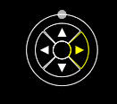
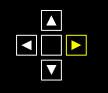
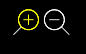
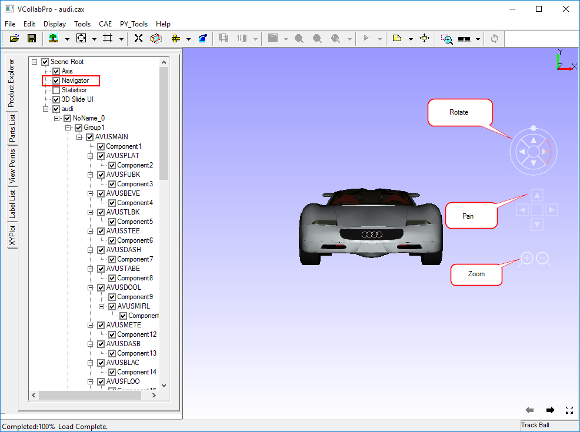

Navigator
=========

The **Navigator** option allows users to transform the model in passive
mode.

The GUI for Navigator is enabled in the viewer by default. Moving the
mouse pointer to the right side of the viewer makes the dynamic GUI
visible.

Events are highlighted during mouse over at the corresponding event
zones.

Navigator is used for Passive Transformation using Rotation, Pan and
Zoom methods. Click **here** for Interactive transformation.

**Rotation**

|image0|

-  To rotate the model with respect to vertical axis,

   -  Move the mouse pointer to the rightmost triangle until the zone is
      highlighted.

   -  Left click and hold it to rotate from left to right.

   -  Move the mouse pointer to the left most triangle until the zone is
      highlighted.

   -  Left click and hold it to rotate from right to left.

-  To rotate the model with respect to horizontal axis,

   -  Move the mouse pointer to the topmost triangle until the zone is
      highlighted.

   -  Left click and hold it to rotate from bottom to top.

   -  Move the mouse pointer to the bottom most triangle until the zone
      is highlighted.

   -  Left click and hold it to rotate from top to bottom.

-  To rotate the model with respect to viewing direction,

   -  Move the mouse pointer to the small circle in the outer circle,
      till the circle with outer periphery is highlighted.

   -  Click and drag the small circle to slide in the outermost circular
      curve.

   -  The model will be rotated according to the motion of a small
      circle.

**Pan**

|image1|

-  To move the model to the right,

   -  Move the mouse pointer to the rightmost triangle inside a square
      until the zone is highlighted.

   -  Left click and hold.

-  To move the model to the left,

   -  Move the mouse pointer to the leftmost triangle inside a square
      until the zone is highlighted.

   -  Left click and hold.

-  To move the model up,

   -  Move the mouse pointer to the topmost triangle inside a square
      until the zone is highlighted.

   -  Left click and hold

-  To move the model down,

   -  Move the mouse pointer to the bottom most triangle inside a square
      until the zone is highlighted.

   -  Left click and hold.

**Zoom**

|image2|

-  To zoom in,

   -  Move the mouse pointer to the left side circle with a plus symbol
      until the zone is highlighted.

   -  Left click and hold

-  To zoom out,

   -  Move the mouse pointer to the right side circle with a minus
      symbol until the zone is highlighted.

   -  Left click and hold

The following image describes where in these objects the rotation,
panning and zooming interface will appear and disappear in the viewer.

|image3|

