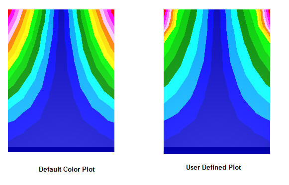

CAE Settings
============

This section helps user to edit, modify, update and display Legend
information.

-  **Legend Settings**

   To edit min and max of Legend values and to apply for current or all frames.

-  **Edit Legend**

   To modify number of colors, precision values and display format.

-  **Hotspot Finder**

   To set up hotspot finder constraints.

-  **Vector Plot Settings**

   To modify settings for Vector Plot

Note:

    Vector Plot features are available from 2010 R1 Version on wards and
    requires license. Contact **sales@vcollab.com** to upgrade these features.

**How to update Legend?**

Click with the right most button in the Viewer Window, to pop up the
Viewer Context menu and then follow the instructions as below.

 |image0|

 +-----------------------------------+-----------------------------------+
 | **Change Range**                  | User can change min & max values. |
 +-----------------------------------+-----------------------------------+
 | **Min**                           | Enables to modify min value in    |
 |                                   | the range.                        |
 +-----------------------------------+-----------------------------------+
 | **Max**                           | Enables to modify max value in    |
 |                                   | the range.                        |
 +-----------------------------------+-----------------------------------+
 | **Filter**                        | Applies the palette colors only   |
 |                                   | for the values with in the min    |
 |                                   | max range. Out of bound values    |
 |                                   | are applied with filter color     |
 +-----------------------------------+-----------------------------------+
 | **Filter Parts**                  | If true, Parts beyond result      |
 |                                   | range will be hidden              |
 +-----------------------------------+-----------------------------------+
 | **All Instances**                 | Applies the min/max changes to    |
 |                                   | all instances.                    |
 +-----------------------------------+-----------------------------------+
 | **Color Plot**                    | Applies the changes to current    |
 |                                   | instance of current result.       |
 +-----------------------------------+-----------------------------------+
 | **Min&Max**                       | Applies the changes to all        |
 |                                   | instances of current result.      |
 +-----------------------------------+-----------------------------------+
 | **Update Color Plot on Show/Hide  | Updates color palette and its     |
 | Parts**                           | values while hiding / showing     |
 |                                   | parts.                            |
 +-----------------------------------+-----------------------------------+
 | **Apply**                         | Applies the modifications.        |
 +-----------------------------------+-----------------------------------+

-  Select 'CAE Settings' option from viewer context menu or click ICON |image1| .

-  Select 'Update Legend' tab.

-  Click **Min** and **Max** option and change the range if necessary.

-  Click **Filter** color option to differentiate user defined range.

-  Select a filter color which is different from colors in the palette.

-  Click **Filter Parts** to hide parts which are beyond user range.

-  Click **All Instances** option to update the changes to all
   instances.

-  Click **Min & Max** option to display min and max value of current result as labels.

-  Click **Color Plot** option to apply or remove color plot on the model.

-  Click **Update Visible Parts Color Plot** to update the color palette and contour when modifying part visibility.

-  Double click either on the viewer color palette or no result color box in the viewer to pop up this dialog.

**How to edit Legend?**

Click with the right most button in the Viewer Window, to pop up the
Viewer Context menu and then follow the instructions as below.

 |image2|

 +-----------------------------------+-----------------------------------+
 | **Palette**                       | User can choose any number of     |
 |                                   | colors to be applied on model     |
 +-----------------------------------+-----------------------------------+
 | **Scientific**                    | Displays the legend values in     |
 |                                   | scientific format                 |
 +-----------------------------------+-----------------------------------+
 | **Precision**                     | User can choose the decimal       |
 |                                   | places for contour values         |
 +-----------------------------------+-----------------------------------+
 | **Font Size**                     | Allows user to change the font    |
 |                                   | size.                             |
 +-----------------------------------+-----------------------------------+
 | **Frame Info**                    | Displays/Hides frame information  |
 +-----------------------------------+-----------------------------------+
 | **Placement**                     | Allows user to place the legend   |
 |                                   | either in left or right or top or |
 |                                   | bottom.                           |
 +-----------------------------------+-----------------------------------+
 | **Undeformed Mesh Mode**          | Allows user to set 'Undeformed    |
 |                                   | Mesh' as Wire frame / Edges /     |
 |                                   | Transparent / Transparent Edges   |
 |                                   | Mode. Default is wire frame.      |
 +-----------------------------------+-----------------------------------+
 | **Contour Lines**                 | Allows user to select contour     |
 |                                   | lines color.                      |
 +-----------------------------------+-----------------------------------+
 | **Show**                          | Shows/Hides Legend palette.       |
 +-----------------------------------+-----------------------------------+
 | **Reverse**                       | Reverses the legend values        |
 |                                   | against color palette.            |
 +-----------------------------------+-----------------------------------+
 | **Discrete**                      | Switches to discrete fringe bands |
 |                                   | in color plot.                    |
 +-----------------------------------+-----------------------------------+
 | **Update All Viewpoints**         | Updates the changes to all        |
 |                                   | available viewpoints.             |
 +-----------------------------------+-----------------------------------+
 | **Custom Range**                  | Switches to user defined custom   |
 |                                   | range palette and color plot.     |
 +-----------------------------------+-----------------------------------+
 | **Apply**                         | Apply the changes in the viewer.  |
 +-----------------------------------+-----------------------------------+

-  Select 'CAE Settings' option from viewer context menu or click ICON |image3| .

-  Select 'Edit Legend' tab.

-  Click 'Palette' drop down to select number of colors.

-  User can select predefined sets of color to view CAE results as he viewed in native CAE software.

-  Click any color in the palette to change.

-  Click 'Scientific' option to toggle display format between scientific and standard decimal mode. Default is Standard display format.

-  Increase or decrease precision values for both scientific and standard display format.

-  No Result color is grey by default. User can change it too.

-  Click 'Frame Info' option to toggle displaying frame information in left bottom of viewer.

-  Select left or right or top or bottom under placement dropdown to place the legend.

-  Click Undeformed Mesh Mode drop down list.

-  Select 'Wire Frame' to view 'Undeformed mesh' in Wire frame mode.

-  Select 'Transparent' to view 'Undeformed mesh' in transparent mode.

-  Select User Color or Palette Color option for contour lines.

-  Click **Discrete** option to toggle between continuous or discrete color plot.

-  Click 'Apply' button to apply the above changes.

Note:

    Palette has predefined color sets for CAE files, which are supported by VMoveCAE as in native CAE software.

    This helps user to view results of CAE files in VCollab Pro, same as he viewed in native software.

    Double Clicking on legend color palette (including No Result color box) inside viewer using mouse left button pops up CAE Settings Dialog with 'Edit Legend' page.

**What is custom range and how to use it?**

Legend palette values are divided evenly by n number of colors. Here length of any two consecutive ranges is constant and interpolated linearly.

Custom range allows user to define any length for any range but with certain limitations.

-  Length of any range should be less than length of min and max.
-  User is not allowed to edit extreme values as it is possible in *Legend settings*.
-  User modified value should be between predecessor and successor values.
-  If there are blank in the palette values, it will be interpolated linearly by default.

**Steps for Custom Range usage:**

-  Click 'Custom Range' option to enable.

 |image4|

-  Click the button next to the option 'Custom Range'.
-  It pops up a dialog 'Custom Range ' as below\

 |image5|

-  Change any value out of extremum values.\

 |image6|

-  Click 'Apply' button.
-  It prompts with an warning message that values should be in descending order.\

 |image7|

-  Change some values and leave some blanks in the palette.\

 |image8|

-  Click 'Apply' and notice that blanks are filled by interpolation.

 |image9|

-  Click 'OK'
-  Click 'Apply'.
-  Notice the changes in the color plot of model according to new custom
   range palette.\

 |image10|

**Hotspot Finder Panel**

 |image11|

 +-----------------------------------+-----------------------------------+
 | **Find**                          | Allows user to select a mechanism |
 |                                   | either Hotspots or Min/Max        |
 +-----------------------------------+-----------------------------------+
 | **Min**                           | Used to set user minimum of       |
 |                                   | range.                            |
 +-----------------------------------+-----------------------------------+
 | **Max**                           | Used to set user maximum of       |
 |                                   | range.                            |
 +-----------------------------------+-----------------------------------+
 | **Top**                           | Used to find                      |
 |                                   | thenumber of top result values.   |
 +-----------------------------------+-----------------------------------+
 | **Bottom**                        | Used to find                      |
 |                                   | the number of bottom result       |
 |                                   | values.                           |
 +-----------------------------------+-----------------------------------+
 | **All Top**                       | Includes all same top values and  |
 |                                   | its IDs.                          |
 +-----------------------------------+-----------------------------------+
 | **All Bottom**                    | Includes all same bottom values   |
 |                                   | and its IDs.                      |
 +-----------------------------------+-----------------------------------+
 | **Zone Radius**                   | Used to skip an area around       |
 |                                   | already found hotspots.           |
 +-----------------------------------+-----------------------------------+
 | **Visible Surfaces**              | Considers visible labels only.    |
 +-----------------------------------+-----------------------------------+
 | **Probe Label Settings**          | Allows user to modify probe label |
 |                                   | settings. Pops up a detailed      |
 |                                   | dialog.                           |
 +-----------------------------------+-----------------------------------+
 | **Compare Options**               | This option is visible if at      |
 |                                   | least one file is merged with     |
 |                                   | existing one. It will pop a       |
 |                                   | dialog with compare options.      |
 +-----------------------------------+-----------------------------------+
 | **Add Viewpoints**                | Generates viewpoints according to |
 |                                   | viewpoint options if enabled.     |
 +-----------------------------------+-----------------------------------+
 | **Export**                        | Exports the viewpoints into       |
 |                                   | either vpt file or Microsoft ppt  |
 |                                   | file                              |
 +-----------------------------------+-----------------------------------+
 | **View Point Options**            | Provides various options to       |
 |                                   | include or exclude different type |
 |                                   | of viewpoints                     |
 +-----------------------------------+-----------------------------------+
 | **Find Hotspots**                 | Generates viewpoints for the      |
 |                                   | model according to above          |
 |                                   | information                       |
 +-----------------------------------+-----------------------------------+

 `more... <Hotspot_Finder.html>`__

**Vector Plot**

 |image12|
    

*

 +-----------------------------------+-----------------------------------+
 | **Vector Plot**                   | On/Off switch to plot vectors.    |
 +-----------------------------------+-----------------------------------+
 | **Derived Vector**                | Default derived vector for vector |
 |                                   | result is Translational and for   |
 |                                   | tensor is Normals.                |
 +-----------------------------------+-----------------------------------+
 | **Deformation**                   | Sets deformed nodal position as   |
 |                                   | starting point of vector.         |
 +-----------------------------------+-----------------------------------+
 | **Detach Geometry**               | Allows user to display vector     |
 |                                   | plot of a part, even if the       |
 |                                   | geometry is hidden.               |
 +-----------------------------------+-----------------------------------+
 | **Auto Scale**                    | Enables Auto Scale for vector     |
 |                                   | plot                              |
 +-----------------------------------+-----------------------------------+
 | **Scale Slider Control**          | Allows provides user              |
 |                                   | unconstrained scaling up or down  |
 +-----------------------------------+-----------------------------------+
 | **User Color**                    | Allows user to choose a color     |
 |                                   | from palette for vector.          |
 +-----------------------------------+-----------------------------------+
 | **Arrow Size**                    | Allows user to choose any one     |
 |                                   | size out of three.                |
 +-----------------------------------+-----------------------------------+
 | **Nodal Position As**             | Allows user to set nodal position |
 |                                   | as either start point or end      |
 |                                   | point                             |
 +-----------------------------------+-----------------------------------+
 | **Reverse**                       | Allows user to change the         |
 |                                   | direction of vector               |
 +-----------------------------------+-----------------------------------+
 | **Refresh**                       | Allows user to re-compute vector  |
 |                                   | plot.                             |
 +-----------------------------------+-----------------------------------+

 The derived vectors are based on the type of result selected.

 +-----------------------------------+-----------------------------------+
 | **Result type**                   | **Available Derived Vectors**     |
 +-----------------------------------+-----------------------------------+
 | Scalar                            | Normals (Nodal or Elemental)      |
 +-----------------------------------+-----------------------------------+
 | Vector                            | Translational (Default)           |
 +-----------------------------------+-----------------------------------+
 | Six DOF                           | Translational (Default)           |
 |                                   |                                   |
 |                                   | Rotational                        |
 |                                   |                                   |
 |                                   | Both                              |
 +-----------------------------------+-----------------------------------+
 | Tensor                            | Normals (Default)                 |
 |                                   |                                   |
 |                                   | Minimum Principal Direction       |
 |                                   |                                   |
 |                                   | Middle Principal Direction        |
 |                                   |                                   |
 |                                   | Maximum Principal Direction       |
 |                                   |                                   |
 |                                   | Full Tensor                       |
 +-----------------------------------+-----------------------------------+

 `more... <CAEDisplay_VectorPlot.html>`__

 Note:
 
  This Vector Plot needs a separate license file to get activated.

.. |image0| image:: Images/UpdateLegend.JPG
.. |image1| image:: icons/LegendHotspots.JPG

.. |image3| image:: icons/LegendHotspots.JPG
.. |image4| image:: Images/CAE_Dynamic_Range_Options.jpg
.. |image5| image:: Images/CAE_Legend_Dynamic_Range_Settings.jpg

.. |image7| image:: Images/CAE_Legned_User_Edit_Warn.jpg
.. |image8| image:: Images/CAE_Legend_User_Edit_Blanks.jpg
.. |image9| image:: Images/CAE_Legend_User_Edit_Apply.jpg

