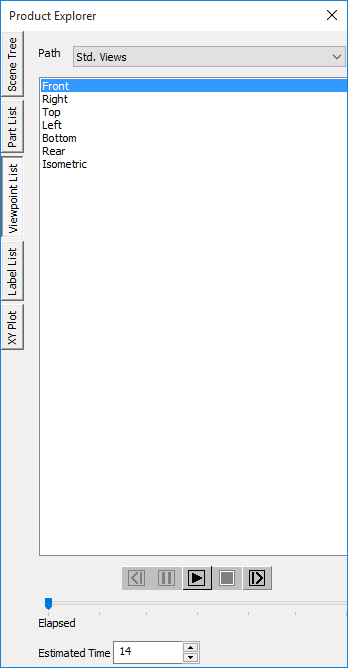
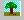

ViewPoint List
==============

The View point List is a tab found under Product Explorer. VCollab
Presenter allows users to view as well as animate viewpoint states.
Users can export and import VPT files that consist of all viewpoints for
a specified viewpath.

**View point state:** This is a user defined viewpoint state to which
more information can be added.

Users can store view points with view paths and retrieve them to view.
They can also animate a path that contains a set of user view points.

**Context Menu**

Right Clicking in the Viewpoint list opens the context menu as shown
below

|image0|

The various fields and options available in the Viewpoint List context
menu are explained below.

+--------------------------------+-----------------------------------------------------------------------------------------------------------------------------------------------------------------------------------------------------------------------------------------------------------------------------------------------------------------------------------+
| **Add ViewPoint**              | Adds a view point to current view path                                                                                                                                                                                                                                                                                            |
+--------------------------------+-----------------------------------------------------------------------------------------------------------------------------------------------------------------------------------------------------------------------------------------------------------------------------------------------------------------------------------+
| **Rename Viewpoint**           | Provides new name to the current view point                                                                                                                                                                                                                                                                                       |
+--------------------------------+-----------------------------------------------------------------------------------------------------------------------------------------------------------------------------------------------------------------------------------------------------------------------------------------------------------------------------------+
| **Insert ViewPoint**           | Inserts a view point before current view point                                                                                                                                                                                                                                                                                    |
+--------------------------------+-----------------------------------------------------------------------------------------------------------------------------------------------------------------------------------------------------------------------------------------------------------------------------------------------------------------------------------+
| **Delete ViewPoint**           | Deletes the view point selected                                                                                                                                                                                                                                                                                                   |
+--------------------------------+-----------------------------------------------------------------------------------------------------------------------------------------------------------------------------------------------------------------------------------------------------------------------------------------------------------------------------------+
| **Update ViewPoint**           | Allows user to edit and update an existing viewpoint                                                                                                                                                                                                                                                                              |
+--------------------------------+-----------------------------------------------------------------------------------------------------------------------------------------------------------------------------------------------------------------------------------------------------------------------------------------------------------------------------------+
| **Capture Camera**             | Adds current view to viewpoint without any states.                                                                                                                                                                                                                                                                                |
+--------------------------------+-----------------------------------------------------------------------------------------------------------------------------------------------------------------------------------------------------------------------------------------------------------------------------------------------------------------------------------+
| **Animate Path**               | Animate the current view path                                                                                                                                                                                                                                                                                                     |
+--------------------------------+-----------------------------------------------------------------------------------------------------------------------------------------------------------------------------------------------------------------------------------------------------------------------------------------------------------------------------------+
| **Stop**                       | Stops animating view path                                                                                                                                                                                                                                                                                                         |
+--------------------------------+-----------------------------------------------------------------------------------------------------------------------------------------------------------------------------------------------------------------------------------------------------------------------------------------------------------------------------------+
| **Slide Show**                 | Switches viewpoint animation into slide show mode.                                                                                                                                                                                                                                                                                |
+--------------------------------+-----------------------------------------------------------------------------------------------------------------------------------------------------------------------------------------------------------------------------------------------------------------------------------------------------------------------------------+
| **Apply State**                | Applies or Skips CAE states during viewpoint animation.                                                                                                                                                                                                                                                                           |
+--------------------------------+-----------------------------------------------------------------------------------------------------------------------------------------------------------------------------------------------------------------------------------------------------------------------------------------------------------------------------------+
| **Apply View**                 | Skips applying view/orientation if this flag is unchecked. Flag is checked by default.                                                                                                                                                                                                                                            |
+--------------------------------+-----------------------------------------------------------------------------------------------------------------------------------------------------------------------------------------------------------------------------------------------------------------------------------------------------------------------------------+
| **Loop Animation**             | Enables to play animation continuously.                                                                                                                                                                                                                                                                                           |
+--------------------------------+-----------------------------------------------------------------------------------------------------------------------------------------------------------------------------------------------------------------------------------------------------------------------------------------------------------------------------------+
| **Add ViewPath**               | Adds new path to the list                                                                                                                                                                                                                                                                                                         |
+--------------------------------+-----------------------------------------------------------------------------------------------------------------------------------------------------------------------------------------------------------------------------------------------------------------------------------------------------------------------------------+
| **Rename Path**                | Provides new name for the current path                                                                                                                                                                                                                                                                                            |
+--------------------------------+-----------------------------------------------------------------------------------------------------------------------------------------------------------------------------------------------------------------------------------------------------------------------------------------------------------------------------------+
| **Delete path**                | Deletes current view path.                                                                                                                                                                                                                                                                                                        |
+--------------------------------+-----------------------------------------------------------------------------------------------------------------------------------------------------------------------------------------------------------------------------------------------------------------------------------------------------------------------------------+
| **Generate Path**              | Generates view path with various viewpoints for model presentations.                                                                                                                                                                                                                                                              |
+--------------------------------+-----------------------------------------------------------------------------------------------------------------------------------------------------------------------------------------------------------------------------------------------------------------------------------------------------------------------------------+
|                                | **Presentation 1** - Except focused part or group of parts, all others are in semi transparent mode.                                                                                                                                                                                                                              |
+--------------------------------+-----------------------------------------------------------------------------------------------------------------------------------------------------------------------------------------------------------------------------------------------------------------------------------------------------------------------------------+
|                                | **Presentation 2** - Except focused part or group of parts, all others are in hidden mode.                                                                                                                                                                                                                                        |
+--------------------------------+-----------------------------------------------------------------------------------------------------------------------------------------------------------------------------------------------------------------------------------------------------------------------------------------------------------------------------------+
|                                | **CAE Results** **Viewpoints** **-** Viewpoints for all CAE results and its components.                                                                                                                                                                                                                                           |
+--------------------------------+-----------------------------------------------------------------------------------------------------------------------------------------------------------------------------------------------------------------------------------------------------------------------------------------------------------------------------------+
|                                | **CAE Viewpoints Settings** - Customized Viewpath generation                                                                                                                                                                                                                                                                      |
+--------------------------------+-----------------------------------------------------------------------------------------------------------------------------------------------------------------------------------------------------------------------------------------------------------------------------------------------------------------------------------+
| **Import ViewPoints...**       | Imports viewpoints from external vpt or cax file.                                                                                                                                                                                                                                                                                 |
+--------------------------------+-----------------------------------------------------------------------------------------------------------------------------------------------------------------------------------------------------------------------------------------------------------------------------------------------------------------------------------+
| **Export Viewpoints...**       | Exports viewpoints into vpt file or ppt file..                                                                                                                                                                                                                                                                                    |
+--------------------------------+-----------------------------------------------------------------------------------------------------------------------------------------------------------------------------------------------------------------------------------------------------------------------------------------------------------------------------------+
| **Export Image As**            | Exports all viewpoint states into bmp, tiff, jpeg and png file formats                                                                                                                                                                                                                                                            |
+--------------------------------+-----------------------------------------------------------------------------------------------------------------------------------------------------------------------------------------------------------------------------------------------------------------------------------------------------------------------------------+
| **AddVisibleLabelViewPt...**   | This is applicable only if the selected viewpoint contains CAE probed labels. In the selected viewpoint, labels of parts that are not visible in the current view are hidden. The hidden labels can be used to create a new viewpoint which can be named by the user.                                                             |
|                                |                                                                                                                                                                                                                                                                                                                                   |
|                                | -  This option is to interactively modify/split a viewpoint in such a way that multiple viewpoints can be created with visible hotspots.                                                                                                                                                                                          |
|                                |                                                                                                                                                                                                                                                                                                                                   |
|                                | -  User selects a viewpoint. Then changes the view by using rotate / zoom / section options such that a set of hotspot labels are visible.                                                                                                                                                                                        |
|                                |                                                                                                                                                                                                                                                                                                                                   |
|                                | -  Then the user selects the **Add Visible Label ViewPoint** option. A new viewpoint with only visible hotspots in this modified view will be created. The remaining hotspots will remain in the original viewpoint.                                                                                                              |
|                                |                                                                                                                                                                                                                                                                                                                                   |
|                                | -  By repeating these steps users can create multiple viewpoints without missing any hotspot.                                                                                                                                                                                                                                     |
+--------------------------------+-----------------------------------------------------------------------------------------------------------------------------------------------------------------------------------------------------------------------------------------------------------------------------------------------------------------------------------+
| **Edit Mode**                  |     Selecting a viewpoint clears current view information. Accidental selection of viewpoints may result in loss of current scene information. The Edit Mode option prompts users before applying the new viewpoint to the scene.                                                                                                 |
+--------------------------------+-----------------------------------------------------------------------------------------------------------------------------------------------------------------------------------------------------------------------------------------------------------------------------------------------------------------------------------+
| **Auto Backup**                |     This option helps users to have a back up of viewpoints during creating or updating viewpoints. If a user forgets to save viewpoints into CAX, he can retrieve the viewpoints created using this option. A VPT file with CAX file name will be created and updated. File will be available in **%VCOLLAB\_TEMP%\\VCollab**.   |
+--------------------------------+-----------------------------------------------------------------------------------------------------------------------------------------------------------------------------------------------------------------------------------------------------------------------------------------------------------------------------------+

A viewpoint state may contain

-  Notes

-  Annotation

-  Display mode

-  Probed CAE result labels

-  Pick and move part state

-  Exploded view

-  Measurements

-  Cut section

-  CAE result information.

-  Merged dataset view.

-  XY Plot

-  Vector Plot

-  etc.

**Benefits**

-  Users can create a CAE report with viewpoints.

-  Users can add and delete viewpoint states.

-  Animate path or a walk through model helps user to get more knowledge
   on model

**Note:**

Default view path with default viewpoints are,

-  **Standard Views**

   -  All standard views front, back, left, right, top, bottom and
      isometric views are generated by default.

   -  Users can add, and update viewpoints using the Capture Camera
      option in the context menu.

   -  Only the viewing position and orientation is saved, not other
      states.

   -  These viewpoints can be saved through profile. And it can not be
      saved in the CAX file.

|image1|

**Steps to add viewpoint**

-  Right click in the Viewer Window, to open the Viewer Context menu

-  Click **Product Explorer**\ or click |image2|

-  Click the **Viewpoint List** tab.

-  Right click to open the context menu

-  Select **Add View point** option

-  Provide a name for the view path if no view path exists.

|image3|

-  The **Add View Point** dialog opens up now.

|image4|

-  Enter a **name** for viewpoint.

-  Click **OK** to add current view as a viewpoint state to the list.

-  Check **Apply State** to store all state variables (labels, display
   mode, section, etc.). By default only the current viewpoint will
   be stored.

-  Viewpoint name is now displayed in the list.

|image5|

-  Repeat the process to add more view points.

**Steps to animate view point states**

-  Select a path from the path list if path exists.

-  Right click and select **Animate Path** in the drop down context
   menu.

    Or

-  Click the **Play** button available at the bottom of the viewpoints
   panel.

-  Animation starts from the first view point state and ends with the
   last viewpoint state.

-  Click **Loop Animation** to play animation continuously.

-  Right click and click **Stop** to stop the animation.

**Steps to export all viewpoint states as images into PowerPoint**

-  Open the Viewpoints context menu.

-  Click **Export Viewpoints**

-  **A Save file dialog opens up.**\ Select file type as \*.ppt.

-  Enter a **filename** .

-  Click **Save**

-  Another dialog opens which asks for a template.

-  Click **Yes** to provide a template.

-  Click **No** to continue without template.

-  Now all the viewpoint states are inserted as images into PowerPoint.

-  First slide is left empty of the presentation if the template is
   provided.

|image6|

 -  If a viewpoint contains CAE Animation state, animation will not be captured but first frame image will be captured in the ppt file.   
                                                                                                                                          
**Steps to export and import viewpoints**                                                                                                
                                                                                                                                          
To **Export** viewpoints                                                                                                                 
                                                                                                                                          
 -  Select **Export Viewpoints** from the Viewpoints context menu.                                                                        
                                                                                                                                          
 -  A **Save file** dialog opens up                                                                                                       
                                                                                                                                          
 -  Select file type as **.vpt** to store viewpoints.                                                                                     
                                                                                                                                          
 -  Click **Save**.                                                                                                                       
                                                                                                                                          
To **Import** viewpoints                                                                                                                 
                                                                                                                                          
 -  Click **Import Viewpoints** from the context menu.                                                                                    
                                                                                                                                         
 -  A **Save file** dialog opens up.                                                                                                     
                                                                                                                                          
 -  Select any **.cax** or **.vpt** file to import view points.                                                                           
                                                                                                                                          
 -  Click **Open** and notice that view paths are imported.                                                                               

.. |image0| image:: Images/Presenter_viewpoint.png

.. |image6| image:: Images/Export_powerpoint.jpg

