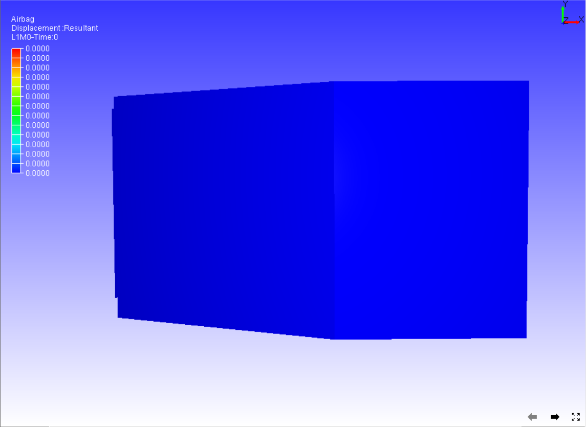

Viewpoint
==========

The **Viewpoint** option allows users to navigate information through
viewpoints and view its states.

|image0|

The various options available under the Viewpoint sub menu are explained
below

+------------------------------+--------------------------------------------------------------------------+
| **Add ViewPoint**            | Allows the user to add the current scene as a viewpoint.                 |
+------------------------------+--------------------------------------------------------------------------+
| **Next View**                | Displays the next viewpoint state.                                       |
+------------------------------+--------------------------------------------------------------------------+
| **Previous View**            | Displays previous viewpoint state.                                       |
+------------------------------+--------------------------------------------------------------------------+
| **Standard Views**           | Allows the user to select a standard view Front, Rear,etc.               |
+------------------------------+--------------------------------------------------------------------------+
| **3D Slide UI**              | Shows/Hides 3D slide UI in the bottom right corner of the viewer.        |
+------------------------------+--------------------------------------------------------------------------+
| **Play**                     | Plays Viewpoint Animation.                                               |
+------------------------------+--------------------------------------------------------------------------+
| **Stop**                     | Stops the animation.                                                     |
+------------------------------+--------------------------------------------------------------------------+
| **Pause**                    | Pauses animation                                                         |
+------------------------------+--------------------------------------------------------------------------+
| **Loop Animation**           | Animates continuously                                                    |
+------------------------------+--------------------------------------------------------------------------+
| **Perspective Projection**   | Enables perspective projection                                           |
+------------------------------+--------------------------------------------------------------------------+
| **Ortho projection**         | Enables Ortho projection                                                 |
+------------------------------+--------------------------------------------------------------------------+
| **Coordinate System**        | Allows users to switch between XY, XZ and YZ coordinate systems.         |
+------------------------------+--------------------------------------------------------------------------+
| **Import View Points**       | Allows users to import viewpoints from either vpt or another cax file.   |
+------------------------------+--------------------------------------------------------------------------+
| **Export View Points**       | Allows the user to export the viewpoint to vpt or ppt file.              |
+------------------------------+--------------------------------------------------------------------------+
| **Camera Settings...**       | Allows users to modify camera attributes.                                |
+------------------------------+--------------------------------------------------------------------------+

**Coordinate System**

+------+-------------------------------------------------------------------------------------------------------------------+
| XY   | X is the horizontal axis and Y is the vertical axis. Z axis points towards the user in front view.                |
+------+-------------------------------------------------------------------------------------------------------------------+
| XZ   | X is the horizontal axis and Z is the vertical axis. The Y axis points outwards towards the user in front view.   |
+------+-------------------------------------------------------------------------------------------------------------------+
| YZ   | Y is the horizontal axis and Z is the vertical axis. X axis towards the user in front view.                       |
+------+-------------------------------------------------------------------------------------------------------------------+

The coordinate system option helps users to switch between these three
systems.

**XY System**

|image1|

**XZ System**

|image2|

**YZ system**

|image3|

**Steps to view viewpoints states**

-  Load any CAx model with CAE information.

-  Create and store viewpoint states in the list.

-  Select **Viewpoint \| Next** from the context menu to view the next
   viewpoint state.

-  Select **Viewpoint \| Previous** from the context menu to view the
   previous viewpoint state.

-  Select **Play** to animate the current view path.

-  Select **Stop** to stop animation.

**How to import and export viewpoints?**

-  Open the context menu and click **Viewpoint \| Import Viewpoints**.

-  Select and Open any .cax file or .vpt files using the File Open
   dialog that opens up.

-  Click **ViewPoint \| Export View Points...**

-  Enter a filename in the Save file dialog that opens and click
   **Save** to export viewpoints into a .vpt file.

**Camera Settings Panel**

|image4|

The various fields available in the Camera settings panel are explained
below

+-----------------------------+----------------------------------------------------------------------------------------------------------------------------------------------------------------+
| **Quaternion**              | Toggles to Axis & Angle attributes.                                                                                                                            |
+-----------------------------+----------------------------------------------------------------------------------------------------------------------------------------------------------------+
| **Position**                | Allows users to modify camera position coordinates.                                                                                                            |
+-----------------------------+----------------------------------------------------------------------------------------------------------------------------------------------------------------+
| **Direction/Orientation**   | Allows users to modify camera direction vector/ orientation axis and angle in case of quaternion option.                                                       |
+-----------------------------+----------------------------------------------------------------------------------------------------------------------------------------------------------------+
| **Up Vector**               | Allows users to modify the Camera Up vector.                                                                                                                   |
+-----------------------------+----------------------------------------------------------------------------------------------------------------------------------------------------------------+
| **Vertical FOV**            | This refers to the camera 'Vertical Field of View' in case of Perspective.                                                                                     |
+-----------------------------+----------------------------------------------------------------------------------------------------------------------------------------------------------------+
| **Fit View**                | If a user is not sure about the model in scene after applying the modifications, this option helps to bring the model into scene with same direction vector.   |
+-----------------------------+----------------------------------------------------------------------------------------------------------------------------------------------------------------+
| **Refresh**                 | Click this option to update the current camera attributes to this dialog.                                                                                      |
+-----------------------------+----------------------------------------------------------------------------------------------------------------------------------------------------------------+
| **Apply**                   | Click to apply all the attributes to the camera.                                                                                                               |
+-----------------------------+----------------------------------------------------------------------------------------------------------------------------------------------------------------+

**Note:**

-  Up vector should be perpendicular to Direction vector. If not, a
   projected UP vector defined by the user will be applied.

-  A new field, Angle, is displayed if the Quaternion option is
   selected.

**Steps to change camera attributes**

-  Enter camera position using x, y and z coordinates.

-  Enter **Vertical FOV** to change the field of view.

-  To change the camera orientation, there are two ways of modifying.
   Using **Direction** and **Up** vectors.

-  Provide direction and up vectors in the corresponding fields.

   Using Axis and Angle of camera orientation.

-  Check the Quaternion option.

-  In the **Orientation** field, provide an axis of rotation in the
   first 3 x, y and z fields.

-  Provide angle of degrees in the last field, **Angle**.

-  Click the Apply button.

-  Notice the change in camera view.

-  If the user is not sure about the model view, check the **Fit View**
   option which helps in viewing the model in the scene with modified direction.

-  In the case of **Fit View**, camera position may be different from
   user defined position.

.. |image2| image:: Images/XZ_coord_view.png

.. |image3| image:: Images/YZ_coord_view.png

