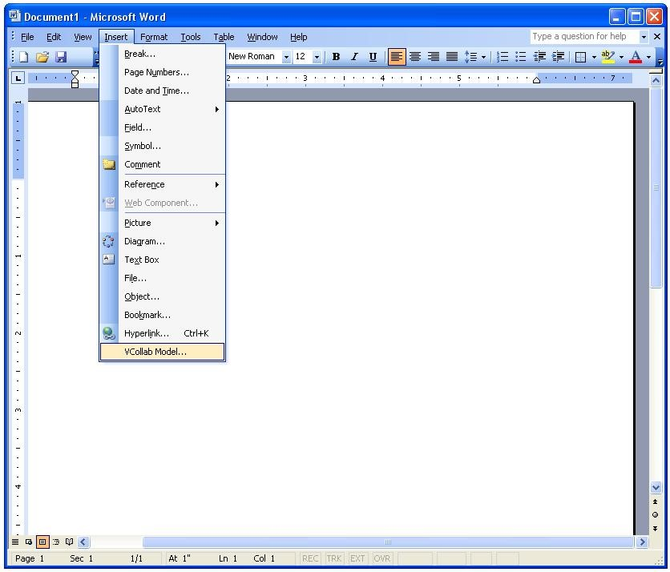
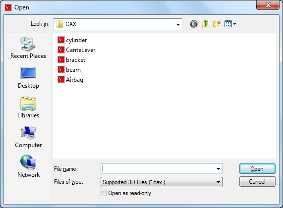
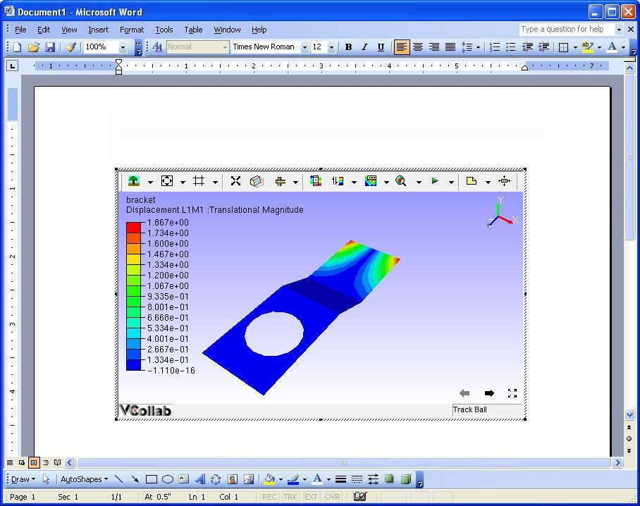
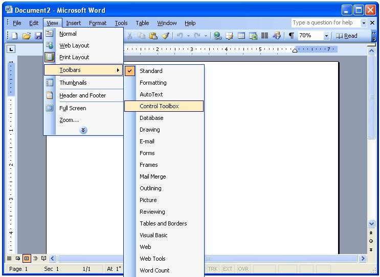
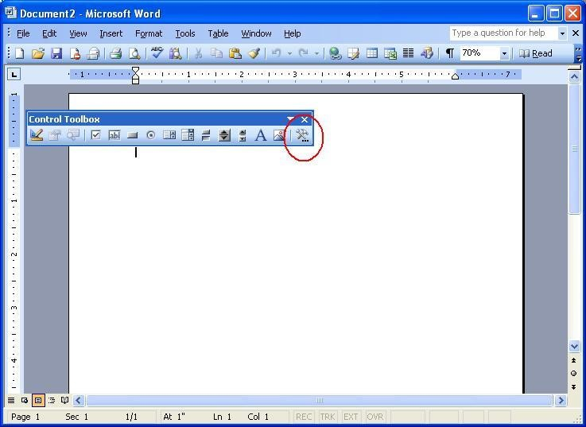
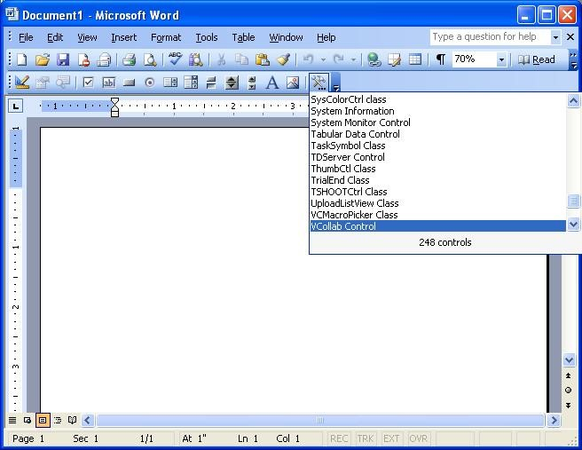
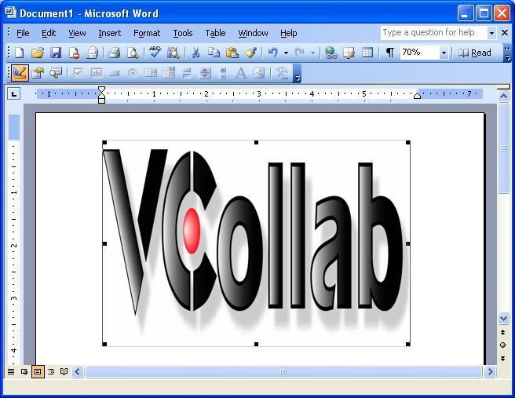
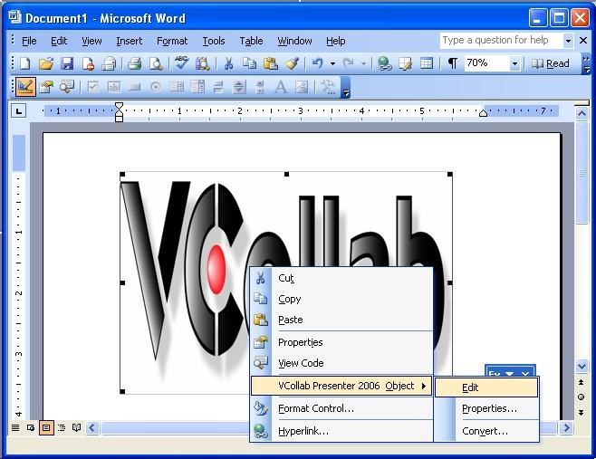
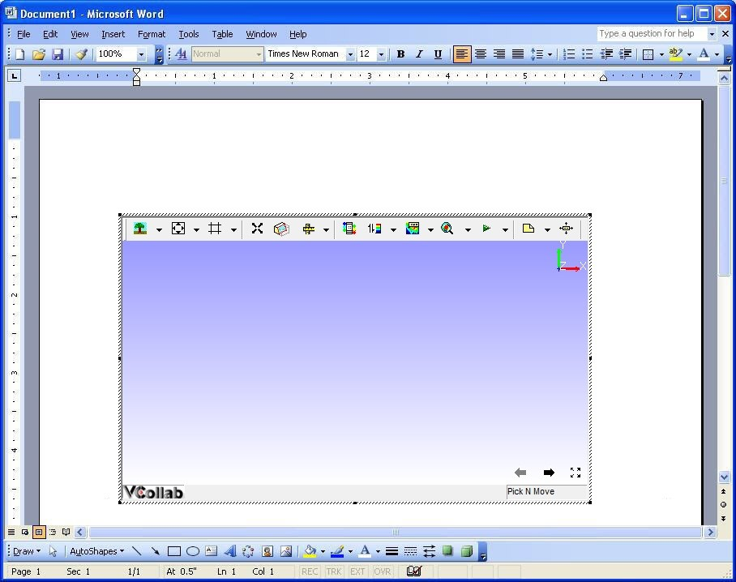

Embedding VCollab Presenter in MS Word 2003
============================================

VCollab Presenter control can be embedded into MS Word 2003 in two ways

-  Using the **Insert** menu

-  Using the **Control Toolbox**.

-  Images can also be set for offline mode.

**Steps to embed Presenter control using the Insert menu**

-  Open Microsoft Word 2003

-  Click the **Insert** menu.

-  Select VCollab Model. This option is available if the VCollab suite
   is installed on the system.

|image0|

-  This opens the open file dialog as shown below. Select a CAX file.

|image1|

-  The VCollab control is seen embedded as below.

|image2|

-  Use the right click options to view the loaded model.

**Steps to load Control Toolbox in MS Word 2003**

-  Open Microsoft Word 2003

-  Click **View \| Toolbars \| Control Toolbox** as shown below.

|image3|

-  The More Controls icons can be seen in the toolbar as highlighted
   below.

|image4|

**Steps to embed VCollab Presenter in Microsoft Word 2003**

-  Open Microsoft Word 2003.

-  Select **VCollab Control** from the list of controls.

    |image5|

-  Draw a rectangle on the page to embed the presenter object.

    |image6|

-  Right click on the object which drops down menu items.

    |image7|

-  Select **VCollab Control Object \| Edit** to load the model as shown
   below.

    |image8|

