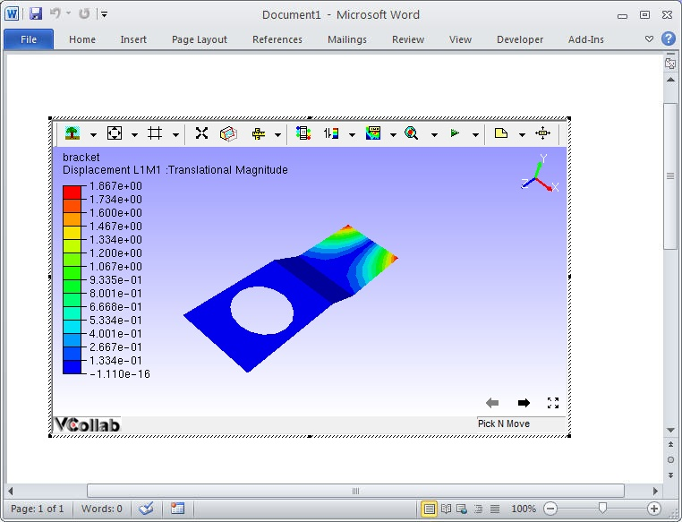
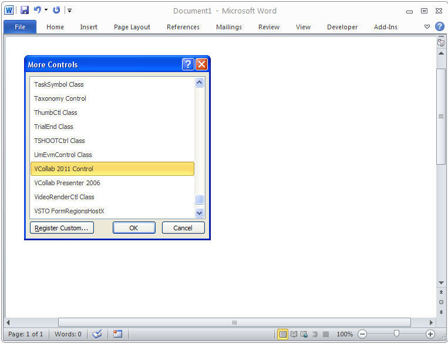
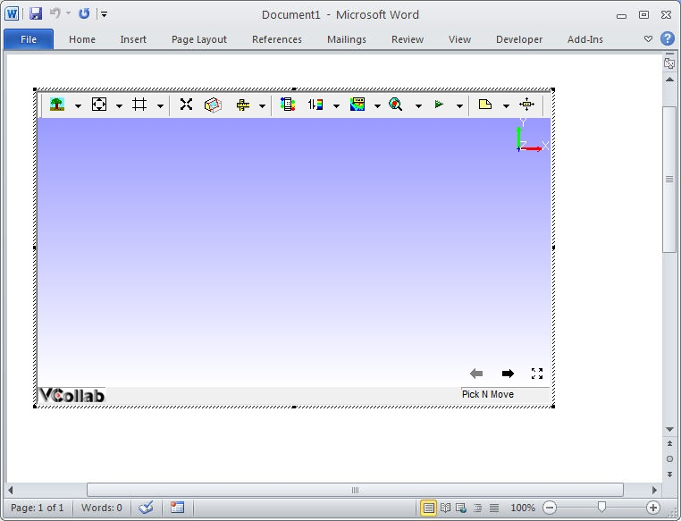

Word 2010
=========

This section describes how to embed VCollab Presenter into Microsoft
Word 2010

VCollab Presenter can be embedded into Word 2010 in two ways

-  Embed through Add-Ins tab
-  Embed through Developer tab

**How to embed Presenter through Add-Ins tab?**

-  Open Microsoft Word 2010
-  Click Add In tab and click VCollab Control (This is available only if
   VCollab suite is installed)

   If there is no Add-Ins tab, `click
   here <DeveloperNAddInsTab_2010.html>`__ to enable.

    |image0|

-  It pops up Open file dialog to load a CAx file.

    |image1|

-  Select a file name and click open.
-  Notice that VCollab Control is embedded as below.

    |image2|

-  Use right click options to view loaded model.

**How to embed VCollab Presenter through Developer tab?**

-  Open Microsoft Word 2010.
-  Click Developer tab.
-  Click Legacy Forms and Click More controls tool box as below

   If there is no Developer tab, `click
   here <DeveloperNAddInsTab_2010.html>`__ to enable.

    |image3|

-  Browse and select VCollab Control from the popped up dialog as below.

    |image4|

-  Click Ok and Notice that VCollab presenter is embedded.

-  Right Click and Select **VCollab Control Object \| Edit** in the drop
   down menu items as below.

    |image5|

-  Click Ok and notice that VCollab presenter is ready to load a model
   now.

    |image6|

..

.. |image1| image:: Images/PowePoint02.JPG

