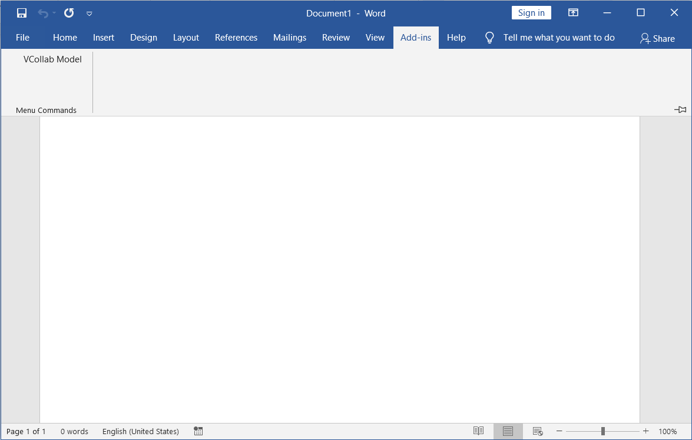
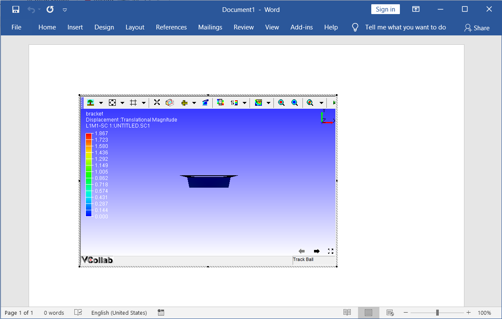
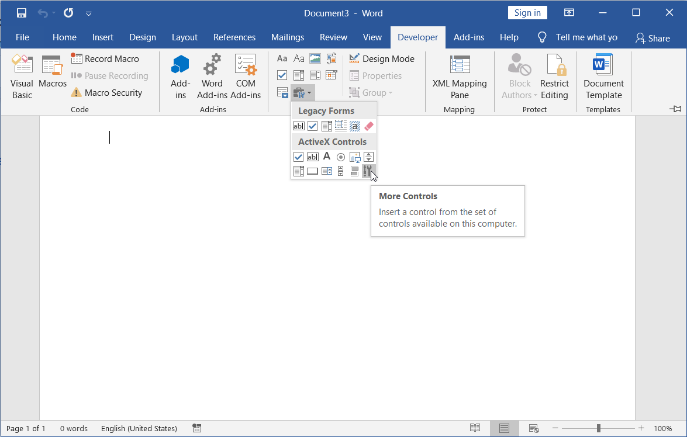
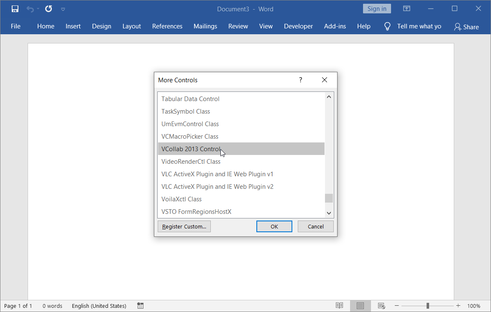
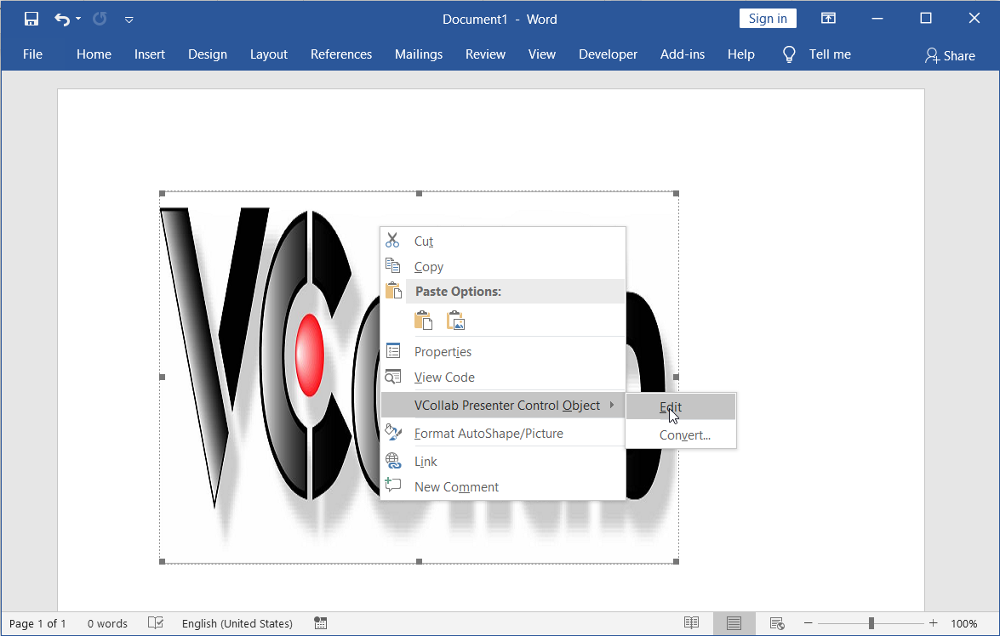
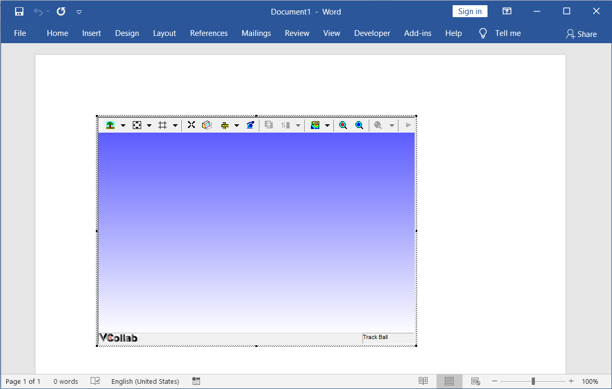

Embedding VCollab Presenter in Microsoft Word 2016
==================================================

VCollab Presenter control can be embedded into MS Word 2016 in two ways

-  Using the **Add-Ins** tab

-  Using the **Developer** tab.

**Steps to embed Presenter control using the Add-Ins tab**

-  Open Microsoft Word 2016

-  Go to **Add-Ins** tab and click **VCollab Model** (This is available
   only if VCollab suite is installed)

    If there is no Add-Ins tab, click here to know how to enable it.

    |image0|

-  Select the CAX file to load from the file open dialog box that opens
   up.

    |image1|

-  VCollab Control is thus embedded as below.

    |image2|

**Steps to embed VCollab Presenter control using Developer tab**

-  Open Microsoft Word 2016

-  Go to the **Developer** tab and click on the |image3|\ **More
   Controls** icon.
   If there is no Developer tab, click here to know how to enable
   it.

    |image4|

-  Browse and select **VCollab Control** from the **More Controls** list
   as shown below.

    |image5|

-  Click **OK** and observe that the VCollab presenter is embedded as
   shown below.

    |image6|

-  Click OK. The VCollab Presenter is ready to load a model now.

    |image7|

.. |image1| image:: Images/Open_cax_dialog.png

.. |image3| image:: Images/More_controls_powerpoint.png

