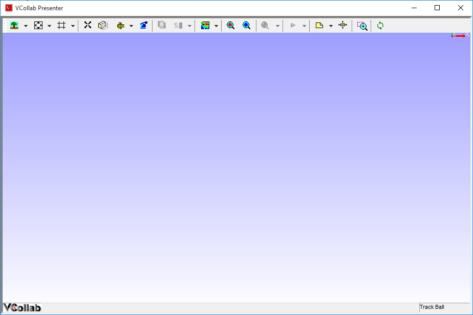
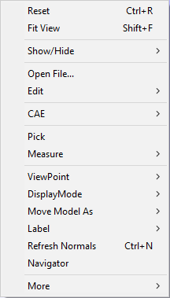

VCollab Presenter Layout
=========================

|image0|

**Layout of VCollab Presenter**

The key sections of the VCollab Presenter window are a Toolbar, Viewer
window and Context Menu.

**ToolBar:** Consists of various tools that perform key functions

**Viewer Window:** This window occupies 90 % area of Presenter Layout
and loads the object or the model which is opened

As the name suggests, users can see the simulations and the different
views of the object in the viewer window.

**Viewer Context Menu**

Right clicking in the Viewer Window opens up the Viewer Context menu.

This context menu contains various options available in VCollab
Presenter.

|image1|

