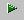

Quick Reference
================

**What is a CAX file?**

CAX file is the native proprietary file format of VCollab.

This file is currently generated using VMoveCAE utility from CAE result
files.

**How to generate a CAX file from CAE result and geometry files of
Native CAD/CAM/CAE softwares?**

Users can use VMoveCAE, a product of VCollab, to convert CAE result
files into CAX files.

Visit `http://www.vcollab.com <http://www.vcollab.com/>`__ to know
more about VMoveCAE.

**How to embed VCollab Presenter in Microsoft Powerpoint for
Presentation?**

-  Open Microsoft Powerpoint

-  Click **Control Toolbox**.

-  Select **VCollab Control**.

-  Draw a rectangle to indicate the size for the VCollab Control object.

-  Right click on the VCollab Control

-  Click **VCollab Control \| Edit** menu item to get the Presenter
   ready.

Click here to know in detail.

**How to Open a file in VCollab Presenter?**

-  Select **Open File** option from the Context menu.

-  Select the file to be opened from the file open dialog box.

-  The selected file will be loaded in the presenter.

**How to use Scene Tree?**

-  Select **Product Explorer** option from the context menu.

-  Select **Scene Tree** tab

-  This displays the scene tree window, which shows the hierarchy of
   groups, parts and transforms of the object in the viewer window.

-  Use the Product Tree to show / hide and highlight parts in the
   viewer.

**How to Load CAE Results?**

-  Click |image0| icon which opens up Results dialog box.

-  Select a **Result**

-  Select an instance from the **Instance** drop down list.

-  Select a derived type from **Derived type** drop down.

-  Notice that selected CAE results are applied concurrently in the
   viewer.

**How to activate CAE Animation?**

-  Click |image1| icon to open up dialog to manage animation.

**How to See Through a Model?**

-  Click **Display mode** from the context menu.

-  Select **Transparent** and notice that all parts of the model are
   transparent.

**How to Show/Hide parts?**

-  Select **Product Explorer** from the context menu.

-  Select **Scene Tree** tab.

-  Expand **Product tree**.

-  Uncheck a Part to hide and check again to show.

**How to create a viewpoint state?**

-  Select **Product Explorer** from the context menu.

-  Select **Viewpoints** tab

-  Right click on the panel

-  Click **Add Viewpoint**

-  The Add Path dialog box opens if there is no path available.

-  Enter a **name** for the path.

-  Click **Ok** which opens up **Add Viewpoint** dialog.

-  Enter a **name**.

-  Current scene view is stored as a viewpoint state.

-  Users can retrieve the viewpoint state at any time by just clicking
   on the viewpoint state name.

-  Users can store all observations as a number of viewpoint states.

**How to create a Viewpoint Animation?**

-  Open Viewpoints panel from Product Explorer.

-  Right click in the viewpoints panel.

-  Select **Animate Path from** the drop down menu.

-  Animation starts with the first viewpoint state and ends with the
   last one.

**How to change CAE legend colors?**

-  Click |image2| icon.

-  Select **Edit Legend** tab.

-  Select Number of colors in the **Palette** drop down list.

-  Click a specific color in the palette to change the individual color.

-  Select a color or define a custom color in the opened up color picker
   dialog.

-  Click Apply to apply the changes in the viewer.

**How to change the CAE Result range?**

-  Click |image3| icon. It pops up CAE Settings dialog.

-  Click **Update Legend** Tab.

-  Check both the check boxes provided for Min and Max.

-  Enter a new range in edit boxes provided for Min and Max.

-  Click **Update Current Instance** to apply the change in current
   frame alone.

-  Click **Update All Instances** to apply the change to all frames.

**How to find distance between two points in the model?**

-  Select Measure option from viewer context menu items.

-  Select Distance option.

-  Click a start point on the model.

-  Click an end point on the model.

-  The distance value is displayed in the right most corner of the
   viewer.

**How to pick and move a part?**

-  Select a part or group of parts.

-  Select **Pick** from the context menu.

-  Drag with the right mouse button to move the part.

-  Select **Pick** option again to drop the part

**How to set an exploded view?**

-  Select **Explode** option from the context menu.

-  Click **Explode** in the opened up dialog to set the exploded view of
   the model.

-  Click **Animate** check box to enable animation in exploding model

**How to probe CAE Result?**

-  Click the probe icon |image4| from the toolbar.

-  Click on the model and notice that the CAE value for the clicked node
   is displayed as a label in the viewer.

-  Click away from the model to hide displayed labels.

**How to move labels?**

-  Click icon |image5| from the toolbar.

-  Click on a label and move the mouse pointer to the new position.

-  Click on the new position.

.. |image0| image:: Images/CAE_result_icon.jpg

.. |image2| image:: Images/CAE_icon.jpg

.. |image3| image:: Images/CAE_icon.jpg

.. |image5| image:: Images/Move_label_icon.jpg

