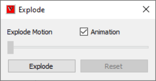
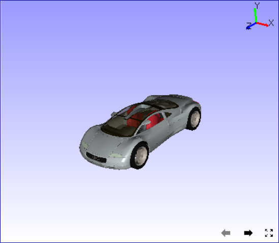
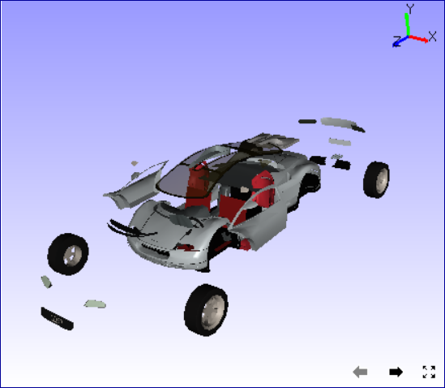

Explode
=========

This command helps user to understand the detailed assembly of        
product or model. It improves users knowledge on product model.       
                                                                          
**Explode panel**
                                            
                                                                          
       |image1|                                                           
                                                                          
       ============== ================================================    
       Animation      Animates the Explode.                               
       Explode Motion Slider indicates the position in the simulation.    
       Explode        Explodes the model in viewer                        
       Reset          Resets the model to initial.                        
       ============== ================================================    
                                                                          
**How to explode model?**

                                                                         
    -  Click 'Tools \| Explode'.                                          
    -  It pops up Explode dialog.  

       |image2|
                                                                  
    -  Click 'Animation' option if user wants to view explosion with      
       animation.                                                         
    -  Click 'Explode' button and view exploding part with animation      
    -  User can apply further explodes until he would get a clear         
       visibility of a specific part.                                     
                                                                          
 Before Explode

       |image3|                                                         
                                                            
After Explode   

       |image4|                                                         
                                                                          
                                                                          
 

