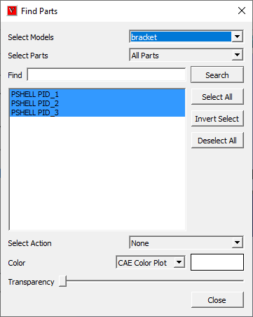

Find Parts
=============

This option helps user to select the part or group of parts by name. User can apply few commands only on the selected parts in the list box. 
                                                                          
**Find Parts Panel**
                                          
                                                                          
    |image1|                                                           
                                                                          
    ============================================================ ==========================================================================                                                                          

    *Select Models*                                               Allows user to choose any one loaded model or 'All Models' option.

    *Select Parts*                                                Allows user to list all parts, visible parts, selected parts or selected visible parts as a first filter.

    *Find*                                                        Allows user to enter the text to be used for filtering.

    *Search*                                                      Search and Lists the filterd parts..

    *Select All*                                                  Selects all parts in the list

    *Deselect All*                                                Deselects all parts in the list

    *Invert Selection*                                            Inverts the selection in the list.

    *Select Action*                                               Allows user to select and apply any action from the list.

    *Color*                                                       Allows user to select and set material color or contour color.

    *Transparency*                                                Allows user to set transparency level for selected parts.

    **Close**                                                     Closes the dialog.

    ============================================================ ==========================================================================
                 
**List of Actions**
 - Highlight
 - Hide
 - Hide Others
 - Shaded
 - Shaded Mesh
 - Hidden Line
 - Wire Frame
 - Transparent
 - Points
 - Delete
 - Show
 - Contour Color / Material Color
 - Transparency Level
                 
**How to find and select the parts by name?**                         
                                                                          
-  Load a sample cax file               
                                                                     
-  Fileter parts in viewer using mouse selection and context menu if possible                              
                                                                     
-  Click 'Edit | Find Parts...' menu item.                
                                                                     
-  It pops up the 'Find Parts' panel.                                    
                                                                     
   |image2|                                                           
                                                                     
-  It lists all the parts of all models by default.
                                                                     
-  Select a single model if required.                                
                                                                     
-  Select Visible Parts or other options if required.               
                                                                     
-  It lists filtered part names.                                       

-  Enter a search text in the box to filter further.

-  Click 'Search' button.

-  It lists all the part names which contains the text string.

-  User can use two wild card character *(multiple characters) and  ?(single character).

-  User can clear the text and search for a new text for further filtering in the list.

-  Each search filters the available list.

-  To retain initial list of parts, search empty text or *. Or 'Select Parts' option can be used.

-  Filter further in the list by manual select or unselect or invert select options.

-  Select any action from the drop down list to be applied immediatly in the viewer.

-  Select CAE Color Plot/ Material Color.  Color Window next to drop down can be used only for Material Color.

-  Transparency slider can be used to set transparency level to the filterd parts.

