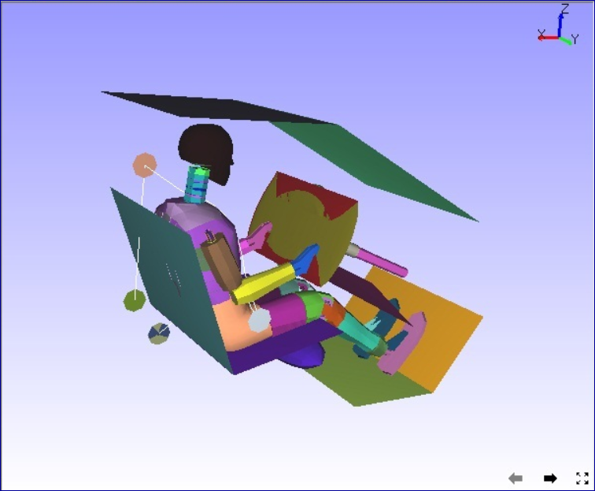

Fit View
---------

This option fits the entire model into viewer.                        
                                                                     
After few or more transformations, model will be some where in the    
scene so that user could not view completely. This command helps to   
pull the entire scene into the viewer quickly.                        
                                                                          
                                                  
**Clipped Model**                                                  
                                                
     |image1|                                                
                                                                                                                                                                 
**Fit View Model**                                                 
                                              
     |image2|                                                   
                                                
.. |image1| image:: images/airbag_moved.png

