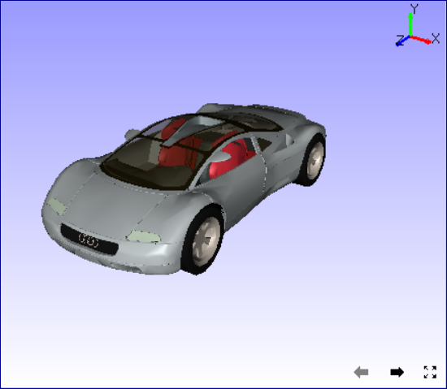
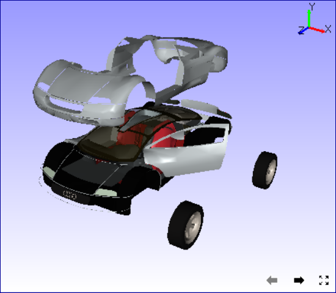

Pick
======

This command helps user to interact with each individual part alone   
in assembly of parts or a product.                                    
                                                                          
    User can,                                                             
                                                                          
    -  Pick a part(s)                                                       
    -  transform the picked part(s),                                      
                                                                          
    Once a part is picked by this command, mouse mode transformation is   
    made applicable to the selected parts until 'Pick' is disabled.    
    Once 'Pick' option is disabled, mouse mode transformation is made     
    available back to camera (viewer).                                                   
                                                                          
**How to pick and drop a part?**
                               
                                                                          
    -  Select the parts required to transform.
    -  Click 'Pick' icon in the Tools toolbar.                           
    -  Do transformations using mouse pan, zoom and rotation.                   
    -  Notice that all transformations are applied to selected parts only.  
    -  Click 'Pick' again to disable picking.                                     
    -  Do pan, zoom and rotation through mouse, and notice that transformations are applied to scene/model, not specific to any part.                             
                                                                          
                                                                  
       ================= =================                                     
       Loaded Model       Transformed Parts                                     
       |image1|           |image2|                                              
       ================= =================                                     
 

