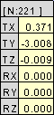
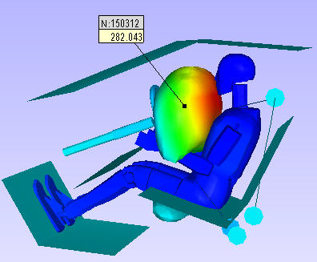
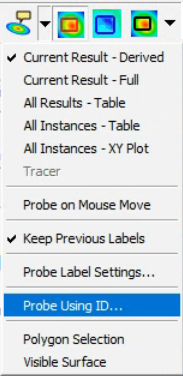
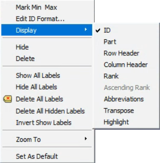
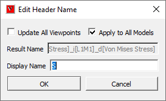
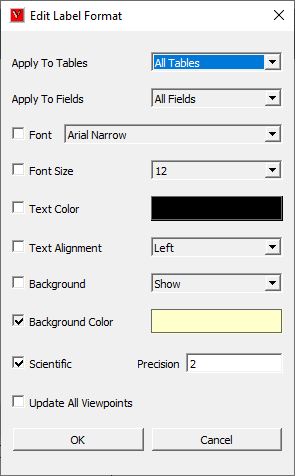

Probe
=======

This command displays CAE result values in the viewer as labels. User 
could observe CAE result value for specific node or element.          
                                                                          
**Probe types**
                                                                                                                       
                                                                          
    -  *Current Result - Derived*                                         
       This displays value of current derived result at probed ID.        
       Enable Probe and Left mouse button click on the model. 

       |image1|  

    -  *Current Result - Full*                                            
       This displays base components of selected result.                  
       X,Y,Z components for *vector* result.                              
       Translational (TX, TY, TZ) and Rotational (RX, RY, RZ) values for  
       *six degrees of freedom* result.                                   
       XX,YY,ZZ, XY,YZ,XZ components for *tensor* result in a matrix      
       form. 

       |image2|

    -  *All Results - Table*                                              
       This displays all result values of the probed ID.                  
       short cut - Shift + Mouse left button click. 

       |image3|           

    -  *All Instances - Table*                                            
       This displays all instance values of current result for t the      
       probed ID.                                                         
       Short cut  - Shift + Mouse left button click. 

       |image4|

    -  *All Instances - XY Plot* This displays XYPlot curve which         
       describes  instances vs CAE result values.                         
       Short cut - Ctrl + Mouse left button click. 

       |image5|               

    -  *Tracer* This displays path of a node traced in transient          
       animation                                                          
                                                                          
**Note:**                                                             
                                                                          
    -  User can probe only for current dataset if more than one dataset   
       exists.                                                            
                                                                          
**Known Issue:**                                                      
                                                                          
    -  For small geometry or model, user may have problem in probing,     
       VCollab provides a remedy for that problem. User is advised to     
       scale the geometry or model and then start probing. Go down to     
       read how to scale geometry or model.                               
                                                                          
**How to probe CAE results?**
                                   
                                                                          
    -  Click Probe icon |image6| in the tool bar.                         
    -  Click the down arrow next to the probe icon.                       
    -  It drops down the list of probe types.                             
    -  Select a type.                                                     
    -  Click on a node to probe current CAE result for the same node.     
    -  Notice that CAE value with nodal number is displayed as label in   
       viewer.                                                            
                                                                          
    Note:                                                                 
                                                                          
    -  User can show / hide the nodal/element id in probed labels using   
       table context menu item 'ID'.                                      
                                                                          
    **Current Result - Derived**                                          
                                                                          
       |image7|                                                           
                                                                          
    **Current Result - Full**                                             
                                                                          
       |image8|                                                           
                                                                          
    **All Results - Table**                                               
                                                                          
       |image9|                                                           
                                                                          
    **All Instances-Table**                                               
                                                                          
       |image10|                                                          
                                                                          
    **All Instances - XYPlot**                                            
                                                                          
       |image11|                                                          
                                                                          
    **Tracer**                                                            
                                                                          
       |image12|                                                          
                                                                          
**How to probe using nodal or elemental ID?**

    -  Click Probe toolbar icon drop down menu.   

       |image13|

    -  Select 'Probe Using ID...' option.                                 
    -  It pops up a dialog for user to enter Node/ Elemental ID.          
    -  'Elemental ID' option should be checked to enter elemental ID.

       |image14|     

    -  Enter an elemental or a node ID.                                   
    -  Click 'Probe' button.                                              
    -  ID will be probed and label will be displayed in viewer, only if   
       ID is valid one.                                                   
    -  User can enter multiple IDs separated by comma's. (i.e.,           
       "24,78,45,...").                                                   
                                                                          
**All Result Table Context Menu**
                          
                                                                          
    All result table is split into three regions for context menu.        
                                                                          
    #. ID Header                                                          
                                                                          
       *This is table header. It contains node or element ID. In case of  
       merging more than one models, this header contains more than one   
       ID and each ID refers to one column in value region.*              
                                                                          
    #. Row Header                                                         
                                                                          
       *This refers to the model name of the column data. It is useful    
       when comparing multiple models.*                                   
                                                                          
    #. *Column Header*                                                    
                                                                          
       *This refers to list of result names. It contains only             
       abbreviation of results. Here is D is for displacement. User can   
       view the abbreviation table if necessary.*                         
                                                                          
    #. Value Region                                                       
                                                                          
       *This is set of cells and its values corresponds to its column and 
       row header.*                                                       
                                                                          
       |image15|                                                          
                                                                          
**Table Header Context Menu**
                                 
                                                                          
       |image16|                                                          
                                                                          
**Column or Row header Context Menu**
                          
                                                                          
       |image17|                                                          
                                                                          
**Value Region Context Menu**
                                 
                                                                  
                                                                          
       |image18|                                                          
                                                                          
=========================== ==================================================================================================
**Edit Name**                Allows user to edit Name of the header.

**Edit Format**              Allows user to edit table text and border styles.

**Hide**                     Hides the probe tables. User can retrieve labels visibility using Show All labels item in the label toolbar drop down.

**Delete**                   Delete the picked label.

**ID**                       Shows  or hides table header.

**Part**                     Displays part name header

**Row Header**               Shows or hides row header.

**Column Header**            Shows or hides column header.

**Zoom To**                   Orients the view and zooms in to the label attached position for a better visualization. There are 4 levels of zooms supported. Level 0 is closest to the node or element.

**Add Row**                  Adds a new row at the end.

**Add Column**               Adds a new column at the end.

**Insert Row**               Inserts a new row at the mouse cursor position.

**Insert Column**            nserts a new column at the mouse cursor position.

**Delete Row**               Deletes row.

**Delete Column**            Deletes column.

**Set As Default**           Sets current label settings as default to all labels.

**Rank**                     Ranks current visible labels and displays rank based on current derived result values.

**Ascending Rank**           Rank option. Ascending if option is checked, descending otherwise.

**Abbreviations**            Displays abbreviation and acronym for results header.

**Transpose**                Transposes label matrix display.

**Highlight**                Highlights the labels based on current result value range, set by user.

=========================== ==================================================================================================
                                                                          
*Zoom To* option helps to zoom in the nodal vertex region in four     
levels for better visualization:                                      
                                                                          
    -  *Level 0* focuses the element associated with the nodal vertex.    
    -  *Level 1* focuses nodal vertex with 1/10th of part bounding        
       radius.                                                            
    -  *Level 2* focuses nodal vertex with 1/4th of part bounding radius. 
    -  *Level 3* focuses nodal vertex with part bounding radius.          
                                                                          
**How to scale geometry or parts?**
                            
                                                                          
    -  Click 'Edit \| Product Explorer', which displays the product tree. 
    -  Click the group node, not leaf node.                               
    -  Right mouse click on the node drops down a context menu.           
    -  Select 'Transform' option.                                         
    -  Check 'Scale' option.                                              
    -  Enter the scale factors for each coordinate axis.                  
    -  Now the model is scaled and is ready for probing.                  
                                                                          
**How to edit or format table?**
                                         
                                                                          
    -  Double click on the table using left mouse button.                 
    -  It pops table context menu                                         
    -  Click Edit Name to change the header or result name.  

       |image19|

    -  Check 'Update Viewpoints' option to update all viewpoint tables.   
    -  Enter a name and click OK button.                                  
    -  Click Edit Font to format the table.   
                                
       |image20|                                                          
                                                                          
======================= ===============================================================                                                                          
Apply to Tables           Allows user to set either current table or all tables

Apply to Fields           Allows user to set all fields or current field or current column.

Font                      Allows user to change a font and its size

Font Size                 Allows user to change a font size.

Text Color                Allows user to change text color

Background                Allows user to show/hide background

Background Color          Allows user to enable/disable background and to select a color.

Border                    Allows user to show or hide border.

Border Color              Allows user to change border color.

Scientific                Allows user to set the numerical format for value cells.

Precision                 Allows user to set the decimal places for value cells.   

Update All ViewPoints     Allows user to apply and update the modifications to viewpoints too.
======================= ===============================================================  

    -  Only the checked options are applicable for modifications.         
    -  Make necessary changes and click OK.                               
    -  User has to select 'All Tables' and 'All Fields' option to apply   
       the modifications to all viewpoints.                               
    -  User can apply the modified value to all fields or the column      
       selected or current cell or field.                                 
    -  Click 'OK' to apply all modifications.                             

