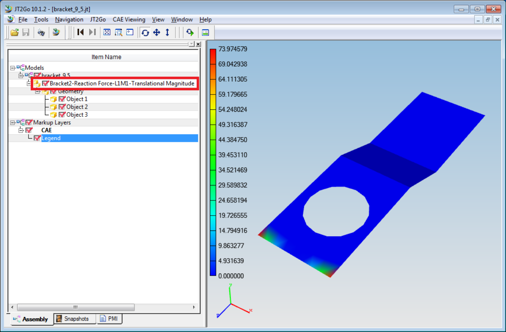

Save As
========                                                 
                                                                          
VCollab supports saving current scene data into following 3D file     
formats,                                                              
                                                                          
    #. CAX (\*.cax)                                                        
    #. 3DPDF (\*.pdf) and                                                  
    #. Jt (\*.jt)                                                          
                                                                          
Note:                                                                 
                                                                          
   ====== ==================================================          
   Format  Limitation                                                  
   CAX     Saving of adaptive shared meshes is not supported.          
   3DPDF   Color is not supported for point set.                       
   JT      Points are not supported                                    
   ====== ==================================================          
                                                                          
**Saving into CAX**
                                          
                                                                          
VCollab saves current available CAX data into another CAX file.    
                                                                          
VCollab Pro **Saves** the following data in addition to existing   
CAX data,                                                          
                                                                          
      -  User created viewpoints,                                        
      -  Auto generated hotspot viewpoints,                              
      -  Background image data, saved in viewpoints                      
                                                                          
VCollab Pro **Does Not Save** the following data into new CAX,     
                                                                          
      -  Deleted parts,                                                  
      -  Deleted results/instances, 

                                                                          
**How to save as a new CAX file?**                                              
                                                                          
       -  Click SaveAs option in the File toolbar.                        
                                                                          
          |image1|                                                        
                                                                          
       -  It pops up 'Save As' file dialog box.                           
                                                                          
       -  Enter a new file name. Click 'Save'.                            
                                                                          
       -  If the cax model has adaptive shared meshes, an error message   
          will pop up.                                                    
                                                                          
       -  On successful saving, following message will appear.            
                                                                          
       -  On saving failure, following message will appear.               
                                                                          
       -  Click 'OK' to complete the process.                             
                                                                          
**Saving into 3DPDF**                                          
                                                                          
VCollab writes the following data of current scene,                
                                                                          
       -  Mesh / Geometry,                                                
       -  Material Color / Vertex Contour Color,                          
       -  CAE Contour Legend,                                             
       -  Frame Information,                                              
       -  Probed Labels (Current Result - Derived type is only supported. 
          Other types are ignored)                                        
                                                                          
The Legend, Result and Frame Information are shown in 3DPDF for    
merged models as below,                                            
                                                                          
          |image2|                                                           
                                                                          
      -  The maximum number of legends allowed is 2 while exporting into 
         3DPDF. If more than 2 CAE models are merged, then it's          
         recommended to select 'Combined' or 'Active Model' in 'Palette' 
         option of 'CAE Results' dialog.                                 
                                                                          
      -  While saving a large units file or a very small Nano units      
         file, VCollab prompts for a scaling down or up the units with   
         an auto scale factor value           

           |image3|                           
                                                                          
      -  User can modify the scale factor. Based on the scale factor,    
         VCollab converts possible geometries into pdf.                  
                                                                          
      -  If 'Cancel' button is clicked, no scaling will be applied to    
         geometry.                                                       
                                                                          
**Note**

Adobe Reader XI or above is required to view these 3DPDF files.  
                                                                          
**Saving into JT**                                             
                                                                          
VCollab exports JT 9.5 files and writes 3D model with current    
derived result color plot into JT file.                          
In case of CAD files, VCollab writes the current scene into JT.  
                                                                          
The Result Information is added in the Product Tree of JT models   
as shown below,       

   |image4|
                                                                          
The number of legends allowed is 1 while exporting into JT. If     
more than 1 CAE models are merged, then it's recommended to select 
'Combined' or 'Active Model' in 'Palette' option of 'CAE Results'  
dialog.                                                            
                                                                          
**Note:**      

JT2Go 10.1.2 or above is required to view these JT files         
 

.. |image1| image:: images/File_Menu_Items.png

   
