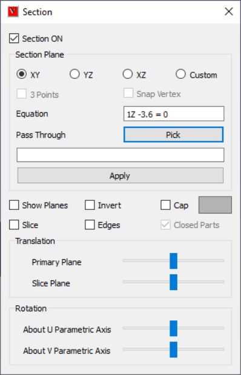
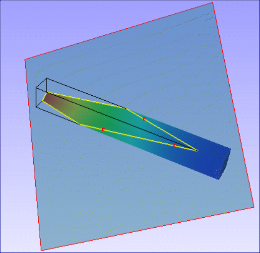
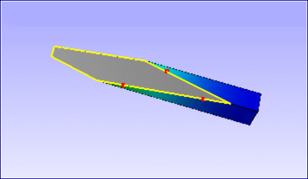

Section
========
    
This option helps user to make section on the model and view the      
sectional part.                                                       
                                                                         
**Section Panel**

      |image1|

============================== ==============================================================================
Section Plane                   Options for quick primary planes.

XY                              Defines plane parallel to XY Plane

YZ                              Defines plane parallel to YZ Plane

XZ                              Defines plane parallel to XZ Plane

Custom                          Custom plane mode, which displays options to users to define plane.

3 Points                        Enables mouse mode to select 3 points to define a custom plane.

Snap Vertex                     Allows user to select a nearest vertex to mouse cursor

Keep Feature Edges              Allows user to exclude feature edges from clipping.

Equation                        Displays cut section plane equation.

Pick (Pass Through)             User can pick a point on a model and translate the plane to pass through the point without changine orientation of the plane. User can enter a point coordinates in the text box or pick a point in the model.

Apply                           Applies the modifications to the section plane.

Show Planes                     Shows section planes.

Invert                          Toggles in clipping either side of  cut section of the plane

Slice                           Allows user to create a secondary section plane parallel to primary, which clips the model in other side.

Edges                           Displays intersection lines of model with the section plane.

Cap                             This option helps to fill the hollow, closed region to appear as solid. In general capping works for solid parts only (set closed part option on). If multiple open parts form a closed part then also capping will work (set closed part option off). When parts are open (holes are present in body) capping may not work properly. Section capping is not supported in OPENGL mode (OpenGL version < 1.2);

Closed Parts                    This option depends on 'Cap' option. In general capping works for solid parts only. If this option is on, closed part will be capped. If this option is off, capping is attempted for open parts also. But result may not be valid in some cases.

Translation Slider Control      Controls the translation of  cut section planes.

Rotation - U axis               Rotates the prime and secondary planes about U parametric axis.

Rotation - V axis               Rotates the prime and secondary planes about V parametric axis.

============================== ==============================================================================

.. Note::                                                                 
                                                                          
   -  Section CAP may not work in some of the display modes.             
   -  User can use section cap in shaded mode only.                      
   -  Picking / Probing will not work properly in Section CAP mode.       
                                                                          
**How to cut or clip model and view the cut section?**
        
                                                                          
    -  Load model.                                                        
    -  Click 'Cut Section' icon in the Tools toolbar.                     
    -  It pops up 'Section' dialog.                                       
    -  To view cut sections of prime planes, click the corresponding      
       options provided for XY, YZ & XZ planes.                           
    -  Click 'Show Planes' option to view semi transparent section plane. 
    -  Click 'Edges' option to view intersecting edges on the plane.      
    -  Click 'Invert' option to change clipping side.                     
    -  Click 'Slice' option to add cut section plane parallel and offset  
       to the existing one.                                               
                                                                          
**How to define a custom cutting section or clipping plane?**
 
                                                                          
    -  Click 'Custom' option in section manager panel                     
    -  Click '3 Points' option.                                           
    -  Click 3 points anywhere in the model.                              
    -  User can use Vertex Info option to know the coordinate values of   
       point before clicking.                                             
    -  Cut section plane is defined by user clicked three points.         
    -  User points are highlighted in red color.                          
    -  Use 'Snap Vertex'  to select a nearest vertex.  

|image2|                       
                                                                          
**How to translate or rotate the cutting section plane?**
                                                                          
    -  Use corresponding control sliders to rotate section planes about U 
       and V parametric axes.                                             
    -  Use translation slider control to translate prime plane along      
       plane normal axis.                                                 
                                                                          
**How to know section plane location?**
                                                                                                
    -  Equation displays current cut-section equation dynamically.        
                                                                          
**What are cap and closed parts options?**
                                                                                                
    -  VCollab extracts skin of the solid parts for better performance.   
    -  This creates hollow in the model when section clip is applied.     
    -  Cap option is used to make hollow appearance into solid by capping 
       hollow, closed regions.                                            
    -  Cap option will cap all hollow closed regions independent of       
       whether the part or model is solid or hollow.                      
    -  To avoid it, Closed Parts option is used  to cap only for solid    
       components. 

|image3|                                                              
                                                                                                                                                   

