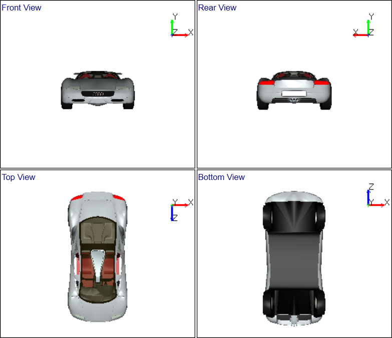

Standard Views
===============

This option allows user to change between following standard views.   
                                                                          
    -  Front View,                                                        
    -  Rear View,                                                         
    -  Top View,                                                          
    -  Bottom View,                                                       
    -  Left View,                                                         
    -  Right View,                                                        
    -  Iso metric view.                                                   
                                                                          
Note: 

Standard views are based on user selected Coordinate System.        
Following views are based on default coordinate system XY.    

 |image1|
 |image2|
                                                                          

.. |image2| image:: images/Audi_image2.png

