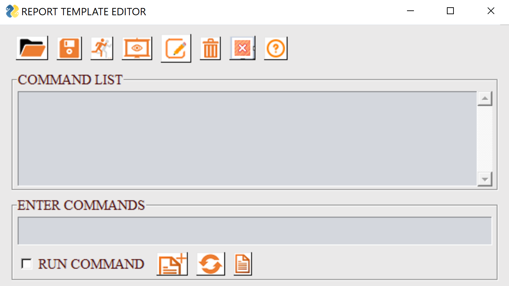

***************************
Report Template Editor GUI
***************************

To open the GUI, select the submenu *Report Template Edit* from *PY_Tools* main menu of VCollab Pro or ProX.

GUI
====

- **COMMAND LIST**: Current list of commands in the template. User can Add, Modify, Run or Save these commands.

- **ENTER COMMANDS**: User can define a new command in this text field. This command can be added to the command list.

- **ARGUMENT LIST**: When user enter a valid command, a list of parameters that can be specified for the command will be displayed in this text box.

Menu 
=====

.. |save| image:: media/icons8-save-64.png

.. |editcmdn| image:: media/editiconN.png

.. |delete| image:: media/icons8-trash-64.png

.. |help| image:: media/Help.png
.. |addcmd| image:: media/icons8-addlist1-64.png

- |open| **File Open**: Select a report template file (A file selection dialog will popup). The commands from this file will be added to the *Command List*. Use *Run Command* option in the popup dialog to create the report.
- |save| **Save File**: Save all commands defined in  the *Command List* as a report template file.
- |runcmd| **Run Commands**: Run all commands in the *Command List*.
- |applytovp| **Apply to VP**: Run all commands for each selected ViewPoints and update ViewPoint. A dialog will popup to select ViewPoints.
- |editcmdn| |editcmdy| **Edit Commands**: This is a toggle button. When green, user can directly edit the commands in the *Command List*.
- |delete| **Clear All**: Clear all commands from the *Command List*.
- |exit| **Exit**: Close this dialog and exit.
- |help| **Help**: Show this help message in a browser tab.
- |addcmd| **Add Command**: Click the button(icon) to add the specified command from *Enter Commands* field.

.. note:: If *Run Command* checkbox is selected, this command will also be executed.

- |reset| **Reset**: Clear '*Enter Commands*' text field.
- |cmdlist| **Command List**: Select a command from the list of all commands in a tree view (*Select Commands* Dialog).

Example
========
Here is a sample command template file::
    
    VIEWPATH,CAE Report#=> Set Viewpath for the report
    IMAGE_VP,N,VC_ColorBG.png#=> Set image background for all viewpoints
    SET_Font,NOTE,12,Arial Bold,92,92,92,255,255,240,0 #=> Set font for all 2D text labels
    PARTS_SHOW,ALL#=> Display all parts
    CAMERA_VIEW, 1.0, 1.0, 1.0,0.0,0.0,1.0#=> (direction dx,dy,dz , up vector ux,uy,uz)
    FIT_VIEW, 0.1#=> Fit model and zoom out
    #Set display parameters for next viewpoint
    DEL_ENTITY,XY,LABEL,SYMBOL,PROBE#=>Delete all existing label and xyplotdisplays
    SET_DISPLAY,COLOR=Y,LEGEND=Y,DEFORM=Y,DMODE=0#=> Set model display settings for next viewpoint
    #-Create specific views
    MODAL_VPS,5,Y#=> If Modal data create Modal views else create hotspot views for each result
    #Save Report
    CUR_FOLDER,CAX#=> Set current folder to CAX file folder. Used for next Save commands
    #SAVE, CAX#=> Save CAX file
    #SAVE,HTML#==> Save html file
    EXIT#=> Quit command processing

.. note:: Commands will be excecuted line by line. Any text after '#' is a comment.

