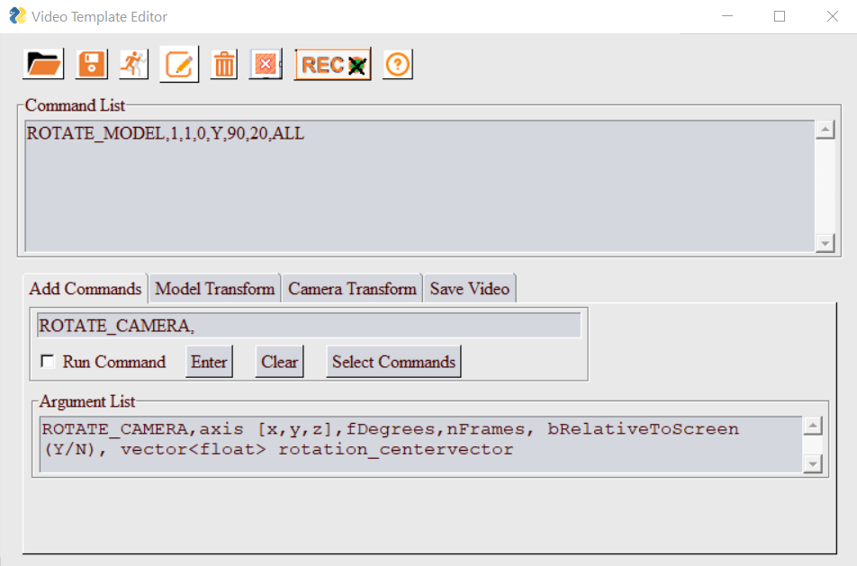
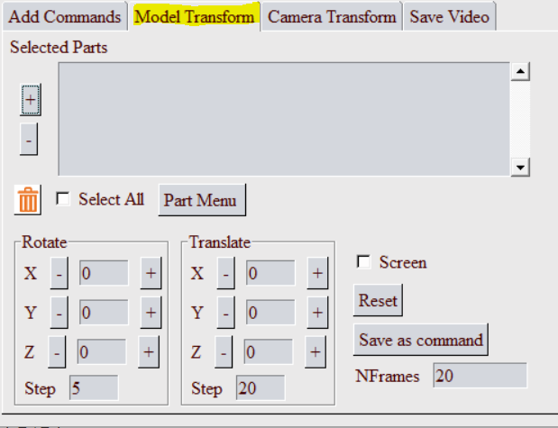
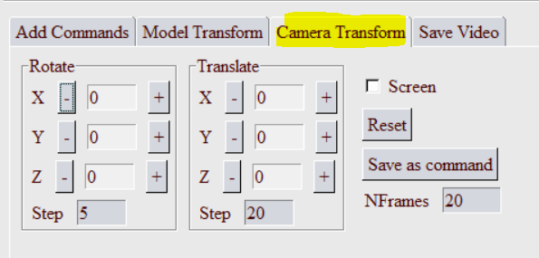
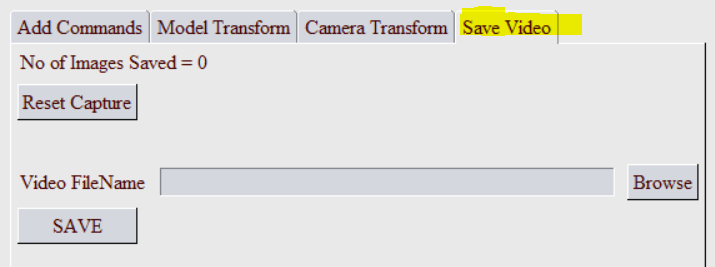

**************************
Video Template Editor GUI
**************************

To open the GUI, select the submenu *Video Maker* from *PY_Tools* main menu of VCollab Pro or ProX.

..
    .. image:: media/VideoMaker_PyTools.png

Command List
=============

Current list of commands in the template. User can Add, Modify, Run or Save these commands.

Menu 
=====

.. |open| image:: media/icons8-open-64.png

.. |runcmd| image:: media/icons8-run-64.png

.. |editcmdy| image:: media/editiconY.png
.. |delete| image:: media/icons8-trash-64.png

.. |exit| image:: media/icons8-closewin.png

- |open| **File Open**: Select a video template file (A file selection dialog will popup). The commands from this file will be added to the *Command List*.
- |save| **Save File**: Save all commands defined in  the *Command List* as a video template file.
- |runcmd| **Run Commands**: Run all commands in the *Command List*.
- |editcmdn| |editcmdy| **Edit Commands**: This is a toggle button. When green, user can directly edit the commands in the *Command List*.
- |delete| **Clear All**: Clear all commands from the *Command List*.
- |recon| |recoff| **Record Images**: Toggle button to set image capturing ON/OFF. When this is in ON mode, Images will be captured into a temporary folder. Save command will create video from these images.
- |exit| **Exit**: Close this dialog and exit.
- |help| **Help**: Show this help message in a browser tab.

Add Commands 
=============

User can define a new command in this text filed. This command can be added to the *Command list*.

- **Argument List**: When user enters a valid command, a list of parameters that can be specified for the command will be displayed in this text box.
- **Run Command**: If this checkbox is *ON*, command will be run before entering into the *Command List*.
- **Enter**: Click this button to add the command in the text filed to the *Command List*.
- **Clear**: Click this button to clear current command in the text field.
- **Select Commands**: Click this button to select a command from the Tree View (as shown below).

When a new command is selected/edited in text filed, corresponding argument list will be displayed in the *Argument List* text box.

Model Transform
================

User can define a set of Model/Part transformation (rotate and move) commands using GUI.

- Select few parts from screen and use **+/-** buttons to rotate or translate the selected parts. 
- Selected parts will be displayed in the **Selected Parts** list box.
- Use **Part Menu** to select any parts from a listbox. 
- **Screen** toggle can be used to define axis in Screen/Camera cordinate system. 
- **Save as Command** will save all the model movement commands.
- **NFrames** will be used as number of frames.

Camera Transform
=================

User can define a set of Camera transform commands (rotate and move) in this GUI.

- Use **+/-** buttons to rotate or translate the camera. 
- **Screen** toggle can be used to define axis in Screen/Camera cordinate system. 
- **Save as Command** will save all the camera movement commands.
- **NFrames** will be used as number of frames.    

Save Video
===========

User can Save a video file from this tab.

- When the **Record Images** button is *ON*, the recorded images will be saved in a temperory folder and the **Number of Images Saved** will be updated.
- **Reset Capture** will reset the captured images.
- User can **Browse** to the folder and set the video file name. Currently supported formats are: *MP4*, *GIF*, *AVI*, *FLV*, and *WMV*.
- **Save** will stitch all the captured images together and save them as the video file.

Example
========
Here is a sample command template file::
    
    #-- VPANIM_PARAMS,nFrame_VP2VP,nImgsPerView=1,iSectionAnimFrames,iExplodeAnimFrames
    VPANIM_PARAMS,25,2,25,25
    #-- VPANIM_CAEPARAMS,bCAEAnim(Y/N),nCylesPerView,nFramesPerCyle,nImgsPerCAEFrame
    VPANIM_CAEPARAMS,Y,4,24,1
    #-- Select ViewPoint 1
    APPLY_VP,1
    VP2VP_ANIM,1,3
    MOVE_CAMERA,300,100,0,30,Y
    ROTATE_CAMERA,1,0,0,90,30,Y
    SAVE_VIDEO,Test123.mp4,0
    EXIT

.. note:: Commands will be excecuted line by line. Any text after '#' is a comment.

