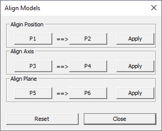
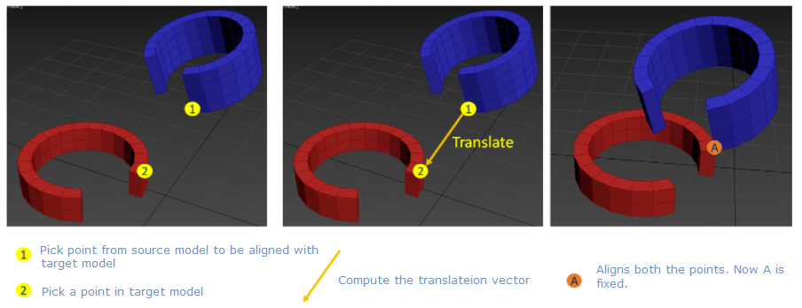
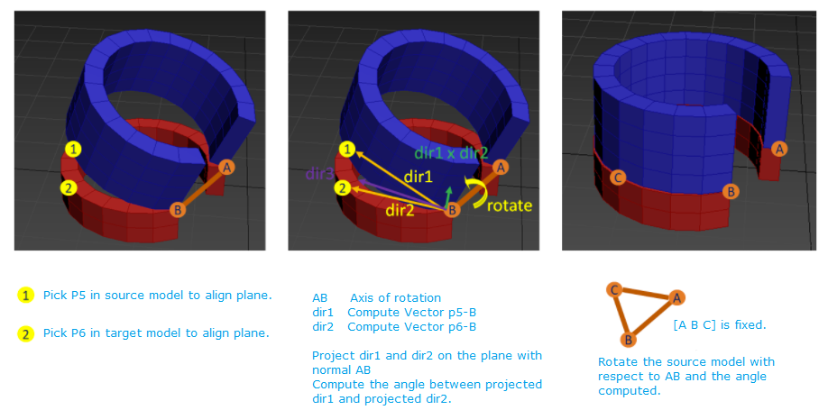

Align Models
============
This section explains how merged models can be aligned and assembled. User can do the following operations.
- Align points
- Align axis using a line segment.
- Align faces.

.. note::
    This option is enabled only if one or more models are merged.
    
Align Models Panel
------------------

 |image1|

 +------------------+----------------------------------------------------+
 | P1               | Point 1 in Model 1                                 |
 +------------------+----------------------------------------------------+
 | P2               | Point 2 in Model 2                                 |
 +------------------+----------------------------------------------------+
 | Apply (Position) | Aligns P1  to P2                                   |
 +------------------+----------------------------------------------------+
 | P3               | Point 3 in Model 1                                 |
 +------------------+----------------------------------------------------+
 | P4               | Point 4 in Model 2                                 |
 +------------------+----------------------------------------------------+
 | Apply (Axis)     | Aligns P3-P1 line wth P4-P2                        |
 +------------------+----------------------------------------------------+
 | P5               | Point 5 in Model 1                                 |
 +------------------+----------------------------------------------------+
 | P6               | Point 6 in Model 2                                 |
 +------------------+----------------------------------------------------+
 | Apply (Plane)    | Aligns [P5-P3-P1] plane with [P6-P4-P2]            |
 +------------------+----------------------------------------------------+
 | Reset            | Resets the transformation to previous state        |
 +------------------+----------------------------------------------------+
 | Close            | Closes dialogbox                                   |
 +------------------+----------------------------------------------------+
 
Steps to align models
---------------------
#. Load and merge two or more models
#. Click *Tools | Align Models | 3 Points...* option
#. It pops up Align Models panel
#. Click P1 button which enables user to pick a point on model
#. Pick a point from a model. This becomes the **source** model. So P3 and P5 should be picked from this same model.
#. P2 is checked or enabeld automatically once P1 is picked. 
#. User can pick P2 from any model other than source model. This becomes the **target model**. So P4 and P6 should be picked from the same target model.
#. Click *Apply (Position)*, which aligns P1 to P2

   |image2|
   
#. Click P3 from source model and P4 from target model.
#. Click *Apply (Axis)*, which aligns the lines P1-P3 to the line P2-P4.

   |image3|
   
#. Click P5 from source model and P6 from target model.
#. Click *Apply (Plane)*, which aligns the planes [P1-P3-P5] to [P2-P4-P6].

   |image4|
   
#. Click *Reset* if required, which resets the previous states of models.
#. Click *Close* to close the panel.
 
.. note::
   User should make sure that P1,P2&P3 are picked from same source model and P2,P4 & P6 are picked from target model.
    
    

.. |image3| image:: JPGImages/AlignModel_Axis.png  

