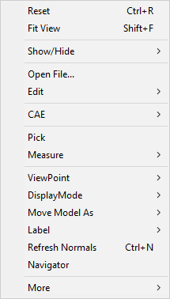
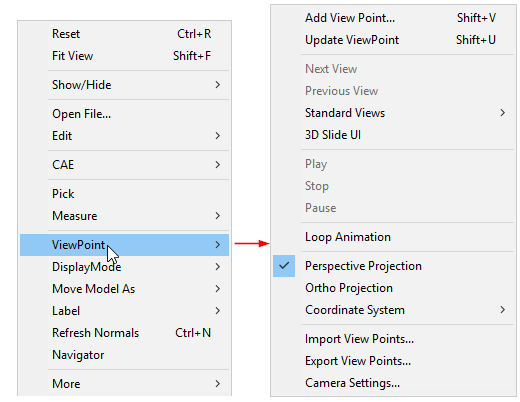
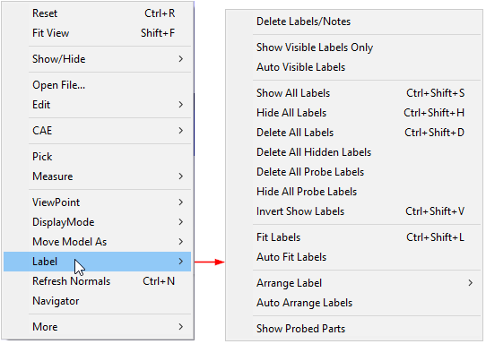
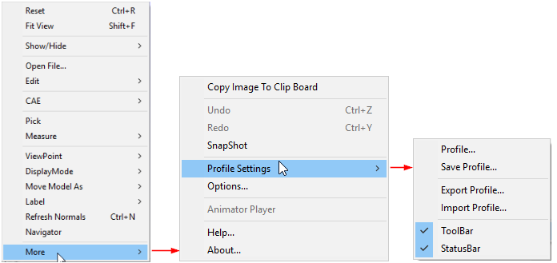

Context Menu
=============

VCollab Pro offers its users a context menu with various options that
correspond to main menu options. The context menu opens up on the right
mouse click event in the viewer. It helps in making a user’s interaction
with a model more efficient and quick.

**Context Menu**

|image1|

+---------------------+-----------------------------------------------+
| **Reset**           | Resets view or displays standard front view   |
+=====================+===============================================+
| **Fit View**        | Fits all parts of the model into the scene    |
|                     | and displays.                                 |
+---------------------+-----------------------------------------------+
| **Show / Hide**     | Provides different types of show - hide       |
|                     | options.                                      |
+---------------------+-----------------------------------------------+
| **Open File**       | Interface to load a CAX file.                 |
+---------------------+-----------------------------------------------+
| **Edit**            | Enables users to edit in Background, Mouse    |
|                     | Customization, Product Explorer,Explode and   |
|                     | Section.                                      |
+---------------------+-----------------------------------------------+
| **CAE**             | Lists all CAE functionalities.                |
+---------------------+-----------------------------------------------+
| **Pick**            | Allows users to pick, move and drop a part.   |
+---------------------+-----------------------------------------------+
| **Measure**         | Allows users to measure distance and arc      |
|                     | objects.                                      |
+---------------------+-----------------------------------------------+
| **ViewPoint**       | Allows users to create a viewpoint and        |
|                     | animate a view path.                          |
+---------------------+-----------------------------------------------+
| **Display Mode**    | Allows users to change display modes into     |
|                     | different types.                              |
+---------------------+-----------------------------------------------+
| **Move Model As**   | Increases Rendering performances.             |
+---------------------+-----------------------------------------------+
| **Label**           | Allows users to change visibility and delete  |
|                     | labels/notes.                                 |
+---------------------+-----------------------------------------------+
| **Refresh Normals** | Recomputes normals and provides proper        |
|                     | lighting to the model.                        |
+---------------------+-----------------------------------------------+
| **Navigator**       | Allows Passive Transform mode and displays    |
|                     | the GUI on the right side of the viewer.      |
+---------------------+-----------------------------------------------+
| **More**            | Shows more options.                           |
+---------------------+-----------------------------------------------+

**Sub Menu items**

Show / Hide

|image2|

+------------------------------+--------------------------------------+
| **Hide Part**                | Hides the selected part(s).          |
+==============================+======================================+
| **Hide Other Parts**         | Hides all parts except the current   |
|                              | selected one.                        |
+------------------------------+--------------------------------------+
| **Show All Parts**           | Displays all parts.                  |
+------------------------------+--------------------------------------+
| **Invert Visible Parts**     | Displays hidden parts and Hides      |
|                              | displayed parts.                     |
+------------------------------+--------------------------------------+
| **Deselect All Parts**       | Deselects all type selections.       |
+------------------------------+--------------------------------------+
| **Delete All Visible Parts** | Deletes all visible parts            |
+------------------------------+--------------------------------------+
| **Delete All Hidden Parts**  | Deletes all hidden parts             |
+------------------------------+--------------------------------------+
| **Axis**                     | Displays the axis                    |
+------------------------------+--------------------------------------+
| **Origin**                   | Displays Origin settings             |
+------------------------------+--------------------------------------+
| **Full Screen**              | Makes the viewer window full screen  |
+------------------------------+--------------------------------------+
| **Properties**               | Displays the properties              |
+------------------------------+--------------------------------------+

**CAE**

|image3|

+-------------------------+-------------------------------------------+
| **Result List...**      | Lists all results available for current   |
|                         | dataset.                                  |
+=========================+===========================================+
| **CAE Settings...**     | Allows users to edit and update legend.   |
+-------------------------+-------------------------------------------+
| **Scale Factor...**     | Allows users to scale the model.          |
+-------------------------+-------------------------------------------+
| **Animate...**          | Animates the CAE Model.                   |
+-------------------------+-------------------------------------------+
| **Animate Settings...** | Allows users to define the animation.     |
+-------------------------+-------------------------------------------+
| **Probe**               | Allows users to probe node/element and    |
|                         | display the information on the viewer.    |
+-------------------------+-------------------------------------------+
| **Probe Type**          | Allows users to select a probe type.      |
+-------------------------+-------------------------------------------+
| **Hotspot Finder**      | Allows users to find CAE hotspots on the  |
|                         | model.                                    |
+-------------------------+-------------------------------------------+
| **Display**             | Allows users to modify CAE display        |
|                         | attributes.                               |
+-------------------------+-------------------------------------------+
| **Symbol Plot...**      | Allows users to plot symbols at user      |
|                         | defined vertices.                         |
+-------------------------+-------------------------------------------+
| **CAE Results**         | Allows users to set current result        |
|                         | operations.                               |
+-------------------------+-------------------------------------------+
| **NodeSet Manager**     | Allows users to group a set of nodes and  |
|                         | use it in other functional modules        |
+-------------------------+-------------------------------------------+

**Measure**

|image4|

+-------------------+-------------------------------------------------+
| **Distance**      | Allows users to measure distance between        |
|                   | points.                                         |
+===================+=================================================+
| **Arc**           | Allows users to measure arc / circle.           |
+-------------------+-------------------------------------------------+
| **Point To Edge** | Allows users to measure the shortest distance   |
|                   | between a point and an edge.                    |
+-------------------+-------------------------------------------------+
| **Point To Face** | Allows users to measure the shortest distance   |
|                   | between a point and a polygon.                  |
+-------------------+-------------------------------------------------+
| **Snap Vertex**   | Allows users to select the nearest vertex while |
|                   | clicking on the model for measurement.          |
+-------------------+-------------------------------------------------+
| **Vertex Info**   | Displays x, y, z coordinates of current mouse   |
|                   | position on the model.                          |
+-------------------+-------------------------------------------------+
| **Compare Mesh**  | Allows users to compare two meshes and its      |
|                   | deviation.                                      |
+-------------------+-------------------------------------------------+

**ViewPoint**

|image5|

+-------------------------------------------------------------------------+
| +----------------------------+----------------------------------------+ |
| | **Add View Point**         | Allows users to add viewpoint to a     | |
| |                            | path.                                  | |
| +============================+========================================+ |
| | **Update View Point**      | Allows users to update an existing     | |
| |                            | view point.                            | |
| +----------------------------+----------------------------------------+ |
| | **Next View**              | Allows users to navigate to the next   | |
| |                            | view point.                            | |
| +----------------------------+----------------------------------------+ |
| | **Previous View**          | Allows users to navigate to the        | |
| |                            | previous viewpoint.                    | |
| +----------------------------+----------------------------------------+ |
| | **Standard Views**         | Allows users to select one of six      | |
| |                            | standard views, Front, Rear,Top,etc.   | |
| +----------------------------+----------------------------------------+ |
| | **3D Slide UI**            | Shows/Hides 3D slide UI in the bottom  | |
| |                            | right corner of the viewer.            | |
| +----------------------------+----------------------------------------+ |
| | **Play**                   | Starts viewpath animation              | |
| +----------------------------+----------------------------------------+ |
| | **Stop**                   | Stops Animation                        | |
| +----------------------------+----------------------------------------+ |
| | **Pause**                  | Pauses Animation                       | |
| +----------------------------+----------------------------------------+ |
| | **Loop Animation**         | Animates continuously                  | |
| +----------------------------+----------------------------------------+ |
| | **Perspective Projection** | Allows users to toggle between         | |
| |                            | Perspective and Ortho Projection       | |
| +----------------------------+----------------------------------------+ |
| | **Ortho Projection**       |                                        | |
| +----------------------------+----------------------------------------+ |
| | **Coordinate System**      | Allows users to toggle between XY, XZ  | |
| |                            | and YZ coordinate system               | |
| +----------------------------+----------------------------------------+ |
| | **Import View Points...**  | Allows users to import viewpoints from | |
| |                            | .vpt or .cax files.                    | |
| +----------------------------+----------------------------------------+ |
| | **Export View Points...**  | Allows users to export viewpoints as   | |
| |                            | .vpt files or .ppt files.              | |
| +----------------------------+----------------------------------------+ |
| | **Camera Settings..**      | Allows users to modify camera          | |
| |                            | attributes.                            | |
| +----------------------------+----------------------------------------+ |
+-------------------------------------------------------------------------+

**Display Mode**

|image6|

+-----------------------+---------------------------------------------+
| **Shaded**            | Displays model faces shaded.                |
+=======================+=============================================+
| **Shaded Mesh**       | Displays model faces shaded with mesh       |
|                       | triangles.                                  |
+-----------------------+---------------------------------------------+
| **Wireframe**         | Displays model in wireframe mode.           |
+-----------------------+---------------------------------------------+
| **Hidden Line**       | Displays model in wireframe mode after      |
|                       | removing hidden lines.                      |
+-----------------------+---------------------------------------------+
| **Point**             | Displays model vertices.                    |
+-----------------------+---------------------------------------------+
| **Transparent**       | Displays model with 50% transparency.       |
+-----------------------+---------------------------------------------+
| **Shaded Mesh Color** | Allows users to modify shaded mesh line     |
|                       | color (either contour color or user defined |
|                       | color).                                     |
+-----------------------+---------------------------------------------+
| **Feature Edges**     | Allows users to modify feature edge         |
|                       | properties.                                 |
+-----------------------+---------------------------------------------+
| **Line Size**         | Allows users to modify line width of mesh   |
|                       | between 1 to 5 range.                       |
+-----------------------+---------------------------------------------+

**Move Model As**

|image7|

+-----------------------------+---------------------------------------+
| **As Is**                   | Displays the model in default mode.   |
+=============================+=======================================+
| **Single Bound Box**        | Renders a single bound box while      |
|                             | motion model takes place.             |
+-----------------------------+---------------------------------------+
| **Part Bound Boxes**        | Displays a bound box for each part in |
|                             | the model, while motion model takes   |
|                             | place.                                |
+-----------------------------+---------------------------------------+
| **Detail Culled**           | Displays the parts which consist of,  |
|                             | at least 30% volume relative to model |
|                             | volume.                               |
+-----------------------------+---------------------------------------+
| **Feature Edges**           | Displays feature edges during motion  |
|                             | model.                                |
+-----------------------------+---------------------------------------+
| **Detail Cull Settings...** | Allows users to modify detailed cull  |
|                             | percentage.                           |
+-----------------------------+---------------------------------------+
| **Set Rotation Center**     | Allows users to set motion model      |
|                             | rotation center on the part.          |
+-----------------------------+---------------------------------------+

**Label**

|image8|

+-------------------------------------------------------------------------+
| +------------------------------+--------------------------------------+ |
| | **Delete Label/Notes**       | Deletes labels or notes selected by  | |
| |                              | the user                             | |
| +==============================+======================================+ |
| | **Show Visible Labels Only** | Shows visible labels only at the     | |
| |                              | time of event.                       | |
| +------------------------------+--------------------------------------+ |
| | **Auto Visible Labels**      | Shows visible labels only during     | |
| |                              | user interaction.                    | |
| +------------------------------+--------------------------------------+ |
| | **Show All Labels**          | Shows all labels.                    | |
| +------------------------------+--------------------------------------+ |
| | **Hide All Labels**          | Hides all labels.                    | |
| +------------------------------+--------------------------------------+ |
| | **Delete All Labels**        | Deletes all types of labels.         | |
| +------------------------------+--------------------------------------+ |
| | **Delete All Hidden Labels** | Deletes only the hidden labels       | |
| +------------------------------+--------------------------------------+ |
| | **Delete All Probe Labels**  | Deletes only the probed labels       | |
| +------------------------------+--------------------------------------+ |
| | **Hide All Probe Labels**    | Hides all the probed labels.         | |
| +------------------------------+--------------------------------------+ |
| | **Invert Show Labels**       | Inverts the label selection for      | |
| |                              | display. Shows the hidden labels and | |
| |                              | hides the labels that are visible.   | |
| +------------------------------+--------------------------------------+ |
| | **Fit Labels**               | Fits all labels inside view port     | |
| +------------------------------+--------------------------------------+ |
| | **Auto Fit Labels**          | Fits all labels inside viewport      | |
| |                              | automatically during motion model    | |
| +------------------------------+--------------------------------------+ |
| | **Arrange Label**            | Arranges all labels in an order      | |
| +------------------------------+--------------------------------------+ |
| | **Auto Arrange Label**       | Arranges all labels automatically    | |
| +------------------------------+--------------------------------------+ |
| | **Show Probed Parts**        | Shows all the probed parts           | |
| +------------------------------+--------------------------------------+ |
|                                                                         |
| More                                                                    |
+-------------------------------------------------------------------------+

|image9|

+-------------------------------------------------------------------------+
| +------------------------------+--------------------------------------+ |
| | **Copy Image To Clip Board** | Allows users to copy the current     | |
| |                              | view as an image to clipboard buffer | |
| |                              | and paste in different applications. | |
| +==============================+======================================+ |
| | **UnDo**                     | Erases the last change done in       | |
| |                              | viewer, reverting it to an older     | |
| |                              | state                                | |
| +------------------------------+--------------------------------------+ |
| | **ReDo**                     | Recovers erased state/action.        | |
| +------------------------------+--------------------------------------+ |
| | **SnapShot**                 | Stores current view states into      | |
| |                              | UnDo/ReDo array of action.           | |
| +------------------------------+--------------------------------------+ |
| | **Profile Settings**         | Allows users edit, save and apply    | |
| |                              | session profile settings. Users can  | |
| |                              | turn Off/On the Toolbar and Status   | |
| |                              | bar.                                 | |
| +------------------------------+--------------------------------------+ |
| | **Options**                  | Allows users to change default       | |
| |                              | options                              | |
| +------------------------------+--------------------------------------+ |
| | **Animator Player**          | Allows users to play, pause and stop | |
| |                              | animation. Users can hide or show    | |
| |                              | the player UI.                       | |
| +------------------------------+--------------------------------------+ |
| | **Help**                     | Links to help manuals.               | |
| +------------------------------+--------------------------------------+ |
| | **About**                    | Describes the version of VCollab     | |
| |                              | Pro.                                 | |
| +------------------------------+--------------------------------------+ |
+-------------------------------------------------------------------------+

