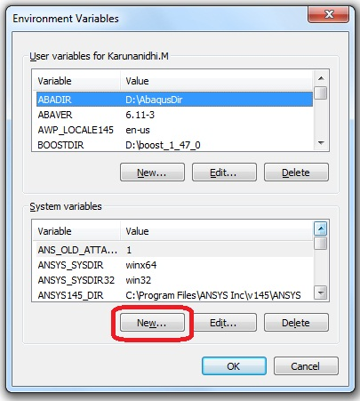

Environment Variables for VCollab Pro
=======================================

 VCollab Suite creates 3 Environment Variables during            
 installation.                                                   
                                                                
 +-------------------+---------------------------------------+   
 | Variables         | Values                                |   
 +-------------------+---------------------------------------+  
 | VCOLLAB_DIR       | Installation_Directory                |   
 +-------------------+---------------------------------------+   
 | PATH              | Installa                              |   
 |                   | tion_Directory\VCollabPro64;Installat |   
 |                   | ion_Directory\VCollabPresenter64;Inst |   
 |                   | allation_Directory\VCollabPresenter32 |   
 +-------------------+---------------------------------------+   
 | VE3D_LICENSE_FILE | Installation_Directory\License        |   
 +-------------------+---------------------------------------+   
                                                                 
 If any of the above Environment variables is deleted, VCollab   
 may not work.                                                   
                                                                 
 In addition to the above variables, the Environment variable,   
 VCOLLAB_TEMP_PATH can manually be set, if required. It can be   
 any temporary directory which will be used by VCollab for       
 temporary files. The "Current User Profile Directory" is used   
 as the default temporary directory by VCollab, if this variable 
 is not set. This Environment variable can be defined in User    
 Environment Variables. Users need to make sure they have both   
 read and write permission to the path specified here else      
 VCOllab Pro may not function properly.                         

 Steps to Set Environment Variables in Windows                   
                                                                 
 -  Go to the Start menu → Settings-->. Control Panel to open   
    the Control Panel window.                                   
                                                                
 -  Click **Advanced system settings** to open System Properties 
    dialog box                                                   
                                                                 
 -  Click the Advanced tab.                                     

|image1|

-  Click the Environment Variables button to open the Environment
   Variables window.

|image2|

-  Click New which opens the New System Variable window as below.

-  Enter VCOLLAB_TEMP_PATH as variable name and the temporary VCollab
   path as Variable value and click OK.

|image3|

**License File Setup**

The Environment Variable **VE3D_LICENSE_FILE** is set along with System
Variables at the time of installation as follows

   VE3D_LICENSE_FILE Installation_Directory\License

The Node Lock licensed products of VCollab will run automatically, if
the license file is copied to the Installation_Directory\License folder.
If the user wants to keep the license file in some other folder, then
the Environment variable (VE3D_LICENSE_FILE) should be changed to
reflect the correct file path.

   Eg: VE3D_LICENSE_FILE License_File_Path

For a Floating license, the Environment variable should point to the
path where the License Server is running.

   Eg: VE3D_LICENSE_FILE @License_Server_Machine_name

As a special case, if the user wants to run Node lock and floating
applications of VCollab products in the same machine, then the
environment variable should be set with both the paths. By default, the
variable contains the node lock license file path as specified above.
For specifying the floating license server path, the user should select
the existing VE3D_LICENSE_FILE variable and append the license server
path

   Eg: VE3D_LICENSE_FILE
   NodeLock_License_FilePath;@License_Server_Machine_name

If the user doesn't have privileges to change the System Variable for
licensing, then the user can create a variable VE3D_LICENSE_FILE under
User variables and set the value for the floating license as follows.

   Eg: VE3D_LICENSE_FILE @License_Server_Machine_name

**Setting up the Environment Variables manually**

If the user doesn't have installation permission, then the user can copy
VCollab files from some other machine, where VCollab products are
installed. In that case, the above mentioned Environment Variables need
to be set manually.

Eg: If the VCollab files are copied into D:\VCollab, then the
environment variables should be manually set as follows

   #. VCOLLAB_DIR - D:\VCollab

   #. PATH -
      D:\VCollab\VCollabPro64;D:\VCollab\VCollabPresenter32;D:\VCollab\VCollabPresenter64

   #. VE3D_LICENSE_FILE- D:\VCollab\License

   #. VCOLLAB_TEMP_PATH can be any temporary directory which will be
      used by VCollab. The "Current User Profile Directory" will be set as
      default temporary directory by VCollab, if this variable is not set.

   **Environment Variables for Visualization**

+-----------+-----------------+-----------------+-----------------+
| **S.No.** | **Environment   | **Description** | **Value**       |
|           | Variable**      |                 |                 |
+===========+=================+=================+=================+
| 1         | **VCOL          | This variable   | 1               |
|           | LAB_FORCE_OGL** | sets OpenGL 1.1 |                 |
|           |                 | as scene        |                 |
|           |                 | renderer.       |                 |
+-----------+-----------------+-----------------+-----------------+
| 2.        | **VCT_          | This variable   | 1               |
|           | COLORPLOT_OFF** | commands the    |                 |
|           |                 | loader not to   |                 |
|           |                 | load results by |                 |
|           |                 | default.        |                 |
|           |                 | Results can     |                 |
|           |                 | however, be     |                 |
|           |                 | loaded on       |                 |
|           |                 | demand.         |                 |
+-----------+-----------------+-----------------+-----------------+
| 3.        | **VCOLLAB_      | This variable   | 1               |
|           | CAPTURE_IMAGE** | captures image  |                 |
|           |                 | and uses it for |                 |
|           |                 | Microsoft PPT   |                 |
|           |                 | embed preview.  |                 |
+-----------+-----------------+-----------------+-----------------+
| 4.        | **VCOLLAB_US    |    There is an  | 1               |
|           | E_OGL_AMBIENT** |    ambient      |                 |
|           |                 |    color issue  |                 |
|           |                 |    in case of   |                 |
|           |                 |    openGL mode  |                 |
|           |                 |    for some     |                 |
|           |                 |    models as    |                 |
|           |                 |    shown below. |                 |
|           |                 |                 |                 |
|           |                 |    |image4|     |                 |
|           |                 |                 |                 |
|           |                 |    This can be  |                 |
|           |                 |    fixed by     |                 |
|           |                 |    setting this |                 |
|           |                 |    environment  |                 |
|           |                 |    variable.    |                 |
|           |                 |                 |                 |
|           |                 |    |image5|     |                 |
+-----------+-----------------+-----------------+-----------------+
| 5.        | **VCOLLAB_F     |    If the       | 1               |
|           | ORCE_OGLIMAGE** |    application  |                 |
|           |                 |    is consuming |                 |
|           |                 |    more than    |                 |
|           |                 |    2GB memory,  |                 |
|           |                 |    saving an    |                 |
|           |                 |    image file   |                 |
|           |                 |    can          |                 |
|           |                 |    sometimes    |                 |
|           |                 |    cause the    |                 |
|           |                 |    application  |                 |
|           |                 |    to crash.    |                 |
|           |                 |    This can be  |                 |
|           |                 |    fixed by     |                 |
|           |                 |    setting the  |                 |
|           |                 |    environment  |                 |
|           |                 |    variable     |                 |
|           |                 |    VCOLLAB      |                 |
|           |                 |    _FORCE       |                 |
|           |                 |    _OGLIMAGE.   |                 |
|           |                 |    Note:        |                 |
|           |                 |                 |                 |
|           |                 |    When running |                 |
|           |                 |    VCollabImag  |                 |
|           |                 |    eGenerator,  |                 |
|           |                 |    .exe if      |                 |
|           |                 |    VCOLLAB      |                 |
|           |                 |    FORCE        |                 |
|           |                 |    _OGLIMAGE    |                 |
|           |                 |    is set, the  |                 |
|           |                 |    background   |                 |
|           |                 |    color cannot |                 |
|           |                 |    be changed.  |                 |
|           |                 |    Only the     |                 |
|           |                 |    default      |                 |
|           |                 |    color is     |                 |
|           |                 |    used.        |                 |
+-----------+-----------------+-----------------+-----------------+
| 6.        | **VCOLLAB       | If the user     | User defined    |
|           | _PROFILE_PATH** | profile folder  | ascii folder    |
|           |                 | path contains   | path.           |
|           |                 | Unicode         |                 |
|           |                 | characters, the |                 |
|           |                 | Profile cannot  |                 |
|           |                 | be saved. This  |                 |
|           |                 | can be fixed by |                 |
|           |                 | setting this    |                 |
|           |                 | environment     |                 |
|           |                 | variable with   |                 |
|           |                 | ascii folder    |                 |
|           |                 | path.           |                 |
+-----------+-----------------+-----------------+-----------------+

.. |image1| image:: JPGImages/BatchMode_EnvironmentVarible.jpg

.. |image3| image:: JPGImages/BatchMode_EnaNewPanel.png

 