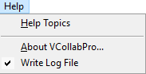
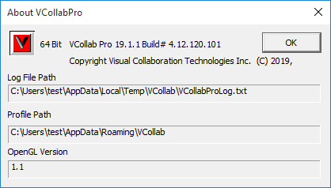
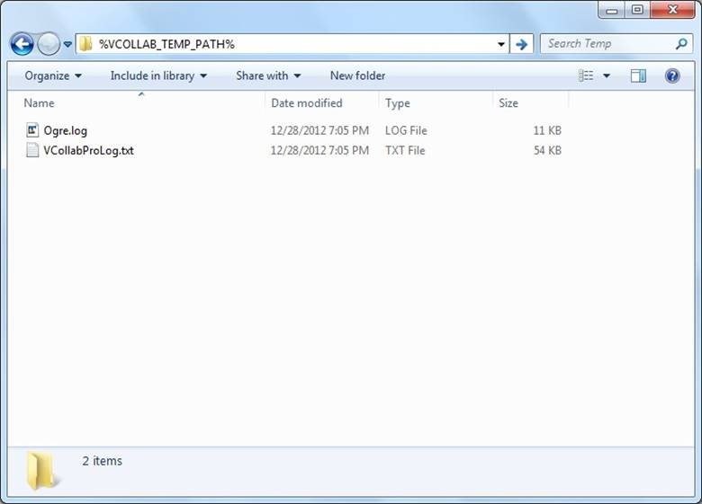
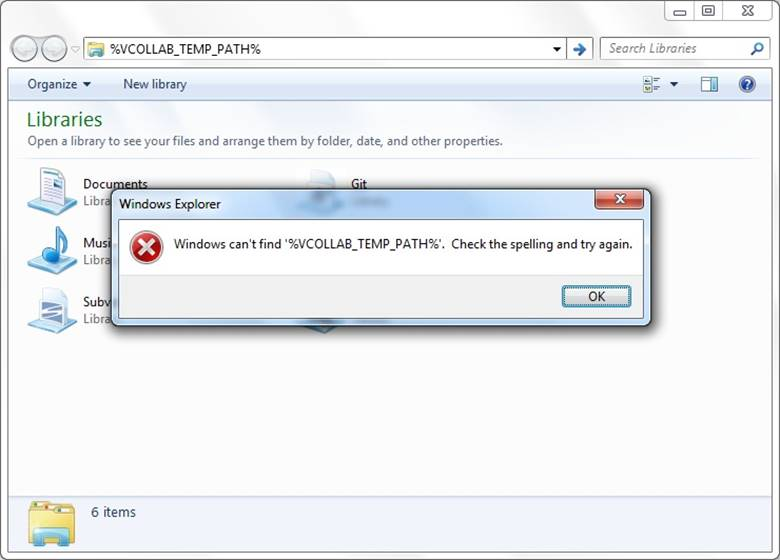
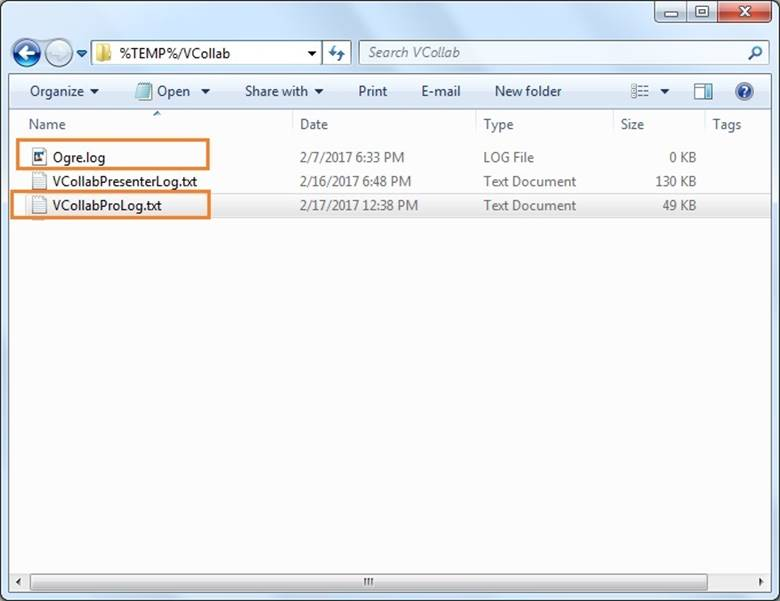

Log Files
=========

VCollab Pro creates the following two log files.

-  VCollabProLog.txt

-  Ogre.log (Rendering log)

**Note:**

-  By default, VCollab Pro writes log files into **%TEMP%\VCollab**
   folder\ **.**

-  Users can change the location by setting the **VCOLLAB_TEMP_PATH**
   environment variable. File path should not contain Unicode
   characters.

-  Users can control whether to write log files or not, using the menu
   item **Help \| Write Log File**.

|image1|

**Log File Path Display**

Log file path will be displayed in **Help \| About VCollab Pro...**
dialog for user convenience.

|image2|

The log files are written into a folder represented by VCOLLAB_TEMP_PATH
environment variable, if VCOLLAB_TEMP_PATH is defined. Users can go to
this folder by just entering %VCOLLAB_TEMP_PATH% in the windows explorer
address bar as shown in the following figure.

|image3|

The files VCollabProLog.txt and Ogre.log can be found in the folder. If
the VCOLLAB_TEMP_PATH environment variable is not defined, the user will
get an error message similar to the one shown in the following figure.

|image4|

In such a case, VCollab Pro writes the log files into %TEMP%/VCollab
directory. This folder can be opened by typing **%TEMP%/VCollab** into
the address bar of windows explorer as shown below.

|image5|

A new VCollab Pro session replaces the previous log files. Therefore
these log files should be saved with another name for troubleshooting
and in cases where users need to share them with VCollab support team
(support@vcollab.com).

