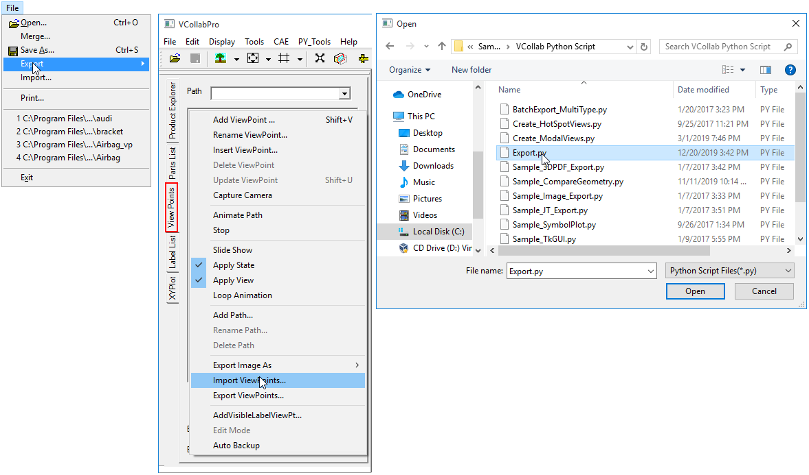
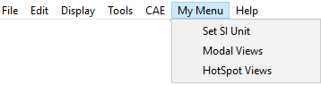
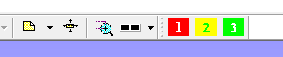

Script Interface
================

VCollab Python API is an Application Programming Interface (API) for
integrating and customizing VCollab Pro application using Python
scripts. Python is embedded into VCollab Pro to provide a scripting
interface to VCollab Pro users.

For more information, refer to VCollab Python API.pdf in the VCollab
installation directory.

**Uses of Python Scripts**

In general, these python interface functions can be used for,

-  Developing customized functions, load specific models, show required
   parts, compare models, display specific 2D labels, create specific
   results, hotspots and viewpoints.

-  Develop customized batch mode applications to create images or merge
   CAX files.

-  Develop customized applications to generate viewpoints (CAX Reports)
   automatically (Report Automation)

The VCollab Pro python API functions are arranged into the following
groups.

-  **General functions:** General status query functions are in this
   group.

-  **File operation functions:** Functions such as load, save and merge
   CAX files, export viewpoints as PPT are present in this group.

-  **Edit operation functions:** Functions for the selection and
   manipulation (show/hide/delete/rename/transform) of parts are in
   this group. Functions for setting background color are also in
   this group.

-  **View operation functions:** Functions related to viewing such as
   setting display modes, feature edge display mode, explode mode,
   fit view etc. are present in this group.

-  **CAE operation functions:** CAE operation functions that are used to
   select result, set legend parameters, probe label attributes, set
   hotspot dialog parameters, create hotspots, set CAE animation
   settings, etc. are present in this group.

-  **Multi-Model operation functions:** Functions that set multi model
   parameters such as current model, legend options etc. are present
   here.

-  **Viewpoint operation functions:** Functions that create, select and
   manipulate viewpoints are present in this group.

-  **Note/Label operation functions:** Functions that add and edit notes
   are present in this group.

**Note:**

-  Python version 3 scripts are supported

-  Most of the function names and arguments for Python interface
   functions are the same as Presenter API functions.

-  When a CAD model is loaded, CAE functions may not work

-  The functions are a part of VCollab Pro. Python scripts with VCollab
   API can’t be executed independently.

**VCollab Scripting Interface**

Python 3 is embedded into VCollab Pro (using C++) to provide scripting interface to VCollab. VCollab API functions listed here can be called from python scripts. Users need to create a python script and run it from VCollab Pro. The python scripts can be run in following two modes:

-  **In Batch Mode:**

   -  When python scripts are specified as command argument, the script
      will be executed in batch mode. In this mode users can use a
      python script to create a CAX file with viewpoints or create
      customized reports as image, PPT and other supported formats.

   -  Run script: "C:\Program Files\VCollab\VCollabPro64\VCollabPro.exe"
      -b "C:\Temp\MyReport_A.py"

   -  Load file1.cax and run script: "C:\Program
      Files\VCollab\VCollabPro64\VCollabPro.exe" -b
      "C:\Temp\MyReport_A.py" <file1.cax>

   -  Load file1.cax, merge file2.cax and run script: "C:\Program
      Files\VCollab\VCollabPro64\VCollabPro.exe" -b
      "C:\Temp\MyReport_A.py" <file1.cax> <file2.cax>

-  **In GUI Mode :**

   -  Python scripts can be specified as input in File->Import menu

   -  Python scripts can also be specified as input for the **Import
      ViewPoints…** function in the Viewpoints context menu in GUI
      mode.

   -  In this mode users can run a python script as a customized
      functionality in VCollab Pro.

     |image1|

.. note::
The python scripts are executed from VCollab Pro. All VCollab
functions are listed under python interface object \_VCollabAPI.

A typical python script will look like this.

+----------------------------------------------------------------------+
| #Sample VCollab Script to create a viewpoint with Stress result      |
|                                                                      |
| import \_VCollabAPI # import Python interface Object from VCollabPro |
|                                                                      |
| bRtnFlag = False;                                                    |
|                                                                      |
| bDebugFlag = True; # flag used to show pop-up messages while         |
| debugging                                                            |
|                                                                      |
| # Open CAX file                                                      |
|                                                                      |
| bRtnFlag = \_VCollabAPI.xFileOpen(u"c:\\Temp\\beam.cax");            |
|                                                                      |
| #Check for error status, If there is an error display a pop-up       |
| message                                                              |
|                                                                      |
| if bRtnFlag == False:                                                |
| \_VCollabAPI.xMessageBox(_VCollabAPI.xGetLastError(),bDebugFlag);    |
|                                                                      |
| \_VCollabAPI.xMessageBox(u"Start: beam.cax File Loaded",             |
| bDebugFlag);                                                         |
|                                                                      |
| #Get Current Model Name                                              |
|                                                                      |
| sCurModel = \_VCollabAPI.xGetCurCAEModelName();                      |
|                                                                      |
| #Display Stress Result                                               |
|                                                                      |
| sCurResult = u"Stress";                                              |
|                                                                      |
| sCurInstance = u"L1M1";                                              |
|                                                                      |
| sCurDerivedResult = u"Von Mises Stress";                             |
|                                                                      |
| bRtnFlag =                                                           |
| \_VCollabAPI                                                         |
| .xSetCAEResult(sCurModel,sCurResult,sCurInstance,sCurDerivedResult); |
|                                                                      |
| if bRtnFlag == False:                                                |
| \_VCollabAPI.xMessageBox(_VCollabAPI.xGetLastError(),bDebugFlag);    |
|                                                                      |
| # Create Viewpoint                                                   |
|                                                                      |
| sViewPathName = u"Path 1";                                           |
|                                                                      |
| sViewPointName = u"VP1- Von Mises Stress"                            |
|                                                                      |
| bRtnFlag = \_VCollabAPI.xAddViewPoint(sViewPointName,                |
| sViewPathName,-1);                                                   |
|                                                                      |
| if bRtnFlag == False:                                                |
| \_VCollabAPI.xMessageBox(_VCollabAPI.xGetLastError(),bDebugFlag);    |
|                                                                      |
| #Save as CAX file                                                    |
|                                                                      |
| bRtnFlag=_VCollabAPI.xFileSave(u"C:\\Temp\\beam-vp.cax");            |
|                                                                      |
| if bRtnFlag == False:                                                |
| \_VCollabAPI.xMessageBox(_VCollabAPI.xGetLastError(),bDebugFlag);    |
|                                                                      |
| \_VCollabAPI.xMessageBox(u"END: beam-vp.cax File Saved",             |
| bDebugFlag);                                                         |
+----------------------------------------------------------------------+

.. note::

For more details, refer to the VCollab Python API manual, which is
available in the VCollab Pro installation directory.

**Menu Customization**

VCollab Pro allows users to append the menu with their own items using
python script files and a CSV file.

-  Go to "%VCOLLAB_DIR%\Samples\VCollab Python Script"

-  Look for a file named, "VCollabPythonUI.csv"

-  It contains menu name, item names and its corresponding python file
   path

-  Open and edit the file with your own titles and python file paths.

-  Save the file.

-  Copy the file "VCollabPythonUI.csv" to %APPDATA%\VCollab folder.

-  Open or restart VCollabPro application.

-  The new interfaces can be seen as menu or toolbar items based on the
   UI style specified in the CSV file.

**CSV file content format**

+-------------+--------------------------+--------------------------+
| Line Number | Syntax                   | Description              |
+=============+==========================+==========================+
| 1           | #                        | VCollab header constant  |
|             | VCollab_Python_INTERFACE |                          |
| 2           |                          | Style of interface;      |
|             | GUI Mode = <style >      | "style=0" means menu     |
| 3           |                          | with items and "style=1" |
|             | < Menu Name >            | means toolbar with       |
| 4           |                          | items.                   |
|             | < Menu Item 1 > , <      |                          |
| .           | Python File Path >       | Enter your menu name.    |
|             |                          |                          |
| .           | < Menu Item 2 > , <      | Enter menu item name and |
|             | Python File Path >       | corresponding python     |
|             |                          | file path                |
|             | ...                      |                          |
|             |                          | ...                      |
|             |                          |                          |
|             |                          | ...                      |
+-------------+--------------------------+--------------------------+

Example CSV File

+----------------------------------------------------------------------+
| #VCollab_Python_INTERFACE                                            |
|                                                                      |
| GUI Mode=0                                                           |
|                                                                      |
| My Menu                                                              |
|                                                                      |
| Set SI Unit,%VCOLLAB_DIR%\Samples\VCollab Python                     |
| Script\setUNITS_SI.py                                                |
|                                                                      |
| Modal Views,%VCOLLAB_DIR%\Samples\VCollab Python                     |
| Script\Create_ModalViews.py                                          |
|                                                                      |
| HotSpot Views,%VCOLLAB_DIR%\Samples\VCollab Python                   |
| Script\Create_HotSpotViews.py                                        |
+----------------------------------------------------------------------+

**Corresponding Menu/toolbar in VCollab Pro for above csv file**

In "GUI Mode =0", the menu is appended with item names.

|image2|

In "GUI Mode =1", the toolbar is appended with item indices.

|image3|

