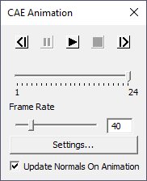

CAE | Animate
===============

VCollab Pro provides a user friendly animation tool for CAE models   
in which users can control                                           
                                                                      
  -  Speed of animation                                                
                                                                      
  -  Direction of animation                                            
                                                                      
  -  Number of Frames per cycle using Animation settings.              

CAE Animation Control Panel
---------------------------
                                                                                                                
 |image1|

 The various controls available in the CAE Animation panel are explained
 below
 
 +---------------------------------+-----------------------------------+
 | |image2|                        | Show previous frame in the        |
 |                                 | animation                         |
 +=================================+===================================+
 | |image3|                        | Pauses the animation.             |
 +---------------------------------+-----------------------------------+
 | |image4|                        | Play Animation in forward         |
 |                                 | direction                         |
 +---------------------------------+-----------------------------------+
 | |image5|                        | Show next frame in the animation  |
 +---------------------------------+-----------------------------------+
 | |image6|                        | Stop Animation. It is enabled     |
 |                                 | once animation starts.            |
 +---------------------------------+-----------------------------------+
 | **Current Frame Slider**        | Slider position indicates current |
 |                                 | frame in the animation.           |
 +---------------------------------+-----------------------------------+
 | **Frame Rate**                  | Allows user to control animation  |
 |                                 | speed by editing frame rate.      |
 +---------------------------------+-----------------------------------+
 | **Settings button**             | Opens CAE Animation Settings      |
 |                                 | panel                             |
 +---------------------------------+-----------------------------------+
 | **Update Normals on Animation** | This option updates normals for   |
 |                                 | each frame during animation.      |
 +---------------------------------+-----------------------------------+

.. |image2| image:: JPGImages/cae_CAE_Animate_Pre.png

 

