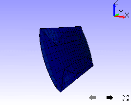

Animation Settings
===================

VCollab Pro users can define and set animation properties using
**Animation settings** found under CAE menu.

Animation Settings Panel
------------------------

-  Click **CAE | Animation Settings** or click **Settings** button in the
   CAE **Animate** panel

   |image1|

   The various fields and controls available under Animation settings are
   explained below.
   
   +-----------------------+---------------------------------------------+
   | **Animation Type\***  | Choose an animation type.                   |
   +-----------------------+---------------------------------------------+
   | **No. Of Frames**     | Specify the number of frames per second.    |
   |                       | Number of frames cannot be modified in      |
   |                       | transient animation when the Interpolate    |
   |                       | option is turned Off.                       |
   +-----------------------+---------------------------------------------+
   | **Swing**             | Apply Swing motion to Animation.            |
   +-----------------------+---------------------------------------------+
   | **Static Fringe**     | Apply Static Fringe to transient animation. |
   +-----------------------+---------------------------------------------+
   | **Reverse Play**      | Play animation in backward motion.          |
   +-----------------------+---------------------------------------------+
   | **Instances**         | Select the instances.                       |
   +-----------------------+---------------------------------------------+
   | **Animate**           | Opens the Animation Dialog and starts       |
   |                       | animation.                                  |
   +-----------------------+---------------------------------------------+
   | **Apply**             | Apply the settings to animation.            |
   +-----------------------+---------------------------------------------+
   | **Interpolate**       | Allows to interpolate time and animate.     |
   |                       | This option is enabled for transient        |
   |                       | animation type. It is unchecked by default. |
   |                       | Users can edit the number of frames only    |
   |                       | when the **Interpolate** option is checked. |
   |                       | Interpolate does not work for moving-mesh   |
   |                       | models                                      |
   +-----------------------+---------------------------------------------+
   | **Static Color Plot** | Animate without changing the model contour. |
   +-----------------------+---------------------------------------------+
   | **Skip By**           | Skip the number of frames/instances while   |
   |                       | selecting instances.                        |
   +-----------------------+---------------------------------------------+
   | **RAM/HDD**           | RAM/HDD is used to optimize memory using    |
   |                       | either RAM or Hard Disk.                    |
   +-----------------------+---------------------------------------------+
   | **Pivot...**          | Users can pick a node or triangle (plane)   |
   |                       | and simulate deformation relative to this   |
   |                       | pivot point or plane.                       |
   +-----------------------+---------------------------------------------+
   | **Capture Animation** | Capture one cycle of animation and export   |
   |                       | into a movie file.                          |
   +-----------------------+---------------------------------------------+
   | **Scale Factor**      | Link to deformation scale factor settings.  |
   +-----------------------+---------------------------------------------+

Types of Animations
*******************

-  **Linear Animation**: Number of frames provided by the user are
   interpolated linearly between original mesh to deformed mesh.

-  **Transient Animation**: This is to animate the model with different time steps or frequency or instances. 
   Each frame refers to one time step or load case or mode case or frequency. **Rigid body** animation is a special case in transient animation.
   Interfaces for Rigid body animation will be visible for the relevant data.

-  **Eigenvector Animation:** Animating eigenvector results (complex eigen as well as mode case data).

-  **Legend Animation:** Animating contour color based on legend palette using transparency.

**Transient Animation Context Menu**

After selecting the Transient animation type, right click in the panel
to open the context menu as shown below.

|image2|

The various options available for Transient animation are explained
below.

+--------------------------+------------------------------------------+
| **Prepare Animation**    | Prepares geometry and textures for       |
|                          | required instances. It may take more     |
|                          | time but animation will be faster.       |
+==========================+==========================================+
| **Clear Preparation**    | Clears animation data and prepares with  |
|                          | current CAE data again.                  |
+--------------------------+------------------------------------------+
| **Load All Instances**   | Loads all instances from CAX file to RAM |
|                          | for faster animation.                    |
+--------------------------+------------------------------------------+
| **Unload All Instances** | Unloads all instances results from RAM   |
|                          | if not required.                         |
+--------------------------+------------------------------------------+

CAE Animation Options
*********************

 CAE Animation is computing and simulating CAE data with a finite number
 of frames.
 
 For example, Let CAE data have 4 frames for animation. In animation this
 data will display frames 1, 2, 3, 4 starting frame 1 and ending with
 frame 4.
 
 *Swing Motion :* Animation starts and ends with the initial frame.
 Frames will thus be displayed in the order of 1,2,3 , 4 ,3,2,1 .
 
 *Reverse Play :* Reverses the animation order and displays the frames
 in the order of 4,3,2,1
 
 *Capture Animation:* Saves one complete cycle of animation into either
 into a movie or a set of image formats as specified by the user.
 
 *Scale Factor :* Opens the CAE Deformation Scale factor settings
 dialog where the user can change scale factor for better visualization.

 +-----------+-----------+------------+----------+---------------+---------------+----------+------------+---------------+
 |Type of    |   Swing   |   Static   |  Reverse |  Interpolate  |  Static Color | RAM/HDD  |  Skip by   |  Pivot        |
 |Animation  |           |   Fringe   |  Play    |               |  Plot         |          |            |               |
 +-----------+-----------+------------+----------+---------------+---------------+----------+------------+---------------+
 |Linear     |   Y       |   Y        |  N       |  N            |  N            | N        |  N         |  Y            |
 +-----------+-----------+------------+----------+---------------+---------------+----------+------------+---------------+
 |Transient  |   Y       |   Y        |  Y       |  Y            |  Y            | Y        |  Y         |  Y            |
 +-----------+-----------+------------+----------+---------------+---------------+----------+------------+---------------+
 |EigenVector|   Y       |   Y        |  Y       |  Y            |  Y            | Y        |  Y         |  Y            |
 +-----------+-----------+------------+----------+---------------+---------------+----------+------------+---------------+
 
 .. note::
    
    **Y: Yes** - Option is applicable and enabled.
    
    **N: No** - Option is not applicable and disabled

Animation Type and Static Fringe Description
********************************************

 +----------------+----------------+----------------+----------------+
 | **Animation    |                | **Static       | **Static       |
 | Type**         |                | Fringe ON**    | Fringe OFF**   |
 +================+================+================+================+
 | **Linear**     | Legend         | Fixed          | Fixed          |
 +----------------+----------------+----------------+----------------+
 |                | Contour        | Fixed          | Varying        |
 |                |                |                |                |
 |                |                | (Current       | (0 to Nodal    |
 |                |                | Result color   | Value)         |
 |                |                | for all        |                |
 |                |                | frames)        |                |
 +----------------+----------------+----------------+----------------+
 | **Transient**  | Legend         | Fixed          | Varying        |
 |                |                |                |                |
 |                |                | (Min/Max       | (Min/Max       |
 |                |                | across all     | Current frame) |
 |                |                | frames)        |                |
 +----------------+----------------+----------------+----------------+
 |                | Contour        | Varying        | Varying        |
 +----------------+----------------+----------------+----------------+
 |                | Legend         | Fixed          | Fixed          |
 |**EigenVector** |                |                |                |
 |                |                |                | (Envelope of   |
 | **(Simple      |                |                | all angle      |
 | Modal)**       |                |                | frames)        |
 +----------------+----------------+----------------+----------------+
 |                | Contour        | Fixed          | Varying        |
 |                |                |                |                |
 |                |                | (Current       | (Based on      |
 |                |                | result color   | frame angle (0 |
 |                |                | for all        | to 360))       |
 |                |                | frames)        |                |
 +----------------+----------------+----------------+----------------+
 |                | Legend         | Fixed          | Fixed          |
 |**EigenVector** |                |                |                |
 |                |                | (min/max       | (min/max       |
 | **(Complex     |                | across all     | across all     |
 | Modal)**       |                | frames)        | frames)        |
 +----------------+----------------+----------------+----------------+
 |                | Contour        | Fixed          | Varying        |
 |                |                |                |                |
 |                |                | (max value     | (Based on      |
 |                |                | across all     | frame angle (0 |
 |                |                | frames)        | to 360))       |
 +----------------+----------------+----------------+----------------+
 |                | Note:          |                |                |
 |                |                |                |                |
 |                | If the current |                |                |
 |                | contour result |                |                |
 |                | is             |                |                |
 |                | non-complex,   |                |                |
 |                | static fringe  |                |                |
 |                | will be        |                |                |
 |                | disabled.      |                |                |
 |                |                |                |                |
 |                | -  Legend -    |                |                |
 |                |       Fixed    |                |                |
 |                |       (based   |                |                |
 |                |       on       |                |                |
 |                |       current  |                |                |
 |                |       results) |                |                |
 |                |                |                |                |
 |                | -  Contour -   |                |                |
 |                |       Fixed    |                |                |
 |                |       (based   |                |                |
 |                |       on       |                |                |
 |                |       current  |                |                |
 |                |       results) |                |                |
 |                |                |                |                |
 |                | - Deformation- |                |                |
 |                |       Based    |                |                |
 |                |       on frame |                |                |
 |                |       angle    |                |                |
 |                |       and      |                |                |
 |                |       current  |                |                |
 +----------------+----------------+----------------+----------------+

Multi Model CAE Animation and its Attributes
********************************************

 Animation settings for each CAE model is influenced by CAE Legend
 palette type.
 
+-------------------------------+------------------------------------------------------+-----------------------------------------------------+
| **Legend Palette type**       | **Frames Display**                                   | **Frames Selection**                                |
+-------------------------------+------------------------------------------------------+-----------------------------------------------------+
| **Multiple**                  | Lists all instances /frames of the current model.    | Selected frames are applied to current model only   |
+-------------------------------+------------------------------------------------------+-----------------------------------------------------+
| **Combined**                  | Lists common instances/frames across models.         | Selected frames will be applied to all models       |
+-------------------------------+------------------------------------------------------+-----------------------------------------------------+
| **Multiple: Common Legend**   | Lists all instances / frames of the current model.   | Selected frames are applied to current model only   |
+-------------------------------+------------------------------------------------------+-----------------------------------------------------+

Animation Settings and Merged Models
************************************

 +------------------+-------------+-------------+-------------+------------------+
 |**Property**      | **Animation | **Combined**| **Multiple**| **Multiple:      |
 |                  | type**      |             |             | Common Legend**  |
 +------------------+-------------+-------------+-------------+------------------+
 | **Animation      |             | Same type   |             |                  |
 | Type**           |             | is applied  |             |                  |
 |                  |             | across all  |             |                  |
 |                  |             | models      |             |                  |
 +------------------+-------------+-------------+-------------+------------------+
 | **Reverse        | All types   | Applied     |             |                  |
 | Play**           |             | across all  |             |                  |
 |                  |             | models      |             |                  |
 +------------------+-------------+-------------+-------------+------------------+
 | **Swing**        | Linear      | Applied     |             |                  |
 |                  | /Transient  | across all  |             |                  |
 |                  |             | models      |             |                  |
 +------------------+-------------+-------------+-------------+------------------+
 | **Static         | All types   | Applied     |             |                  |
 | Fringe**         |             | across all  |             |                  |
 |                  |             | models      |             |                  |
 +------------------+-------------+-------------+-------------+------------------+
 | **RAM/HDD**      | Transient   | Applied     |             |                  |
 |                  |             | across all  |             |                  |
 |                  |             | models      |             |                  |
 +------------------+-------------+-------------+-------------+------------------+
 | **Interpolate**  | Transient   | Applied     |             |                  |
 |                  |             | across all  |             |                  |
 |                  |             | models      |             |                  |
 +------------------+-------------+-------------+-------------+------------------+
 | **Static         | Transient   | Applied to  |             |                  |
 | Color            |             | the current |             |                  |
 | Plot**           |             | model only. |             |                  |
 |                  |             | Users can   |             |                  |
 |                  |             | set this    |             |                  |
 |                  |             | flag to     |             |                  |
 |                  |             | each        |             |                  |
 |                  |             | individual  |             |                  |
 |                  |             | model using |             |                  |
 |                  |             | the result  |             |                  |
 |                  |             | list        |             |                  |
 |                  |             | dialog.     |             |                  |
 +------------------+-------------+-------------+-------------+------------------+
 | **Pivot**        | Linear      | Applied to  |             |                  |
 |                  | /Transient  | the current |             |                  |
 |                  |             | model only. |             |                  |
 |                  |             | Users can   |             |                  |
 |                  |             | set this    |             |                  |
 |                  |             | flag to     |             |                  |
 |                  |             | each        |             |                  |
 |                  |             | individual  |             |                  |
 |                  |             | model using |             |                  |
 |                  |             | the result  |             |                  |
 |                  |             | list        |             |                  |
 |                  |             | dialog.     |             |                  |
 +------------------+-------------+-------------+-------------+------------------+
 | **Deformation    | All types   | Applied to  |  All models | Applied to       |
 | Scale Factor**   |             | current     |             | current          |
 |                  |             | model       |             | model only       |
 +------------------+-------------+-------------+-------------+------------------+
 | **Instance /     | Linear      | Lists all   | Lists       | Lists all        |
 | Frame            | /Eigen      | frames of   | common      | frames of        |
 | Selection**      |             | the current | insta       | the current      |
 |                  |             | model.      | nces/frames | model.           |
 |                  |             | Single      | of all      | Single           |
 |                  |             | selection   | models and  | selection        |
 |                  |             | for each    | apply the   | for each         |
 |                  |             | model can   | selection   | model can        |
 |                  |             | be done.    | to all      | be done.         |
 |                  |             | Default     | models. If  | Default          |
 |                  |             | selection   | there is no | selection        |
 |                  |             | is the      | common      | is the           |
 |                  |             | frame which | frame, the  | frame which      |
 |                  |             | is selected | first frame | is selected      |
 |                  |             | in the      | of each     | in the           |
 |                  |             | is selected | model is    | result list      |
 |                  |             | dialog.     | applied and | dialog.          |
 |                  |             |             | animated.   |                  |
 +------------------+-------------+-------------+-------------+------------------+
 |                  | Transient   | Lists all   | Lists       | Lists all        |
 |                  |             | frames of   | common      | frames of        |
 |                  |             | current     | insta       | current          |
 |                  |             | mode        | nces/frames | mode             |
 |                  |             | l.Selection | of all      | l.Selection      |
 |                  |             | should be   | models and  | should be        |
 |                  |             | done for    | apply the   | done for         |
 |                  |             | each model  | selection   | each model       |
 |                  |             | and         | to all      | and              |
 |                  |             | applied.    | models. If  | applied.         |
 |                  |             | All frames  | there is no | All frames       |
 |                  |             | are         | common      | are              |
 |                  |             | selected by | frame, the  | selected by      |
 |                  |             | default for | animation   | default for      |
 |                  |             | each model. | type will   | each model.      |
 |                  |             |             | be changed  |                  |
 |                  |             |             | to 'Linear' |                  |
 |                  |             |             | au          |                  |
 |                  |             |             | tomatically |                  |
 |                  |             |             | and starts  |                  |
 |                  |             |             | animation.  |                  |
 +------------------+-------------+-------------+-------------+------------------+
 | **Number of      | Linear      | Same number | Same number | Same number      |
 | Frames**         | /Eigen      | of frames   | of frames   | of frames        |
 |                  |             | are used    | are used    | are used         |
 |                  |             | across all  | across all  | across all       |
 |                  |             | models.     | models.     | models.          |
 +------------------+-------------+-------------+-------------+------------------+
 |                  | Transient   | Same number | Same number | Same number      |
 |                  |             | of frames   | of frames   | of frames        |
 |                  |             | are used    | is used     | are used         |
 |                  |             | across all  | across all  | across all       |
 |                  |             | models.     | models      | models.          |
 |                  |             | Maximum     |             | Maximum          |
 |                  |             | time range  |             | time range       |
 |                  |             | is          |             | is               |
 |                  |             | considered  |             | considered       |
 |                  |             | across all  |             | across all       |
 |                  |             | models.     |             | models.          |
 +------------------+-------------+-------------+-------------+------------------+
 | **Frame          | All types   | Same frame  |             |                  |
 | Rate**           |             | rate for    |             |                  |
 |                  |             | all models. |             |                  |
 +------------------+-------------+-------------+-------------+------------------+

**Steps to activate Linear Animation**

-  Click **CAE \| Animation Settings**.

-  Select **Animation Type** as Linear.

-  Enter a number of frames.

-  Click **Harmonic** and **Swing** motions if necessary.

-  Click **Apply** and **Animate**.

**Steps to activate Transient Animation**

-  Click **CAE \| Animation Settings**.

-  Select **Animation Type** as Transient. All instances are selected by
   default.

-  Select **Number of instances** if necessary.

-  Select **Swing** motion if necessary.

-  Select **Static Fringe** if necessary.

-  Click **Apply** and **Animate**.

**Steps to activate Mode Case animation or Eigen Vector Animation**

-  Click **CAE \| Animation Settings**

-  For mode case and complex eigen data, default animation will be Eigen
   Vector animation.

-  If not, select the EigenVector option.

-  Click **Apply** and **Animate**.

**Improve performance during transient animation**

Select frame data source option (RAM/HDD) based on the CAX data size to
improve the animation speed.

|image3|

**Steps to animate CAE results**

-  Click **CAE \| Animation Settings**

-  Select **Animation Type** as Results. All results are selected by
   default.

-  Select the results required for animation.

-  Select **Swing** motion if needed.

-  Click **Apply** and **Animate**.

**Steps to capture CAE Animation into a movie**

-  Click **CAE \| Animation Settings**

-  Click **Capture Animation** to open up the **Capture CAE Animation**
   dialog box.

|image4|

-  Click file browser button next to the Output File field

-  Select any **Save as type** from the list of .mp4, .flv, .wmv, .gif,
   .avi, .jpg, .bmp, .tif, and .png.

-  Click **Capture.**

-  Wait for a confirmation message.

|image5|

-  Click **OK** to complete the process.

Note: If output file type is of image, all frames will be saved as image
files.

**Advantage of 'Skip By' option**

If the CAE animation cycle contains a large number of frames, the time
taken for a cycle will be very long. Skip By helps users to reduce the
cycle time, and yet view a better and complete simulation by skipping
odd frames or two or more frames.

Consider the following image, which contains 201 frames. The animation
cycle will take more than one minute, if the time interval between
frames is 0.5 seconds. By skipping alternative frames. The number of
frames can be reduced to 101.

|image6|

|image7|

It can further be reduced to 67 frames by skipping two frames as shown
below.

|image8|

Animation Relative to Reference Entity
--------------------------------------

 VCollab Pro provides pivot simulation relative to Node and Plane.

 **Pivot Node** arrests translation for picked nodes and simulates
 relative to the pivot node.

 **Pivot Plane** arrests translation of pivot node and rotation of picked
 triangle (polygon) and simulates.

 -  Open CAE Animation Settings dialog box

 -  Click **Pivot...**. to open **Pivot Settings** dialog box

    |image9|

 -  Select **Node** or **Plane** in the Pivot combo box.

    |image10|

 -  Click **'Pick'** to select the node in the model\ **.** To select the
    node, click a node on the model.

    |image11|

 -  Node number is displayed in the ID text. Picked ID will be considered
    as Pivot point.

 -  If the pivot option is **Node**, then the nearest node will be
    highlighted.

 -  If the pivot option is **Plane**, then the picked triangle will be
    highlighted.

 -  The deformation at the pivot point is fixed.

 -  Now animate the model and notice how the simulation changes relative
    to pivot point.

 +----------------------------------+----------------------------------+
 | **Pivot Node**                   | **Pivot Plane**                  |
 +==================================+==================================+
 | Picked Node deformation is fixed | Picked Node deformation is fixed |
 +----------------------------------+----------------------------------+
 | No rotation is arrested.         | Picked triangle rotation is      |
 |                                  | arrested.                        |
 |                                  |                                  |
 |                                  | Pivot edge (Line joining pivot   |
 |                                  | node and next node in triangle)  |
 |                                  | rotation is arrested.            |
 +----------------------------------+----------------------------------+
 
 Example:
 
 Below Image shows where the pivot plane is picked.
 
 |image12|
 
 Animation with and without pivot data is shown below

 **Animation without Pivot** 

 |image13|
 
 **Animation with Pivot Node**

 |image14|
 
 **Animation with Pivot Plane** 

 |image15|

Interpolate option in Transient Animation
-----------------------------------------

**Interpolate** option is enabled only for transient animation type. It
is turned OFF by default.

When turned Off, transient animation simulates actual time step frames
in a loop and users cannot modify the number of frames. For example, the
airbag.cax model has 18 instances of displacement result. VCollab
simulates these 18 instance frames consecutively in a loop.

When the Interpolate option is turned ON, VCollab allows users to edit
the number of VCollab interpolates available and selected frames time
data to find a new set of frames.

Interpolate helps users to customize the simulation for smoothness and
better time step simulation.

The following graph depicts Transient animation with interpolation.

|image16|

Rigid Body Animation
--------------------
This is a special case of transient animation type. If loaded cax contains rigid body transformations, then relavant interfaces will appear.
User have 3 options to animate,
- **Rigid & Flex** Rigid body transformation with Flexi deformation result.
- **Rigid only** Applies rigid body transformation only.
- **Flex only** Applies flex deformation results only.

Track Part
**********
This feature allows the user to pick a part and follow it through the animation. 
- Click Track button
- It pops up Track Part dialog
- Enter the part name or click *Pick* button.
- Click on the required part in the viewer.
- Click OK
- Click Apply and Animate.

Legend Animation
----------------

Legend Animation is, simulating contour colors with tranparency or from base color frame by frame. For example, in case of flow lines applying colors step by step gives us better understanding on how the fluid flows. VCollab provides different options to visualize this animation. First frame contains model with base color.                                                             

Legend Animation Panel
**********************

|image17|

===================================== ======================================
                       
Base Color                             Model will be in base color in the first frame. There are three options. Color Plot with transparent, No Result and No Result with transparent.

Use Legend Color Size                  each frame one color from legend will be fille. Number of animation frames will be equal to number colors in legend.

Single Band                            One color will be visible in one frame of animation. Other zones will be in base color.

Reverse Flow                           Reverses the animation. 

===================================== ======================================

**Different possible combinations of Legend Animation options.**

**Use Legend Color Size** 

1) Color Plot Transparent

   |image18|
   
2) No Result
  
   |image19|  

3) No Result Transparent

   |image20|

**Single Band** 

1) Color Plot Transparent

   |image21|
   
2) No Result

   |image22|

3) No Result Transparent

   |image23|

**Reverse Flow** 

1) Color Plot Transparent

   |image24|

2) No Result

   |image25|

3) No Result Transparent

   |image26|

.. |image1| image:: JPGImages/cae_Animation_Settings_Panel.png

.. |image2| image:: JPGImages/cae_Animation_Settings_AnimationContextMenu.png

.. |image4| image:: JPGImages/cae_Animation_Settings_CaptureAnimation.png

.. |image5| image:: JPGImages/cae_Animation_Settings_messageBox.png

.. |image6| image:: JPGImages/cae_Animation_Settings_HOD.png

.. |image8| image:: JPGImages/cae_Animation_Settings_SkipBy2.png

.. |image9| image:: JPGImages/cae_Animation_Settings_PivotSetting.png

.. |image10| image:: JPGImages/cae_Animation_Settings_PivotSettings.png

.. |image11| image:: JPGImages/cae_Animation_Settings_Pick.png

.. |image15| image:: JPGImages/Animation_with_pivot_plane.gif

.. |image17| image:: JPGImages/Legend_Animation_Panel.png

.. |image23| image:: JPGImages/LegendAnim_SB_NoRT.gif

.. |image25| image:: JPGImages/LegendAnim_Rev_NoR.gif

 
