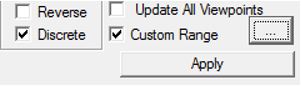
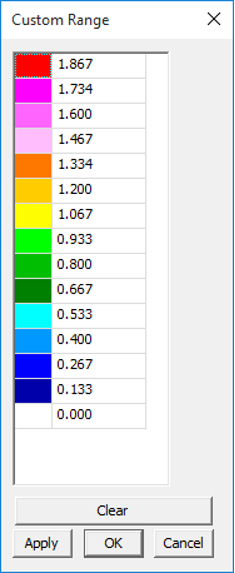
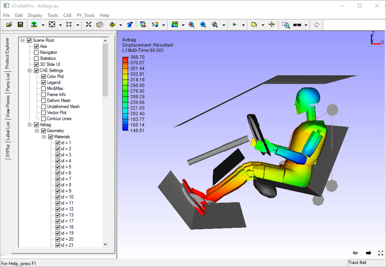

CAE Settings
=============

VCollab Pro users can edit range, colors, format of legend values, etc.
using options available in CAE Settings. The modifications are grouped
into four tabs as below.

-  **Legend Settings**

-  **Edit Legend**

-  **Hotspot Finder**

-  **Vector Plot**

Legend Settings
---------------

 |image1|
 
 The various fields available in the Legend Settings tab are explained
 below.
 
 +----------------------------------+----------------------------------+
 | **Change Range**                 | Change min & max values.         |
 +----------------------------------+----------------------------------+
 | **Min**                          | Modify min value in the range.   |
 +----------------------------------+----------------------------------+
 | **Max**                          | Modify max value in the range.   |
 +----------------------------------+----------------------------------+
 | **Filter**                       | Applies palette colors only for  |
 |                                  | values within the min max range. |
 |                                  | Out of bound values are applied  |
 |                                  | with filter color                |
 +----------------------------------+----------------------------------+
 | **Filter Parts**                 | If enabled, Parts beyond result  |
 |                                  | range will be hidden             |
 +----------------------------------+----------------------------------+
 | **All Instances**                | Applies the modification to all  |
 |                                  | instances                        |
 +----------------------------------+----------------------------------+
 | **Color Plot**                   | Applies/Removes color plot. The  |
 |                                  | model will be seen in material   |
 |                                  | color if this option is off.     |
 +----------------------------------+----------------------------------+
 | **Min & Max Labels**             | Displays Min and Max value       |
 |                                  | labels attached to corresponding |
 |                                  | nodes.                           |
 +----------------------------------+----------------------------------+
 | **Update Color Plot on Show/Hide | Updates color palette and its    |
 | Parts**                          | values while hiding / showing    |
 |                                  | parts.                           |
 +----------------------------------+----------------------------------+
 | Header Display                   | Show / Hides Legend Headers,     |
 |                                  | Model Name, Result Name          |
 |                                  | and Instance Name                |
 +----------------------------------+----------------------------------+
 | **Apply**                        | Applies the modifications.       |
 +----------------------------------+----------------------------------+

Edit Legend
-----------

 |image2|
 
 The various fields and options available under Edit Legend tab are
 explained below.
 
 +---------------------------+-----------------------------------------+
 | **Palette**               | Choose the colors to be applied on the  |
 |                           | model.                                  |
 +---------------------------+-----------------------------------------+
 | **Auto**                  | Allows the application to compute text  |
 |                           | format precision and scientific values. |
 |                           | Precision and scientific options are    |
 |                           | disabled when 'Auto' option is enabled. |
 +---------------------------+-----------------------------------------+
 | **Scientific**            | Displays the legend values in           |
 |                           | scientific format.                      |
 +---------------------------+-----------------------------------------+
 | **Precision**             | Select the decimal places for contour   |
 |                           | values                                  |
 +---------------------------+-----------------------------------------+
 | **Font Size**             | Change the font size.                   |
 +---------------------------+-----------------------------------------+
 | **No Result Color**       | Select a color to denote no result      |
 |                           | data. Default color is grey.            |
 +---------------------------+-----------------------------------------+
 | **Transparency**          | Allows user to invert the transparency  |
 |                           | and to clear the transparency.          |
 +---------------------------+-----------------------------------------+
 | **Background**            | Enable and set background color.        |
 +---------------------------+-----------------------------------------+
 | **Frame Info**            | Display/Hide frame information          |
 +---------------------------+-----------------------------------------+
 | **Orientation**           | Choose the orientation of the legend -  |
 |                           | left, right, top or bottom of the view  |
 |                           | port.                                   |
 +---------------------------+-----------------------------------------+
 | **Undeformed Mesh Mode**  | Change Undeformed Mesh Mode and its     |
 |                           | color.                                  |
 +---------------------------+-----------------------------------------+
 | **Contour Lines**         | Select contour lines color.             |
 +---------------------------+-----------------------------------------+
 | **Show**                  | Show/Hide Legend palette.               |
 +---------------------------+-----------------------------------------+
 | **Reverse**               | Reverse the legend values against the   |
 |                           | color palette.                          |
 +---------------------------+-----------------------------------------+
 | **Discrete**              | Switch to discrete fringe bands in      |
 |                           | color plot.                             |
 +---------------------------+-----------------------------------------+
 | **Update All Viewpoints** | Update the changes to all available     |
 |                           | viewpoints.                             |
 +---------------------------+-----------------------------------------+
 | **Custom Range**          | Switch to customized range palette and  |
 |                           | color plot.                             |
 +---------------------------+-----------------------------------------+
 | **Apply**                 | Apply the changes to the viewer.        |
 +---------------------------+-----------------------------------------+
 
 .. note::
 
  Double Clicking on the legend color palette (including No Result color
  box) inside the viewer opens up CAE Settings Dialog with **Edit Legend** page.

Hotspot Finder
--------------

 |image3|

 The Hotspot Finder can find in,

 -  **Local Extrema** - To find regional or local min and max values.

 -  **Global Extrema** - To find the minimum and maximum values in the selected region not like local extreme values.

 -  **Range Cluster** - To finds hotspots one per palette range.

 The various options and fields seen in Hotspot Finder tab are explained below.
 
 +------------------------+--------------------------------------------+
 | **Find**               | Select a mechanism either Local extrema or |
 |                        | Global extrema                             |
 +========================+============================================+
 | **Min**                | Set minimum range.                         |
 +------------------------+--------------------------------------------+
 | **Max**                | Set maximum range.                         |
 +------------------------+--------------------------------------------+
 | **Top**                | Specify the top count. If 5 is specified,  |
 |                        | the top 5 values will be given             |
 +------------------------+--------------------------------------------+
 | **Bottom**             | Specify the bottom count. If 5 is          |
 |                        | specified, the bottom 5 values will be     |
 |                        | given                                      |
 +------------------------+--------------------------------------------+
 | **All Top**            | Includes all same top values and its IDs.  |
 +------------------------+--------------------------------------------+
 | **All Bottom**         | Includes all same bottom values and its    |
 |                        | IDs.                                       |
 +------------------------+--------------------------------------------+
 | **Mark MinMax**        | Highlight the labels of maximum of top     |
 |                        | labels and minimum of bottom labels        |
 +------------------------+--------------------------------------------+
 | **Zone Radius**        | Skip an area around already found          |
 |                        | hotspots.                                  |
 +------------------------+--------------------------------------------+
 | **Visible Surfaces**   | Consider visible labels only.              |
 +------------------------+--------------------------------------------+
 | **Probe Type**         | Based on this, displays value for current  |
 |                        | result or all results in a table, or all   |
 |                        | instances in table or XYPlot.              |
 +------------------------+--------------------------------------------+
 | **Template Type**      | Provides a list of predefined label        |
 |                        | formats.                                   |
 +------------------------+--------------------------------------------+
 | **Result Options**     | Allows users to customize the list and     |
 |                        | order of results in the labels.            |
 +------------------------+--------------------------------------------+
 | **ID**                 | Includes or excludes node or element ID in |
 |                        | the label                                  |
 +------------------------+--------------------------------------------+
 | **Compare Options**    | This option is visible if at least one     |
 |                        | file is merged with the existing one. It   |
 |                        | will open a dialog box with compare        |
 |                        | options.                                   |
 +------------------------+--------------------------------------------+
 | **Add Viewpoints**     | Generates viewpoints according to          |
 |                        | viewpoint options if enabled.              |
 +------------------------+--------------------------------------------+
 | **Export**             | Exports the viewpoints into either VPT     |
 |                        | file or microsoft PPT file                 |
 +------------------------+--------------------------------------------+
 | **View Point Options** | Provides various options to include or     |
 |                        | exclude different types of viewpoints      |
 +------------------------+--------------------------------------------+
 | **Find Hotspots**      | Generates viewpoints for the model         |
 |                        | according to above information             |
 +------------------------+--------------------------------------------+
 

Vector Plot
-----------

 |image4|

 The various fields seen in the Vector plot settings panel are explained below
 
 +--------------------------+------------------------------------------+
 | **Vector Plot**          | On/Off switch to plot vectors.           |
 +--------------------------+------------------------------------------+
 | **Derived Vector**       | Default derived vector for vector result |
 |                          | is Translational and for scalar and      |
 |                          | tensor is Normals.                       |
 +--------------------------+------------------------------------------+
 | **Deformation**          | Sets deformed nodal position as the      |
 |                          | starting point of the vector.            |
 +--------------------------+------------------------------------------+
 | **Detach Geometry**      | Displays vector plot of a part, even if  |
 |                          | the geometry is hidden.                  |
 +--------------------------+------------------------------------------+
 | **Auto Scale**           | Enables Auto Scale for vector plot       |
 +--------------------------+------------------------------------------+
 | **Scale Slider Control** | Scale up or scale down.                  |
 +--------------------------+------------------------------------------+
 | **User Color**           | Select a color from the palette for      |
 |                          | vectors.                                 |
 +--------------------------+------------------------------------------+
 | **Arrow Size**           | Choose any one size out of three for the |
 |                          | arrow.                                   |
 +--------------------------+------------------------------------------+
 | **Node Position As**     | Set nodal position as either start point |
 |                          | or end point.                            |
 +--------------------------+------------------------------------------+
 | **Reverse**              | Change the direction of vector.          |
 +--------------------------+------------------------------------------+
 | **Refresh**              | Re-generates vectors for visible parts.  |
 +--------------------------+------------------------------------------+

 The derived vectors are based on the type of result selected.

  =============== =============================
  **Result type** **Available Derived Vectors**
  =============== =============================
  Scalar          Normals (Nodal or Elemental)
  Vector          Translational (Default)
  Six DOF         Translational (Default)
                  
                  Rotational
                  
                  Both
  Tensor          Normals (Default)
                  
                  Minimum Principal Direction
                  
                  Middle Principal Direction
                  
                  Maximum Principal Direction
                  
                  Full Tensor
  =============== =============================

**Steps to update Legend with user defined range**

-  Open the **Legend Setting** tab by clicking **CAE \| CAE Settings**.

-  Click Min and Max options to change range.

-  Enter the new range values.

-  Click Filter to enable the color window box.

-  Select a color to be applied for results which are beyond the user  range.

-  Click **Update Current Instance** button.

-  Observe the changes in the viewer.

**Steps to Edit Legend**

-  Open **Edit Legend** tab from **CAE \| CAE Settings**

-  Select "preset#3" in palette dropdown.

   |image5|

-  Click **Apply** and observe the changes in the viewer as below.

   |image6|
   

-  Select an option, say Right, under placement drop down.

-  The legend and frame information is placed on the right side in the viewport.

   |image7|

-  Check Discrete option and click apply.

-  Palette is changed to discrete color from continuous color.

-  Contour plot in the model changes according to the modification in color palette.
   
   |image8|

Custom Range
************

Legend palette values are divided evenly by ‘n’ number of colors. Here
the length of any two consecutive ranges is constant and interpolated
linearly. Custom range allows users to define any length for any range
but with certain limitations.

-  Length of a range should be less than length of min and max.

-  Users cannot edit extreme values. But it is possible in Legend settings.

-  The modified value should be between predecessor and successor values.

-  If there are blank in the palette values, it will be interpolated linearly by default.

**Steps to set Custom Range**

 -  In the Edit Legend tab, check the **Custom Range** option and click on the button next to it.
 
    |image9|

 -  The Custom Range dialog box opens up 
 
    |image10|

 -  Change any value out of extremum values.

    |image11|

 -  Click **Apply**.                                                  
                                                                      
 -  A warning message saying that values should be in descending order is displayed  

    |image12|

 -  Change some values and leave some blanks in the palette.

    |image13|

 -  Click **Apply** and notice that blanks are filled by interpolation.

    |image14|

 -  Click OK                                                          
                                                                      
 -  Click **Apply**.                                                  
                                                                      
 -  Notice the changes in the color plot of the model according to the new custom range palette.   
 
    |image15|

 **Steps to visualize specific result contour range or zones** 
                                                               
 -  Load **Airbag.cax** from the sample folder.                
                                                               
 -  Select **Displacement** result with default derived type.  
                                                               
 -  Select the last instance or frame.  

    |image16|

 -  To customize contour, click **CAE \| Contour Settings** and open  **Legend Settings** tab.   
 
    |image17|

 -  To visualize the result range between 150 to 300 unit, set the  min and max fields with 150 and 300 respectively.              
                                                                      
 -  Click **Apply**

    |image18|

 - To filter the contour color beyond user range, check the **Filter** option and click **Apply**.

   |image19|

 - To hide the parts beyond range, check **Filter Parts** and click **Apply**.

   |image20|

 - Users can visualize the interested result zone clearly with the  above options.                                                       
                                                                      
**Switching CAE Properties On/Off**                                  
                                                                      
 VCollab Pro allows users to switch on/off the following CAE properties through product explorer.                                 
                                                                     
 -  Color Plot                                                        
                                                                      
 -  Legend                                                            
                                                                      
 -  Min & Max                                                         
                                                                      
 -  Frame Info                                                        
                                                                      
 -  Deform Mesh                                                       
                                                                      
 -  Undeformed Mesh                                                   
                                                                      
 -  Vector Plot and                                                   
                                                                      
 -  Contour Lines                                                     
                                                                      
    |image21|                                                            

.. |image21| image:: JPGImages/cae_CAE_PropertiesOn_Off.png

