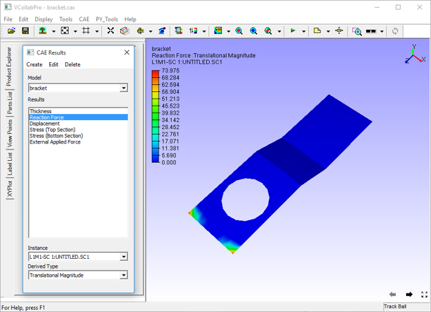
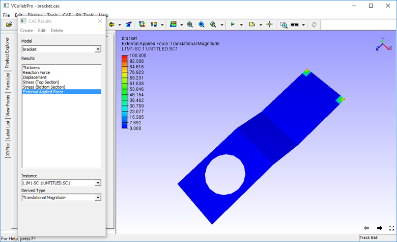

Create Result Using Expression
===============================

VCollab Pro users can create a new CAE result from existing results in
two ways- using expressions and using coordinate systems.

For creating results **Using Expression,** users have to provide a
formula with specific notations, supported operators and functions. New
results will have the same number of instances as other results have.

|image1|

A new CAE result can be created for

-  Combining results

-  Average of two or more results

-  Difference between the two results

-  Summation of two derived results

-  Scaling result, etc.

The computed new result will be updated to **CAE \| Result List**
immediately and users can view the new result in the same way as other
results.

**Note**: Complex results are not supported.

**Create Result Panel**

The Create Result panel opens on clicking **CAE Settings\| Create Result
\| Using Expression**

|image2|

The various fields in the Create Result Panel are explained below.

+---------------------+-----------------------------------------------+
| **Instances**       | Enables Instance Creation.                    |
+---------------------+-----------------------------------------------+
| **Results**         | Displays the name of existing Results.        |
+---------------------+-----------------------------------------------+
| **Notations**       | Displays the corresponding notations. An      |
|                     | alphabetic notation which refers to the       |
|                     | result in the first column is used. Every     |
|                     | result has its own unique alphabet notation.  |
+---------------------+-----------------------------------------------+
| **Result Type**     | Displays result type of the corresponding     |
|                     | results. The type of results can either be a  |
|                     | Scalar or Vector or Tensor. An acronym in the |
|                     | bracket specifies if the result is of         |
|                     | nodal(N), elemental(E) or element nodal       |
|                     | type(EN)                                      |
+---------------------+-----------------------------------------------+
| **Use Formula**     | Enter the formula to be used in the form of   |
|                     | an expression with arithmetic operators,      |
|                     | notations and constants.                      |
+---------------------+-----------------------------------------------+
| **Functions**       | Drops down a list of functions that can be    |
|                     | used in the formula text box.                 |
+---------------------+-----------------------------------------------+
| **New Result Name** | Specify a name for new result that will be    |
|                     | created                                       |
+---------------------+-----------------------------------------------+
| **Create Result**   | Evaluates the expression in the formula bar   |
|                     | and creates the new result. A success or      |
|                     | error message will be displayed depending     |
|                     | upon the outcome.                             |
+---------------------+-----------------------------------------------+

Once a result is created, a success message "New result is created and
added successfully" is displayed. The new result will be added to the
Current CAE model and will contain the same number of instances as the
other results.

The new result name will be added to the **CAE \| Result List** panel as
well as the current panel.

**Notation for a derived component of a Vector or Tensor result**

-  Select a Vector / SixDOF / Tensor result.

-  Right click to open a context menu which lists a set of derived
   result names based on the result type of selected CAE result.

-  Select a result.

-  The derived result name selected by the user will be added at the end
   of the result list temporarily for computation. This result name
   is of the form, "Result Name - Derived result name" (Eg.
   Displacement-Translational Magnitude).

-  Temporary Notation and result type will be generated and will be used
   for current expression.

-  All the temporary derived result names will be cleared if the dialog
   is refreshed.

..

   **Context Menu for Six Degrees of Freedom Result**

   |image3|

**Context Menu for Vector**

   |image4|

**Context Menu for Tensor**

   |image5|

**Basic Operators**

============ ============================== ==========
**Operator** **Description**                **Syntax**
============ ============================== ==========
"+"            Addition between A & B         A+B
"-"            Subtraction between A & B      A-B
\*           Multiplication between A & B   A*B
/            Division between A & B         A/B
^            A to the power of B            A^B
%            Modulus of A with respect to B A%B
============ ============================== ==========

**Inequalities**

============== ======================== ==========
**Inequality** **Description**          **Syntax**
============== ======================== ==========
**<**          Less than                A < B
**>**          Greater than             A > B
**<=**         Less than or equal to    A <= B
**>=**         Greater than or equal to A >= B
**==**         Equal to                 A == B
============== ======================== ==========

..

   Note: Any inequality will result in either 0 (false) or 1 (true).

**Functions**

============ ============================ ================
**Function** **Description**              **Syntax**
============ ============================ ================
abs          Absolute value of a variable abs(A), abs(A+B)
avg          Average of variables         avg(A,B,C...,H)
min          Minimum of values            min(A,B,C)
max          Maximum of values            max(A,B,C)
sqrt         Square root of a value       sqrt(A)
sum          Sum of values                sum(A,B,C)
sin          sine of A (in radians)       sin(A)
cos          cosine of A                  cos(B)
tan          tangent of A                 tan(A)
asin         arc sine of A                asin(A)
acos         arc cosine of A              acos(A)
atan         arc tangent of A             atan(A)
atan2        arc tan of (A/B)             atan2(A,B)
============ ============================ ================

**Operands**

**Create Result** panel lists a set of notations for all CAE results.
These notations can be used in the formula bar. Notations will be in
capital letters for result creation and in small letters for result
instance creation. Other than these notations, users can use any real
value constants.

**Sample Expressions**

========= ==========================
**S.No.** **Sample Expressions**
========= ==========================
**1.**       A+B
**2.**       A*B
**3.**       A-B
**4.**       A/B
**5.**       Sin(B)
**6.**       3*A or A*3
**7.**       A+((-B*C)/(2*D))*cos(B)
**8.**       -A
**9.**       A \* (-B)
**10.**      abs(A+B)
**11.**      sqrt(A)
**12**       A^2
========= ==========================

**Steps to create a new result using expression**

-  Click **CAE \| Create Result…** to open the Create Result panel.

-  Enter a valid expression.

-  Click on **Functions** to insert a supported function.

-  Enter a name for the new result.

-  Click **Create Result**.

-  Wait for the message "Successfully created and added". An error
   message will be shown if there is an invalid expression.

-  Computed result will be added to 'CAE \| Result List ' panel which
   can be opened by clicking **CAE \| Result List..**

-  To interpret the new results, click on the new name appended to the
   result list

Note:

-  Avoid division operator '/', as it leads to undefined results.
   VCollab Pro identifies undefined results and sets **No Result**
   value to those nodes.

-  For any node/element, if any one component of a Vector or Tensor
   result has **No Result** as value, the same value will be set to
   all the components of the new result.

**Different cases of Result Creation**

   1. Creating a new CAE results in a single model.

   2. Creating a new Instance.

   3. Creating a new CAE result across merging models.

**Case 1: Steps to Create a new CAE result in a single model.**

-  Load a CAX model, which contains CAE data.

-  Click **CAE \| Create Result**

    |image6|

 -  Enter the expression or formula in the Use Formula text box. The  
    expression should be valid with correct notations, operators   
    and constants. For example - "A+B/E".                          
                                                                      
 -  Enter a name for the new result.                                  
                                                                      
 -  Click **Create Result**.                                          
                                                                      
 -  A message box will be shown either for successful creation or     
    with error information                                         
                                                                      
**Case 2: Creating a new CAE instance in a single model.**           
                                                                      
 -  Load a CAX model, which contains CAE data.                        
                                                                      
 -  Click **CAE \| Create Result**                                    
                                                                      
 -  Check **Instances** option. This enables the **All Results**      
    option\ 

    |image7|                                               

 -  Users can create a new instance to the currently selected CAE     
    result or all results. This can be controlled by the option    
    **All Results**                                                
                                                                      
 -  Enter the expression or formula in the Use Formula text box. The  
    expression should be valid with correct notations, operators   
    and constants. For example - "A+B/E".                          
                                                                      
 -  Enter a name for the new result.                                  
                                                                      
 -  Click **Create Result**.                                          
                                                                     
 -  A message box will be shown either for successful creation or     
    with error information                                         
                                                                      
 **Case 3: Creating a new CAE result across merged models.**          
                                                                      
 -  Load a CAX model, which contains CAE data.                        
                                                                      
 -  Merge one or more CAX files or models.                            
                                                                      
 -  Click **CAE \| Create Result**                                    
                                                                     
    |image8|                                                         
                                                                      
 -  Check the option **Merged Models**, which opens a drop box list   
    of merged files.                                               

    |image9|

 -  Notations change accordingly with an extension of model number.   
    'A1' refers to the first result of model 1 and 'B2' refers to  
    the second result of model 2.                                  
                                                                      
 -  Users can create a new instance to the currently selected CAE     
    result or all results. This can be controlled by the option    
    **All Results**                                                
                                                                      
 -  Enter the expression or formula in the **Use Formula** text box.  
    The expression should be valid with correct notations,         
    operators and constants. For example: - "A+B/E".               
                                                                      
 -  Enter a name for the new result.                                  
                                                                      
 -  Click **Create Result**.                                          
                                                                      
 -  A message box will be shown either for successful creation or     
    with error information                                         
                                                                      
 **Examples**                                                         
                                                                      
 The following images describe the addition of two results. Notice    
 the contours of,                                                     
                                                                      
 Result one: **Reaction Force.**                                      
                                                                      
    |image10|                                                           

 Result two: **External Applied Force** 

     |image11|

 New Result :**CombineReactionNExternalForce** 
                                               
      |image12|                                     

      |image13|

 