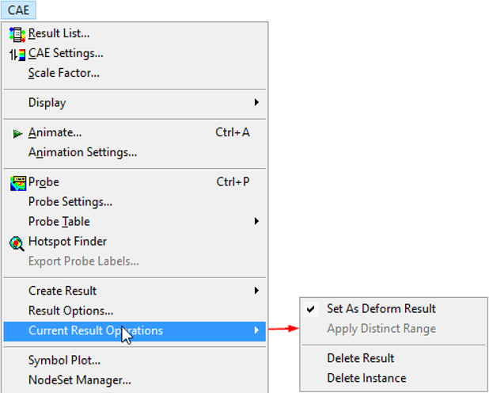

Current Result Operations
============================

The Current Result Operations is a set of operations that can be applied
to the current CAE result.

|image1|

**Set As Deform Result**                           
                                                   
By default, Displacement vector is the deformation 
result. However, users can change the default      
selection by using **Set as Deform Result.** This  
option is applicable to any vector type result.    
                                                   
To visualize the deform result users can go to  **CAE \| Display \| Deform Mesh**                  
                                                   
However, for the following results, the user       
defined deform result will be over ridden to the   
default.                                           
                                                   
-  Displacement                                    
                                                   
-  Displacement - Vibration Mode                   
                                                   
-  Deformation                                     
                                                   
**Apply Distinct Range:** This operation sets      
current result legend into a distinct range. i.e., 
one contour color is mapped to one result value.   
                                                   
**Delete Result:** This operation prompts for      
confirmation and then deletes the current selection
of result.                                         
                                                   
**Delete Instances:** This operation deletes a set 
of instances either from all results or the        
selected result.                                   
                                                   
.. note::
  This interface is also available in CAE Result List dialog                                 

