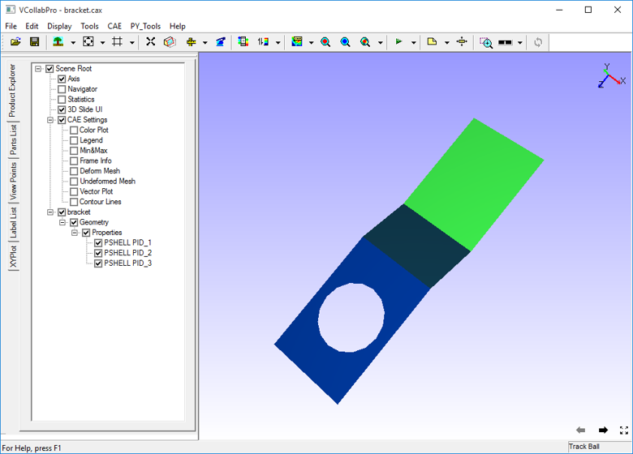
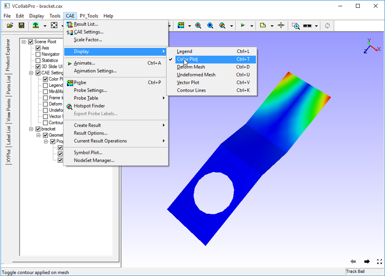

Color Plot
==========

The Color Plot option within the Display sub menu allows users to toggle
between applying and removing Contour / Color plot information from the
viewer.

While this option removes contour information from the model, Legend
Information too is hidden.

**Step to Apply/ Remove Color Plot**

-  Click **CAE\| Color Plot|Display** or use the shortcut key :
   **Ctrl+T** or check the **Color Plot** checkbox in the Product explorer.

Below is the image after removing the contour or color plot from the
model.

|image1|

|image2|

