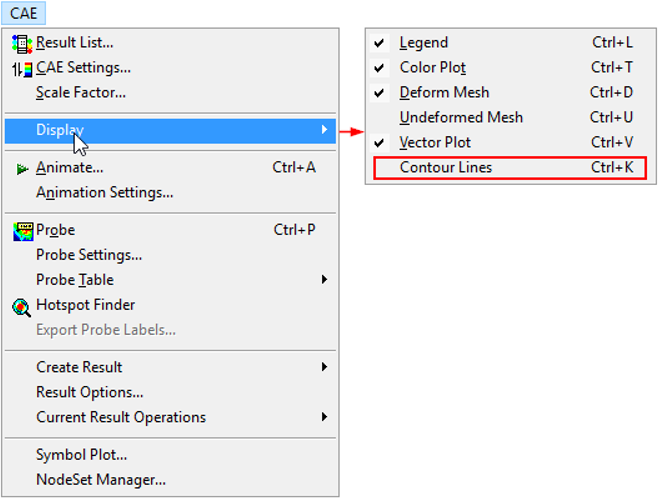
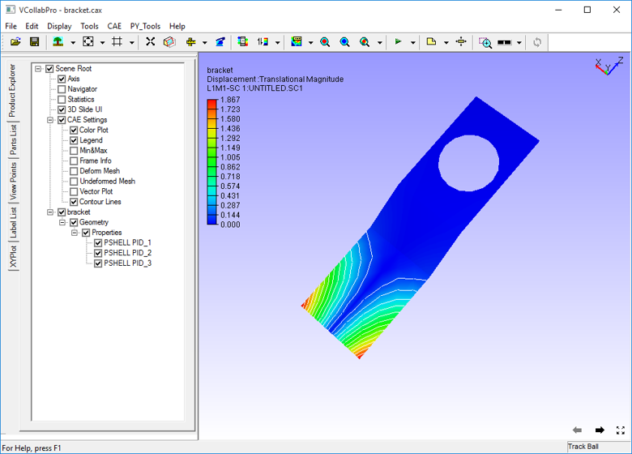
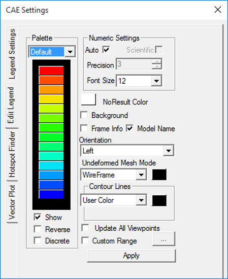
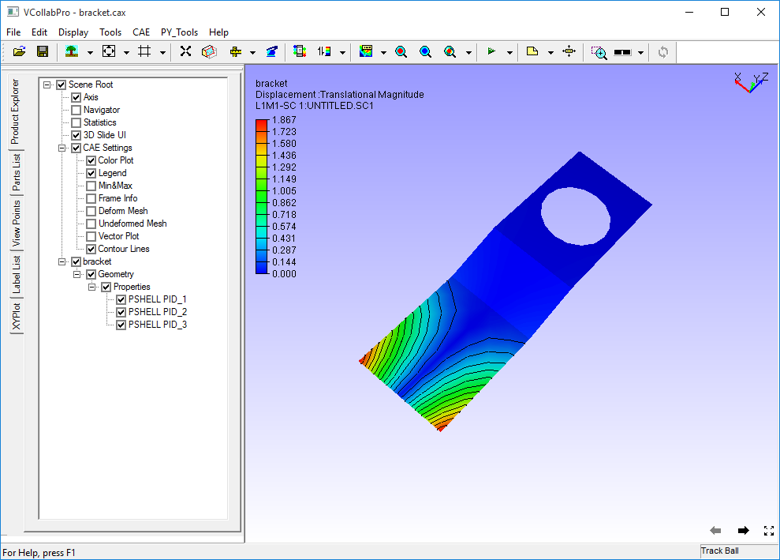
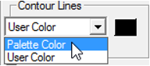
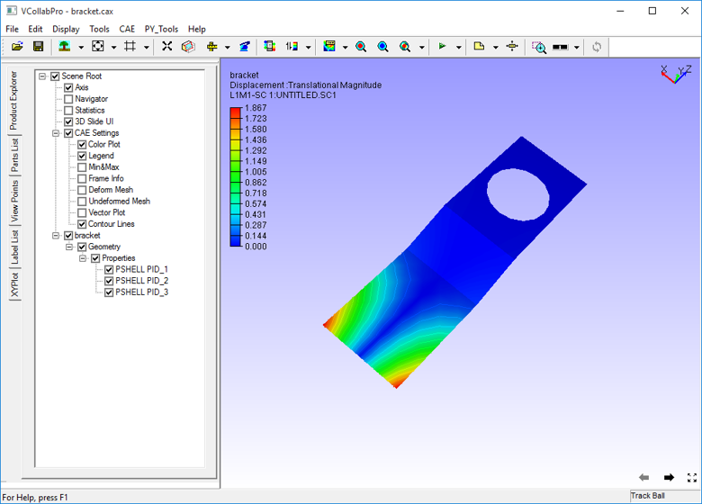

Contour Lines
=============

VCollab Pro users can show or hide contour zones split by lines      
using the Contour lines option under Display sub menu. 
              
**Steps to Show/Hide Contour Lines**                                 
                                                                      
 -  Click **CAE \| Display \| Contour Lines** or use shortcut key     
    **Ctrl + K**.                                                  

    |image1|

 -  The contour zones are created and displayed as shown below. 

    |image2|

 -  Line color is white by default. Open **CAE \| CAE Settings**      
    dialog to change the color.                                    
                                                                     
 -  Click **Edit Legend** tab                                         

    |image3|

 -  Open the color palette window within Contour Lines section 
                                                               
 -  Select a color and click **OK** and **Apply**.             

    |image4|

 -  Select **Palette Color** from the drop down to apply palette      
    fringe color for contour lines.    

    |image5|	
                                                                      
    |image6|                                                             

  

