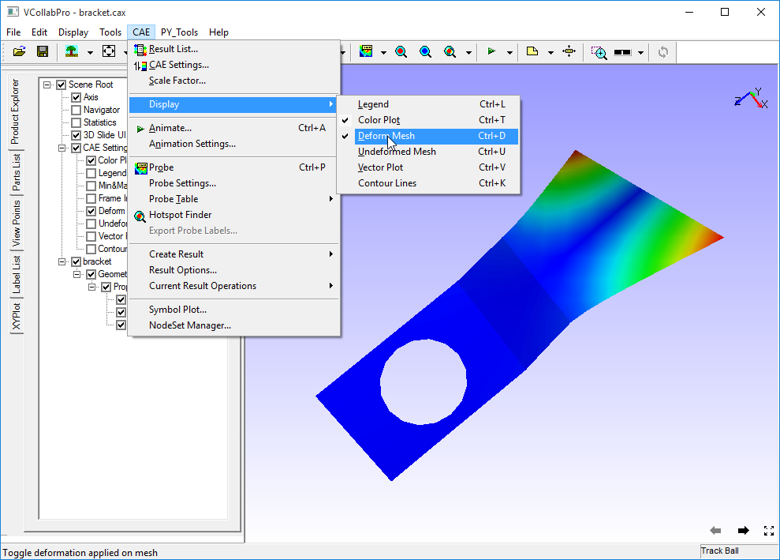

Deform Mesh
===========

The Deform mesh option within the Display sub menu toggles between
deformed mesh and undeformed mesh with color plot.

**Steps to toggle the Deform Mesh Option**

-  Click **CAE \| Display\| Deform Mesh** or use the shortcut key:
   **Ctrl+ D** or check the **Deform Mesh** option in the Product
   Explorer.

Below is the image of bracket2 model with deformed mesh.

|image1|

