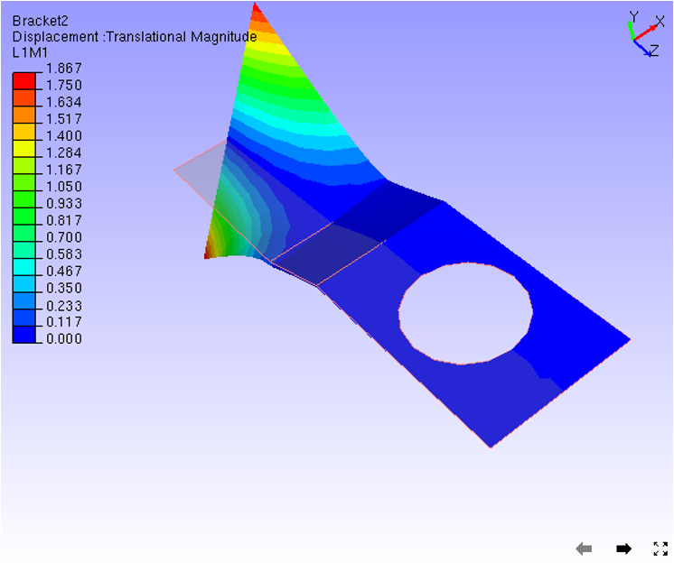

Undeformed Mesh
================

The Undeformed Mesh option within the Display sub menu, displays or
hides undeformed mesh in addition to the original mesh.

**Steps to enable Undeformed Mesh Option**

-  Click **CAE|Display\| Undeformed Mesh** or use the shortcut key :
   **Ctrl+ U** or check **Undeformed** **Mesh** checkbox in the Product
   Explorer

Undeformed mesh is displayed in different modes

-  Wire frame.

-  Transparent

-  Feature Edges

-  Transparent with Edges

Users can edit undeformed mesh color using **CAE \| CAE Settings
dialog.**

**Wire Frame mode**\ |image1|

    **Transparent mode** 

|image2|

    **Feature Edges mode** 

|image3|

    **Transparent Edges mode** 

|image4|

