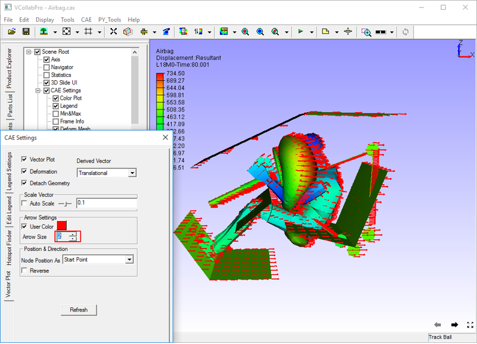

Vector Plot
============

VCollab Pro users can use the Vector plot option found under Display 
sub menu to plot vector for CAE vector type results. Using this      
option, users can identify the direction of force, acceleration,     
velocity, displacement, etc. for each node.                          
                                                                      
.. note::
         
         VCollab Pro saves one user color for vector plot in view point as well as in CAX. 
         Full tensor derived type requires a maximum of 3 user colors.                                                         
                                                                      
**Steps to use Vector Plot**                                         
                                                                      
 -  Click **CAE \| Display \| Vector Plot** or use shortcut key **Ctrl + V** to view the vector 
    plot.                          

    |image1|

    Vectors start from an old nodal position while the model moves    
    with instances. Auto scale allows users to view huge vectors as   
    well as very small changes inside the viewer.                     
                                                                      
**Steps to Modify Vector Plot Setup**                                
                                                                      
 -  Click **CAE \| CAE Settings** and open **Vector Plot Settings**   
    tab.                                                           
                                                                      
 -  By default, Auto Scale is enabled. Uncheck Auto Scale to scale    
    manually using slider control.                                 
                                                                      
 -  Notice the change in vector size.                                 

    |image2|

 -  Uncheck the **Deformation** option to plot the vector without     
    considering deformation of the model.                          

    |image3|

 -  Slider bar is always at the center of the slider (scale value     
    1).. To scale up, move the slider to the right. The slider bar 
    comes back to the center once the user releases the mouse      
    button.                                                        

    |image4|

 -  To scale down, move the slider to the left. 

    |image5|

 -  There is no constraint on scaling up or down. An exact value for  
    scaling can also be entered in the edit box next to the        
    slider.                                                        

    |image6|

 -  Change the value in the **Arrow Size** field to increase or       
    decrease the size of the arrow.                                

    |image7|

 -  Check **User Color** option to enable a color box next to the     
    checkbox.                                                      
                                                                      
 -  Select the default user color from the color palette and click    
    **OK** to apply.                                               

    |image8|

 -  Select **Nodal Position As** either Start Point or End Point. By  
    default, the starting point is enabled.                        

    |image9|

 -  To change the direction of the vector, check the **Reverse** check
    box

    |image10|

 **Derived Vectors**                     
                                         
 -  Select a tensor result like stress.  
                                         
 -  Normals will be displayed as vectors 

    |image11|

 -  From the derived vector drop down, select any other derived vector type, say Mid Principal Direction.

    |image12|

 -  Select any other derived vector type, say Full Tensor. 

    |image13|

**Steps for viewing vector plot only for visible parts** 
                                                          
 -  Load a CAX file                                       
                                                          
 -  Click **CAE \| Display \| Vector Plot**               

    |image14|

 -  Click **CAE \| CAE Settings**.                                  
                                                                    
 -  Select **Vector Plot** tab.                                     
                                                                    
 -  Check **Detach Geometry** if it is unchecked.                   
                                                                    
 -  Hide a part using check boxes in the product tree.              
                                                                    
 -  Notice that the vector plot is available even for hidden parts. 

    |image15|

 -  To disable the vector plot for the hidden part, go to **CAE       
    Settings** dialog.                                             
                                                                      
 -  Uncheck **Detach Geometry** option in Vector Plot tab.            
                                                                      
 -  Now hide a part using the product tree.                           
                                                                      
 -  Notice that the vector plot is available only for visible parts.  

    |image16|

