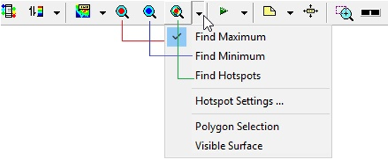
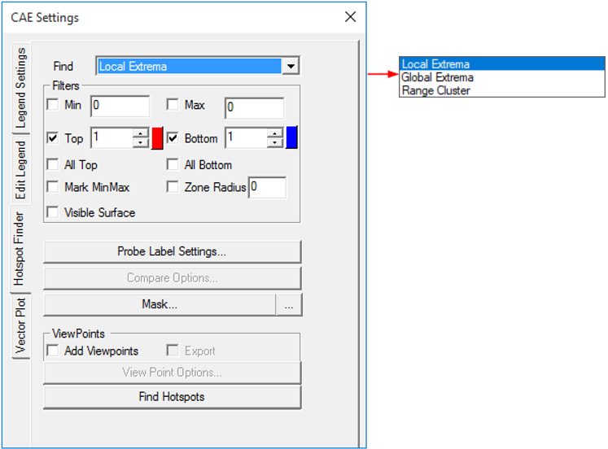
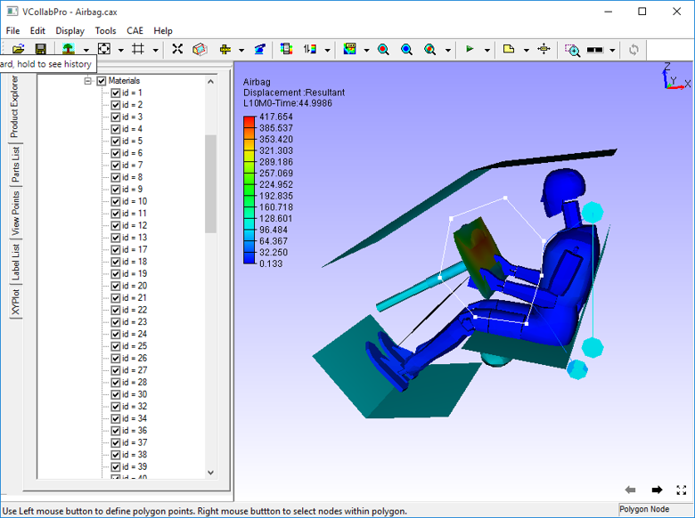
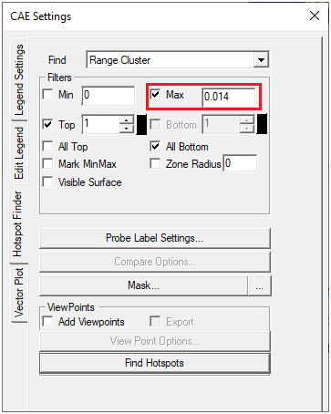

Hotspot Finder
==============

The Hotspot finder tool helps to find the hotspots in a model. A hotspot
can be a node, an element or an area in the computational domain with
extreme values (maximum or minimum) of a result. Local minima, local
maxima or nodes/elements/areas with high gradients can also be
considered as hotspots in certain situations. As the definition of
hotspots can be situational, various mechanisms to identify hotspots are
provided in VCollab Pro. Users can choose the right mechanism based on
their understanding of the problem to identify the hotspots.

Hotspot Finder Tool
-------------------

-  Click **CAE \| CAE Settings \| Hotspot Finder** or Click **Hotspot
   Settings...** under the icon |image1| as shown below.

   |image2|

-  The Hotspot Finder tab opens up as shown below. Select the region in
   which to **Find** from the drop down list

   |image3|

The various options and fields that are available under Hotspot finder
are explained below.

1. **Find:** Users can choose from any one option from the drop down
   list

 -  **Local Extrema :** Under this option, VCollab Pro identifies the
    local maximum or minimum in a node/element within the specified
    zone radius .

 -  **Global Extrema:** Under this option, VCollab Pro identifies the
    nodes or elements with global maximum or minimum values as the
    hotspots.

 -  **Range Cluster** Finds hotspots in a given cluster defined based on the range. Clusters if min and max are not given,  
    legend's first interval values will be taken as the cluster range.
    
 To know more about Local and Global Extrema, click `here <CAE_Hotspots_Extrema.html>`__.

2. **Hotspot Range** (Min & Max): When a range is specified, VCollab Pro
   filters the nodes whose result values lie outside this range. They
   are not considered hot spots. Hot spots are searched among nodes
   whose values satisfy the range limits.

3. **Hotspot Count** (Top and Bottom): This option specifies the number
   of hotspots that need to be generated. Hotspots top and bottom
   labels are differentiated by label border colors, which are red
   and blue respectively. Users can change the default colors if
   needed.

4. **All Top:** If the top value is 100 (as an example) and there are
   multiple IDs with the same value, then hotspot finder considers
   and displays only one of these IDs if All Top is unchecked. If
   this option is checked, hotspot finder displays all IDs with the
   same top values.

5. **All Bottom:** This option is similar to the All Top option, except
   that it considers bottom values.

6. **Mark MinMax:** This option highlights the labels of maximum of top
   labels and minimum of bottom labels. Maximum and Minimum labels
   are highlighted with text colors of Red and Blue respectively.

7. **Zone Radius:** The Zone radius option helps to avoid locating hot
   spots next to each other. Once a hot spot is found, VCollab skips
   all the nodes within the specified radius while searching for the
   next hotspot.

8. **Visible Surface:** Displays the visible labels in the current view.

9. **Probe Label Settings:** Allows users to select probe type and
   template and other result attributes.

   |image4|

 -  **Probe Type:**

   -  CurrentResult - Derived : current scalar value

   -  CurrentResult - Full : Displays all components for vector and
      tensor results.

   -  All Results - Table : Displays user selected scalar result values.

   -  All Instances - Table : Displays all instance values in a table.

   -  All Instances - XYPlot :Displays all instance values as a XYPlot
      graph.

 -  **Template type:** This option displays values in a predefined
    template (format). Header options are meaningful for template 1
    when at least one dataset is merged with an existing one.

 -  **Model:** Selects the model for which results are listed for
    selection.

 -  **All Results:** Displays a list of all available results for the
    selected model. To select a result (for probe labels), click on it
    and then press >> button. The selected result will get added to
    the Select Results list.

 -  **Selected Results:** Displays a list of all the selected results. To
    deselect a result, click on it and then press << button. The
    result will be removed from this list and appear under the **All
    Results** list. To rearrange the results order in the labels, drag
    the result and drop where you want to place.

 -  **Row Header:** To display either dataset name or result/instance
    name in the first column of the label, check the row header box.
    Each row header shows the result/instance that corresponds to the
    CAE result data

 -  **Column Header:** To display either dataset name or result/instance
    name in the top of the labels, check the column header box. Each
    column denotes CAE result data and row denotes the corresponding
    result/instance name.

    |image5|

 -  **Part Header:** Adds annotated part name into the label.

 -  **Header legend:** Displays acronym of the results as a separate label.

 -  **Abbreviation** **Legend:** Displays the legend or abbreviation and
    its acronym in a table separately. It displays a table for short
    letters for results used in the labels. It can be moved like other
    labels.

 -  **ID** : Displays nodal or element ID in the label.

 -  **Rank:** Displays rank number based on the hotspot value and number
    of hotspots found.

 -  **Rank Ascending Order:** Specifies ranking process to be ascending
    or descending.

 -  **Label Settings:** Allows users to format the text and background of
    the label.

 -  **Result Options:** Allows users to select and highlight labels based
    on the result values.

 -  **Apply** or **OK:** Apply the modifications.

10. **Compare Options :** This option is visible only when at least one
    dataset is merged with existing one. It is used to compare
    results of merged models. Users can select the models to be
    compared with the base model (current model). By default it
    generates hotspots/min max labels for the current model.

   |image6|

   The various fields and options available under the Compare options panel
   are explained below.

 -  **Compare merged models:** Check this option to compare the models.
    Once this is checked all other comparison options are enabled.

 -  **Selection of Models for comparison:** The current CAE model is
    listed as the base model. Other models are listed and users can
    select required models to be compared with.

 -  **Compare Results by:** Specify the criteria to compare the results.

   -  **Same Result Name** - Compares selected results with other models
      with same result names.

  +----------------+-------------+-------------------------------------+
  | **Base Model** | **Model 2** | **Same Result**                     |
  +================+=============+=====================================+
  | Result 1       | Result 3    | Result 3 is common in both models.  |
  |                |             |                                     |
  | Result 3       | | Result 2  | So Result 3 will be compared and    |
  |                | | Result 4  | displayed by this type.             |
  | Result 5       | | Result 7  |                                     |
  +----------------+-------------+-------------------------------------+

 -  **Selected Results Order -** Compares results of selected models by
    as per the order of the results.

   ============== =========== ====================
   **Base Model** **Model 2** **Result order**
   ============== =========== ====================
   Result 1       Result 3    Result 1 => Result 3
                              
   Result 3       Result 2    Result 3 => Result 2
                              
   Result 5       Result 4    Result 5 => Result 4
                              
                  Result 7    
   ============== =========== ====================

-  **Results Display Name -** Compares results by same display names
   (case sensitive). Ignores the result names for comparison. In the
   following table display names are specified in braces.

   +----------------------+----------------------+----------------------+
   | **Base Model**       | **Model 2**          | **Same Display       |
   |                      |                      | Name**               |
   +======================+======================+======================+
   | Result 1 (**Result   | Result 3 (**Result   | Result 1 (**Result   |
   | 4**)                 | 2**)                 | 4**) => Result 2     |
   |                      |                      | (**Result 4**)       |
   | Result 3 (**Result   | Result 2 (**Result   |                      |
   | 3**)                 | 4**)                 | Result 3 (**Result   |
   |                      |                      | 3**) => No Result    |
   | Result 5 (**Result   | Result 4 (**Result   |                      |
   | 5**)                 | 6**)                 | Result 5 (**Result   |
   |                      |                      | 5**) => Result 7     |
   |                      | Result 7 (**Result   | (**Result 5**)       |
   |                      | 5**)                 |                      |
   +----------------------+----------------------+----------------------+

-  **Comparison Field:** The following methods are available to users to
   compare results.

   **\*Radius** refers to the default radius and not the user defined
   Zone radius

-  **Position : Nearest -** Compare one hotspot node with a node from
   another model based on position

   -  Get nearest node from the other model with distance < \*Radius

   -  Select this nearest node for comparison.

-  **Position : Min/Max -** Compare one hotspot node with a node from
   another model based on position

   -  Get all nodes in the other model with distance < \*Radius

   -  From this set of nodes select one node for comparison

   -  For top hotspot select the node with Max value

   -  For bottom hotspot select the node with Min value

-  **ID:** Compare the hot spot node with a node from the other model
   having the same id.

-  **ID : Distance -** Compare the hot spot node with a node from the
   other model having the same id

   -  AND distance < \*Radius

-  **Hotspot: Min/Max-** Compare the hotspot node with a hot spot node
   from the other model by:

   -  Get all hotspot nodes in the other model with distance < \*Radius.

   -  From this set of hotspots select one hot spot for comparison

   -  For Top hot spot select the hotspot with Max value

   -  For Bottom hotspot select the hotspot with Min value.

-  **Hotspot: Nearest**

   Compare the hotspot node with a hotspot node from another
   model.

   -  Get all hotspot nodes in the other model with distance < \*Radius.

   -  From this set of hotspots select the nearest hotspot (of same
      type) for comparison.

-  **Hotspot: Min/Max UseRange**

      Compare the hotspot node with a hot spot node from another
      model

   -  Get all hotspot nodes in another model with distance < Zone radius
      (user defined).

   -  From this set of hotspots select one hot spot for comparison.

   -  For Top hotspot select top hotspot with Max value.

   -  For Bottom hotspot select bottom hot spot with Min value.

-  **Hotspot: Nearest UseRange**

     Compare the hotspot node with another hotspot node from the
     other model

   -  Get all hotspot nodes in another model with distance < Zone radius
      (user defined).

   -  From this set of hotspots select nearest hotspot (of same type)
      for comparison

-  **Compare With**

   -  Same Part - Compare using the comparison options specified above
      in the same part of the other model.

   -  Visible Parts - Compare using the compare options specified above
      in all visible parts of the other model.

   -  All Parts - Compare using the compare options specified above in
      all parts.

-  **Within Distance -** Allows users to specify the distance value and
   hotspots are computed within this range.

-  **Hotspots In All Models**: Finds hotspots for each model. Then it
   appends results from merged models as rows or columns based on the
   template selected.

-  **Show All Connections:** Shows all the connecting lines between the
   label and its attached positions.

11. **Mask :** This option in the Hotspot finder panel, allows users to
    mask a set of nodes and elements from the process. Users can mask
    the nodesets from the hotspot finding process using `Node Set
    manager <CAE_NodeSet_Manager_Pro.html>`__.

**Note:** Masking is not supported for Elemental Result.

12. **Add View Points:** When enabled, this option generates viewpoints
    according to viewpoint options specified. Viewpoints Options
    button is enabled only when this option is checked.

13. **Export:** This option helps users to export the viewpoints into
    either VPT file or Microsoft PPT file. While adding the view
    path, users will be prompted for a file name and file type.

14. **Viewpoints Options:** This option helps users to select either
    part wise viewpoints or multi view points for a single scene.
    
   |image7|

The various fields that are seen in the Viewpoint Options panel are
explained below

-  **Each Parts**: Enabling this option creates a viewpoint for every
   part. If top hotspot count is specified as ten, and if the model
   consists of 5 parts, then the generated view path consists of 5
   viewpoints (one per each part) with each viewpoint consisting of
   ten hot spots in the corresponding part. There will not be any
   change in view and orientations. In every viewpoint, one part is
   visible and others are hidden.

-  **Visible:** When enabled, this option filters the parts based on its
   visibility and lists the parts in the list.

-  **All Std. Views:** This option will include 6 standard view points
   (X, Y, Z,-X,-Y and -Z) for each part or current scene based on
   **Each Part** option. The viewpoints can be filtered by checking
   or unchecking the corresponding boxes. options. Users can check or
   uncheck the entire column or row as well in one shot.

-  **Add View**: Add view option adds current camera view or user’s view
   as an option with standard views in the GUI. Users can check or
   uncheck if necessary. To update current view, click on the
   |image8|\ icon. It will set the current camera position as the
   viewpoint.

-  **Regions:** The model area can be split into a number of regions and
   each region that is displayed focuses on that region’s hotspots.
   (2,4) means to split the model area into 2 regions horizontally
   and 4 regions vertically, so the total regions are 2x4=8. |image9|

-  **Hotspots per page:** Users can specify the number of hotspots per
   page in the viewpoints. If there are 45 hotspots in the model and
   20 are the Hotspots per page specified, then 3 viewpoints will be
   generated. First and second viewpoints will have 20 hotspots in
   each and the remaining 5 hotspots will be shown in the third
   viewpoint.

   .. note::
   
      By default the number of hotspots per page is 20 (max allowed).
      Users can change this as per requirement.

-  **Auto Views** : When selected, this option helps to orient the
   viewpoint such that the user can view all the hotspots clearly.

   The number of auto views specifies how many auto viewpoints should be
   generated to make all the hotspots visible to the user.

15. **Find Hotspots:** This option in the Hotspot finder panel generates
    hotspots for a model according to the options specified.

**Steps to find hotspots after hotspot settings**

-  Click **CAE \| Hotspot Finder** or click the icon\ |image10| , which
   enables mouse mode for hotspot finder.

-  Select a region to find hotspots either by rectangular window or by
   polygon selection.

-  If **Polygon Selection** is off, then selection is done using a
   rectangular window by default.

   |image11|

   E.g. : Rectangular window selection

   |image12|

   E.g.: Polygon Selection

   |image13|

-  Once the region is selected, hotspot CAE values are displayed as
   labels as follows.

   |image14|
   
Hotspot Range Cluster
---------------------
Cluster based on range.

 Example:
 Consider the following airbag model,

 |image15|  |image16|

 For Top hotspot, range is defined by Filter Min value, ( 0.024 ). To visualize the cluster defined by  (> 0.024) , enter the same value in  Legend  as in the image above. 
 User can see two red clusters. This algorithm finds maximum value for each cluster and shows the labels.

 |image17|  |image18|

 Similarly for Bottom hotspot, range is defined by Filter Max value ( 0.014 ). To visualize the cluster defined by (< 0.014), 
 enter the same value in Legend  as in the image   above. User can see three blue clusters. This algorithm finds minimum value for each cluster and shows the labels.

.. |image1| image:: icons/HotspotFinder.jpg

.. |image5| image:: JPGImages/cae_Hotspot_Finder_ColumnHeader.png

.. |image10| image:: icons/HotspotFinder.jpg

.. |image15| image:: JPGImages/hotspot_settings_range_cluster_min.png

.. |image16| image:: JPGImages/hotspot_range_cluster_top.png

