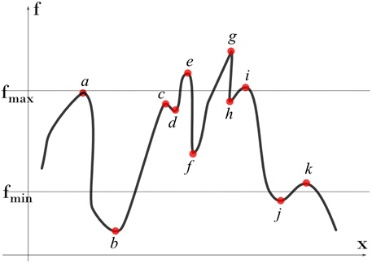

Hotspots Extrema
================

**Hot Spots**

 Extrema are the extreme values of a function - the places where it reaches its minimum and maximum values. There are two types of extrema -local and global. Global extrema are the largest and smallest values that a function takes on over its entire domain, and local extrema are extrema which occur in a specific neighborhood of the function. In both the local and global cases, it is important to be cognizant of the domain over which the function is defined. That which is an extremum on one domain may very well not be over a new domain, and vice versa.

**Local Extrema**

 Mathematically, the local extrema for a field *f*\ (*x*, *y*, *z*) are defined as follows.

 Local maximum: *f'* = 0 and *f''* < 0

 Local minimum: *f'* = 0 and *f''* > 0

 In a continuous field, a hill top represents a local maximum and a valley bottom represents a local minimum. This is true even in a discrete fields with no discontinuities provided the discrete field assuming that extrema are happening only at specified discrete points.The standard way to search for local maxima/minima in a discrete field is to look for all points whose values are more/less than all its neighbors.

**Global Extrema**

  Global extrema are maximum and minimum in the whole domain independent of neighborhood. There will be only one set of extrema for the whole domain.

  Consider the following graph. let us find the local and global extrema.

    |image0|

**Steps to find Local Extrema**

#. Compute all the local minima/maxima for the whole field. As mentioned earlier, we only need to look for nodes whose values are higher/lower than their neighbors. Using this methodology, considering the field displayed in the curve in Fig. 3, we can obtain the local extrema as given below: 
   Local maxima: Nodes *a*, *c*, *e*, *g*, *i* and *k*
   Local minima: Nodes *b*, *d*, *f*, *h* and *j*
#. Sort the nodes (extrema) such that the result values are in descending order. For this case, the order can be obtained as *g*, *e*, *i*, *a*, *h*, *c*, *d*, *f*, *k*, *j* and *b.*

#. Pick the top m nodes and bottom n nodes and highlight them to the user. In this case, if user asks for 3 top and 2 bottom, we highlight nodes *g*, *e* and *i* (maxima) and *b* and *j* (minima).

#. If user sets a range, the nodes that lie outside the range are filtered out. For example, when a range (f\ :sub:`min`\ ,f\ :sub:`max`\ ) is used, we highlight *a*, *c* and *k* (maxima) and *f* and *d* (minima).

**Steps to find Global Extrema**

#. Arrange all values in descending order. For this case, the order can be obtained as g, e, i, a, h, c, d, f, k, j and b.
#. Pick the top m nodes and bottom n nodes and highlight them to the user. In this case, if user asks for 3 top and 2 bottom, we highlight nodes, g,e,i (top) and b,j (bottom).
#. If user sets a range, the nodes that lie outside the range are filtered out. For example, when a range (f\ :sub:`min`\ , f\ :sub:`max`\ ) is used, we highlight a, h, c (top) and f,k (bottom).

