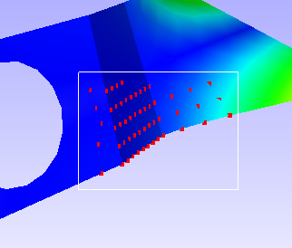

Node Set Manager
================

VCollab Pro users can group a set of nodes and use it in other
functional modules using the Node Set Manager option under CAE menu.
This reduces significant time in selection of nodes for different
purposes.

**Node Set :** A Node Set is a group of nodes having a name given by the
user.

A Node set can be used in

-  masking color plot

-  vector plot

-  XYPlot

-  Hotpot finder

Node Set Manager Panel
----------------------

Click **CAE|Node Set Manager** to open the panel as shown below. There
are three tabs , Creator tab, Manager tab and Filter Save tab.

Creator Panel
*************

|image1|

The various fields and options in the Creator tab are explained below.

================================================================ ====================================================================
**Selection using mouse**

**Rectangle**                                                       Allows user to select nodes by user window

**Point**                                                           Allows user to select nodes by picking

**Polygon**                                                         Allows user to select nodes by user polygon

**Box**                                                             Allows user to select a region by mouse and modify the box dimensions.

**Visible Surface**                                                 A filter option to ignore hidden nodes.

**Get Probe Label Nodes**                                           Selects all visible probed node IDs.

**Bound Box**                                                       A bound box with given distance is considered at each probe label. All nodes within each box are considered for node set.

**Selection using highlighted parts**

**Selection Parts**                                                User can choose any one of the following options.

                                                                   -  All nodes
                                                                   -  Connected element nodes
                                                                   -  All nodes and connected element nodes.
                                                                   -  Edge nodes
                                                                   -  Edge element nodes.

**Get Nodes**                                                      Gets filtered nodes according to the selected constraint.

**Selection using current selected nodes**

**Replace Current**                                                Clears existing nodes and considers new neighborhood or proximity nodes.

**Element**                                                        Considers adjacent element instead of adjacent nodes

**Get Adjacent Nodes**                                             Appends immediate adjacent nodes of current nodes.

**Range**                                                          Proximity radius value of Node or element.

**Element Proximity**                                              A On/Off flag for Element or nodal proximity.

**Get Proximity Nodes**                                            Appends nodes within the proximity range.

**From Resut Range...**                                            
                                                                   Pops up result range dialog, user can select scalar result and set
                                                                   range. This function selects all the nodes those scalar result value
                                                                   falls within the user range.                                      

**Node set Name**                                                  Name of the new node set.               

**Create**                                                         Creates a node set with user defined name and final nodes displayed
                                                                   currently.

**Clear**                                                          Clears displayed nodes.

================================================================ ====================================================================

Manager Panel
*************

|image2|

The various fields available in the Manager tab are explained below.

+------------------+--------------------------------------------------+
| **Model**        | Selects a CAE Model                              |
+------------------+--------------------------------------------------+
| **List Box**     | Lists all node set names corresponding to the    |
|                  | model                                            |
+------------------+--------------------------------------------------+
| **Show**         | Check/Uncheck to show/hide                       |
+------------------+--------------------------------------------------+
| **Node set**     | Node set name mask for hotspot finder or color   |
|                  | plot                                             |
+------------------+--------------------------------------------------+
| **Mask Type**    | Allows user to select mask type. (Inside or      |
|                  | Outside or None are the types)                   |
+------------------+--------------------------------------------------+
| **Color**        | Display color of the node set                    |
+------------------+--------------------------------------------------+
| **Color Mask**   | Masking the node sets in contour.                |
+------------------+--------------------------------------------------+
| **Hotspot Mask** | Masking the node sets in finding hotspots.       |
+------------------+--------------------------------------------------+
| **Show NodeSet   | Displays parts associated with nodesets. And     |
| Parts Only**     | Hides other parts.                               |
+------------------+--------------------------------------------------+
| **Hide NodeSet   | Just hides the parts associated with the nodeset.|
| Parts**          |                                                  |
+------------------+--------------------------------------------------+
| **Edit**         | Allows user to edit the nodeset.                 |
+------------------+--------------------------------------------------+
| **Delete**       | Delete all selected node sets.                   |
+------------------+--------------------------------------------------+

**Types of Color Mask**

VCollab provides following types in color masking.

- None - No masking
- No Result - Masked region will be in 'No Result' color
- Cull - Masked nodes and its associated elements will not be displayed.
- Transparent - Masked region will be displayed as semi transparent.

|image16|
  
**Steps to create a Node Set**

 **Selection of Nodes**

 -  Click **CAE | NodeSet Manager...** menu item, which pops up a dialog.
 -  Click a mouse selection mode, Rectangle / Point / Polygon.
 -  **Rectangle mode**

    -  Use *left mouse* button to drag a window to select nodes.

    -  Use *right mouse* button to drag window to deselect nodes.

       |image3|

 -  **Point mode**

    -  Click on a node directly to select it.

    -  Click a selected node with the middle button to deselect it.

 -  **Polygon mode**

    -  Left click start defining a polygon.

    -  Click points on the screen to build a polygon.

    -  Right click to close the polygon.

       |image4|

    -  The selected nodes are displayed in the viewer.

    -  Use the **Visible Surface** option to filter hidden nodes in the current view.

 -  **Box**   
     
    -  Use left mouse to click and drag to define a box.
      
    -  Each bound plane can be moved in or out using mouse click and drag.

       |image17|

    -  Click the **box button again** to complete node selection within the box. Box will dissappear and nodes will be highlighted.

       |image18|

 **Appending Nodes from selected parts**

 -  Select parts before using this option.

 -  Select

    -  **All Nodes** to get all the nodes from the selected parts.

    -  **Connected Element Nodes** to get nodes from the elements which
       connect selected parts and other parts.

    -  **All and Connected Element Nodes** to get all nodes from selected
       part and connected element parts.

    -  **Edge Nodes** to get nodes on the feature edges of selected
       parts. This depends on feature edge crease angle too.

    -  **Edge Element Nodes** to get nodes from the elements of which has
       at least one feature edge.

    -  Click **Get Nodes** to append the nodes.

       |image5|

 **Appending Nodes from probe**

 -  Click the **Add Probe Labels** button to include all probed nodes.

 -  Select **Visible Probe Labels** option to ignore hidden probe label nodes.

 **Appending or Replacing selection using 'From Selected Nodes : Neighbourhood'**

 -  Click the Get **Adjacent Nodes** button to find adjacent nodes of
    selected nodes.

 -  Use **Proximity Range** to find nodes which falls within a given
    range of selected nodes.( i.e. Nodal Proximity)

 -  Select **Element Proximity** to find nodes which fall within a given
    range of elements (associated with selected nodes).

 -  Click **Get Proximity Nodes** to append the selection of nodes.

 -  Click **Replace Current** option to replace the selection instead of
    appending.

    |image6|

 **Clearing the selection**

 -  Click **Clear** to clear the current selection of nodes.

 **Creating Node Set**

 -  Provide a unique name to the selection of nodes (node set) in the
    text box given

 -  Click **Create** to create a node set whose name will be added to the
    list in the manager tab.

**Steps to manage Node Set list**

-  Created Node Sets as explained above.

-  Click **CAE | NodeSet Manager...** to open the NodeSet Manager panel.

-  Select **Manager** tab.

-  Select the CAE model for which node sets need to be managed

-  Select a node set name.

**Editing Node Set**

-  Click **Edit** to

   -  modify the nodes in the set.

   -  Clear and build new node set, Or

   -  Filter nodes by removing nodes.

**Deleting Node Sets**

-  Select a Node Set to be removed.

-  Click **Delete**.

**Toggling Node Set Attributes**

-  Click the **Show** check box in the Node Set list box to turn On /
   Off its visibility.

-  Click the Mask check box in the Node Set list box to mask / unmask
   color plot for those nodes.

-  Click **Color** cell to edit display color of the nodes.

   |image7|

   **N/A** refers to 'No Masking'
   
   **It refers** to include in masking.
   
   **Out** refers to exclude the nodeset from masking.

-  Click **Color** cell to edit display color of the nodes.

-  Click **Mask** check box in the bottom of dialog to mask / unmask the
   color plot for those nodes.

   |image8|
   
   **Combination of In and Out masked Nodesets**
   
   Nodeset A with *In* mask type is refered as *A*
   Nodeset A with *Out* mask type is refered as *A'*
   
   |image20|
   
   |image21|

**Node Sets in Hotspot Finder**

-  Open **Hotspot Finder** Settings tab under CAE Settings

   |image9|

-  Click **Mask**...to open the dialog below where one can select or
   deselect Node Sets.

   |image10|

   |image11|
   

.. note::
- Masking is not supported for Elemental Result. 
- Users can select multiple Node Sets for masking during hotspot finding operation.

**Steps for creating a nodeset from the result range**

-  Open Nodeset Manager dialog.

-  Click **Creator** tab

-  Click the **From** **Result Range...** button to open the dialog box
   as shown below

   |image12|

-  Select the required **Result, Instance** and **Derived** scalar
   result.

-  Check **Min** and **Max** check boxes and edit their values

   |image13|

-  Click **OK**

-  Nodes within the result range will be highlighted in the viewer.

   |image14|

-  Click the **Create** button to create the nodeset.

    

.. |image4| image:: JPGImages/NodeSet_Polygon_Mode.png

.. |image5| image:: JPGImages/NodeSet_SelectedParts_Options.png

.. |image8| image:: JPGImages/NodeSet_Mask.png

.. |image16| image:: JPGImages/TypesofColor_Mask.png

.. |image17| image:: JPGImages/Box1.png

.. |image18| image:: JPGImages/Box2.png

.. |image20| image:: JPGImages/NodeSetMgr_InOut.png

