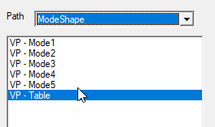
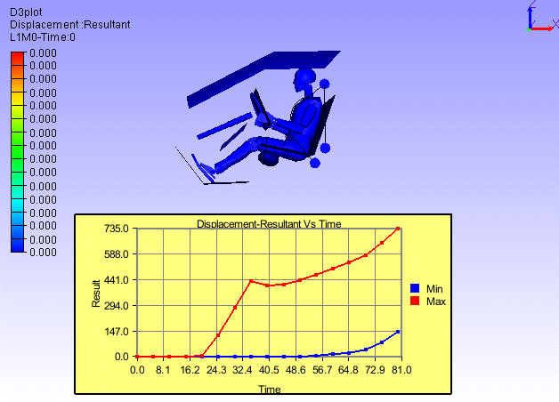
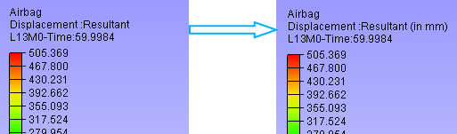
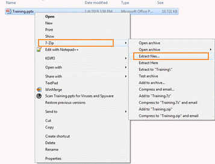
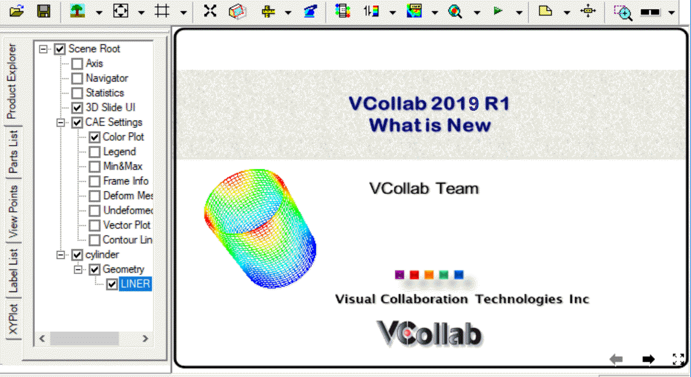
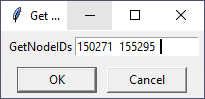
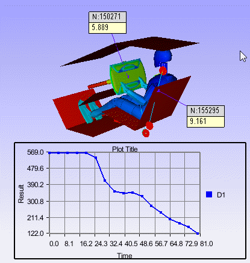
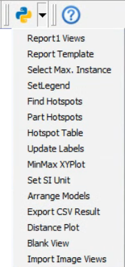
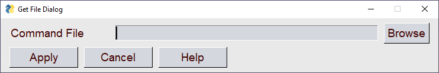
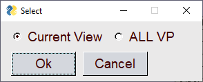

Py Tools
=========

  VCollab provides PY_Tools, a custom tools menu which comes with the
  installer. It contains a set of utility functions which are associated
  with a set of python scripts.
  The description of association between each function name and
  corresponding Python script is to be defined in a specific format in a
  file "**<VCOLLAB_DIR>\VCollabPro64\VCollabStdPyTools.csv**". The
  following set of functions are provided in this release.

   +------------------------------------------------------------------------------+
   | #VCollab_Python_INTERFACE,                                                   |
   | GUI Mode=0,                                                                  |
   | PY_Tools,Images/py_tools.png                                                 |
   | Report Views,%VCOLLAB_DIR%\VCollabProX\PYTools\ReportViews.py                |
   | Report Template,%VCOLLAB_DIR%\VCollabProX\PYTools\CMDTemplate_Run.py         |
   | Select Max. Instance,%VCOLLAB_DIR%\VCollabProX\PYTools\SelectMaxInst.py      |
   | SetLegend,%VCOLLAB_DIR%\VCollabProX\PYTools\SetLegend.py                     |
   | Find Hotspots,%VCOLLAB_DIR%\VCollabProX\PYTools\FindHotspots.py              |
   | Part Hotspots,%VCOLLAB_DIR%\VCollabProX\PYTools\PartHotspots.py              |
   | Hotspot Table,%VCOLLAB_DIR%\VCollabProX\PYTools\HotspotTable.py              |
   | Update Labels,%VCOLLAB_DIR%\VCollabProX\PYTools\Update_Labels.py             |
   | MinMax XYPlot,%VCOLLAB_DIR%\VCollabProX\PYTools\MinMaxXYPlot.py              |
   | Set SI Unit,%VCOLLAB_DIR%\VCollabProX\PYTools\setUNITS_SI.py                 |
   | Arrange Models,%VCOLLAB_DIR%\VCollabProX\PYTools\ArrangeModels.py            | 
   | Export CSV Result,%VCOLLAB_DIR%\VCollabProX\PYTools\ExportAllinstance2CSV.py |
   | Distance Plot,%VCOLLAB_DIR%\VCollabProX\PYTools\TrackDistPlot.py             |
   | Blank View,%VCOLLAB_DIR%\VCollabProX\PYTools\Blankview.py                    |
   | View2Background,%VCOLLAB_DIR%\VCollabProX\PYTools\Create_Background.py       |
   | Import Image Views,%VCOLLAB_DIR%\VCollabProX\PYTools\ImportImageViews.py     |
   +------------------------------------------------------------------------------+
   
   *User Interface*
   
   |PyToolsMenu|

Report Views
------------

 This function (script) will create a set of Viewpoints based on analysis
 type. For loadcase analysis (Linear/Transient) it will create Maximum
 Instance hotspot views for each result. For Modal Analysis, it will
 create first 10 modal animation views with a Frequency Table view.

   |Report_Views_Results| |Report Views Modal Analysis|

Report Template
---------------

 In VCollab, a live 3D report can be created by defining a set of live slides or viewpoints. VCollab Python API can
 be used to create such live slides automatically. To simplify report automation task, a list of generic commands are developed using python. A list of such
 commands ('Report Template' ) can be defined in a text file and run using " PyTools -->Report Template" menu

 The file'Template_CMDList.pdf', located in %VCOLLAB_DIR%\VCollabProX\PyTools\PyTool_Package, gives a brief description for the supported commands.
 User can create their own template using this commands in a text file and run through this interface.

 |ReportTemplate|

 Just click 'Apply' button without providing command file, to run default template command file.
 A message box pops up after the command file is executed.

 |ReportTemplateNotify|

Select Max Instance
-------------------

 This function will display 'Maximum Value Instance' for the current
 result (and derived type).

   
Set Legend
----------

 This function helps user to set pre-min & pre-max legend values, precision and number of colors quickly. This command pops up the following user interface,

   |SetLegend|

Find Hotspots
-------------

   This function will display a Python TK Dialog box (as shown below)
   for the current displayed result and instance. In this dialog box
   user can specify,

   -  Legend Max, Min values to highlight specific range of values.
   -  Option to filter parts and associated limit
   -  Top/Bottom hotspot option (if Top Hotspot check box is check then
      Top option else Bottom option)
   -  Number of hotspots 

   |Py_Find_Hotspots_panel|

   When Apply button is clicked, hotspots are displayed based on user
   selected probe settings. If filter parts option is selected then the
   parts with result value outside the filter limits will be hidden
   (filter limits Top or Bottom is set based on the hotspot option)

Part Hotspots
-------------

  This function computes hotspots for each individual part according to hotspot settings.

Hotspot Table
-------------

 This function creates a 2D table with Node ID, Position and result Value
 for the probed labels.

     |Hotspot TableExample|

 Note: Use similar probe types (Derived or All result). It will not
 work for multi-model comparison tables.

Update Labels
-------------

 This function updates all labels with latest label settings. User can update all viewpoints label also.

    |UpdateLabels|

MinMax XYPlot
-------------

 This script will create MinMax XY Plot for current displayed result.

   |image1|

SetSI_Unit
----------

 This function will set Units (SI) for all common result types (Results
 Option Dialog).

   |image2|

Arrange Models
--------------

 This function arranges all merged models evenly displaced rows.

   |image4| |Arrange Models in view|

Export CSV Result
-----------------

 This function exports current result instance into a csv file. User can enter output file folder path using the popup dialog.
 And user can check 'All Instances' option to write all instances, 'XYZCoord' option to write nodal coordinates data.

   |ExportCSV|

Blank View
----------

 This function clears the viewer screen with white background in a
 single click. i.e. It hides all the objects in the viewport.

Distance Plot
-------------

 This function helps to find or trace the distance between any two
 nodes among all time steps. Clicking this item, pops up a input dialog and prompts for any two
 node IDs.

 Input dialog takes first two node ids from probe tables if they are
 available. Otherwise user has to enter the node IDs manually in the
 input dialog box.

   |Distance Plot Dialog|

 On clicking OK in the dialog, creates an XYPlot with a single curve
 which represents the distance between given nodes.

   |Distance Plot View|

Import Image Views
------------------

 This function will ask for the image folder and add 'background image
 viewpoints' for each image in the folder. This function can be used to
 import all the slides from a PowerPoint (PPTx) as 2D viewpoints.

 Export PowerPoint slides as images (png/jpeg) into a folder.

   |Import Image Views from PPT|

 or Create images from native post processor or CAD tools.

 Select this function. Following Folder selection dialog will appear

   |Select Folder|

 It will add viewpoints for all images in the selected folder.

   |image3|

    

**Note**:

This 'PY_Tools' is for common utility functions (may be for company
level customization).  For user level customization, user can create
same kind of csv file with user defined menu item names and
corresponding scripts. Then copy the created csv and script files to
the **"%APPDATA%\VCollab\"**. VCollab looks for any csv file with the
proper header and creates the menu in the next application session.

 

 

.. |Py_Tools Menu| image:: JPGImages/Report_Views.png

.. |Select Max Instance| image:: JPGImages/Py_Select_Max_Instance.png
.. |Py_Find_Hotspots| image:: JPGImages/Py_Find_Hotspots.png

.. |Hotspot Table| image:: JPGImages/Py_Hotspot_Table.png

.. |Min Max XYPlot| image:: JPGImages/Py_MinMaxPlot.png

.. |Set SI Unit| image:: JPGImages/Py_Set_SI_Unit.png

.. |Import Image Views| image:: JPGImages/Py_ImportImageViews.png

.. |Arrange Models| image:: JPGImages/PY_Arrange_Models.png

.. |Export CSV Result| image:: JPGImages/Py_Export_Result.png
.. |Blank View| image:: JPGImages/Py_Blank_View.png
.. |Result Mask Dialog| image:: JPGImages/Result_Mask_Dlg.png

