Probe
=========

The Probe option helps to query and display CAE result values for specific nodes
or elements as labels in the VCollab viewer.

|image1|

There are several kinds of Probes:

-  **Current Result - Derived :**
   
   Displays value of current derived result at probed ID. Shortcut:enable Probe and click on the model.

-  **Current Result - Full :**
   
   Displays base components of selected result. Shortcut:enable Probe and hit Alt + click on the model.
   X,Y,Z components for vector results like velocity or displacement.

   |image2|

   Translational and Rotational x,y,z for six degrees of freedom result.

   |image3|

   xx, yy, zz, xy, yz, xz components for tensor results like Stress in a
   matrix form.

   |image4|

-  **All Results - Table :**

   Displays all result values of the probed ID.

-  **All Instances - Table :** 

   Displays all instance values of current result for the probed ID.
   Shortcut - enable Probe and hit Ctrl + left click.

-  **All Instances - XYPlot :**

   Displays XYPlot curve which describes instances vs CAE result values. 
   
   Shortcut - enable Probe and hit Shift + left click.

-  **Tracer:** Displays path of a node traced in transient animation.

**Steps to probe CAE results**

-  Click **CAE \| Probe** , which enables mouse mode to probe, Or

   Go to **Probe** icon |image5| in the toolbar and click the down arrow
   next to the probe icon.

   A list of probe types is shown.

   |image6|

-  Select a Probe type.

-  Click on a node to probe its current CAE result.

-  Notice that the CAE value with nodal number is displayed as a label
   in the viewer.

-  Click **Probe** **Settings** and open the Label Settings dialog box.

   |image7|

-  Select the required tab and apply the settings to particular      
   portions of the probe label.                                   

   **Current Result - Derived**  

   |image8|

   **Current Result - Full**

   |image9|

   **All Results - Table**

   |image10|

   **All Instances-Table**

   |image11|

   **All Instances - XYPlot**

   |image12|

   **Tracer**

   |image13|

Probe Table Details
-------------------

The probe table details are split into three regions.

1. **Header** : This corresponds to the table header. It contains node
   or element ID. In case of merging more than one model, this header
   contains more than one ID and each ID refers to one column in the
   value region.

2. **Row Header:** The row header holds the model name for the column
   data. It is useful when comparing multiple models.

3. **Column Header:** The column header lists all the result names. It
   contains only abbreviations of results. For e.g., D is for
   displacement. Users can refer to the abbreviation table if
   necessary.

4. **Value Region**: These cells hold the values corresponding to column
   and row header.

   |image14|

**Probe Label Context Menu**

 To open the context menu, **double click** on a label.

 |image15|

 The various options available under the Probe label context menu are explained below.

 +------------------------------+--------------------------------------+
 | **Edit Font**                | Change the font and its attributes.  |
 +------------------------------+--------------------------------------+
 | **Display**                  | Show/hide the selected label headers |
 |                              | and label legends.                   |
 +------------------------------+--------------------------------------+
 | **Modify**                   | Modify or edit the table except      |
 |                              | existing result values. It is        |
 |                              | visible for Model header, Result     |
 |                              | header and Value cells. It is not    |
 |                              | applicable for ID header and Part    |
 |                              | header cells.                        |
 +------------------------------+--------------------------------------+
 | **Mark Min & Max**           | Highlight the table if value is      |
 |                              | maximum or minimum among the         |
 |                              | available tables.                    |
 +------------------------------+--------------------------------------+
 | **Focus Node**               | Focus the nodal vertex region based  |
 |                              | on levels.                           |
 +------------------------------+--------------------------------------+
 | **Hide Label**               | Hide the selected label.             |
 +------------------------------+--------------------------------------+
 | **Delete Label**             | Delete the selected label.           |
 +------------------------------+--------------------------------------+
 | **Show All Labels**          | Shows all labels independent of      |
 |                              | attached position visibility         |
 +------------------------------+--------------------------------------+
 | **Hide All Labels**          | Hide all labels.                     |
 +------------------------------+--------------------------------------+
 | **Delete All Labels**        | Delete all existing labels.          |
 +------------------------------+--------------------------------------+
 | **Delete All Hidden Labels** | Delete all hidden labels.            |
 +------------------------------+--------------------------------------+
 | **Invert Show Labels**       | Invert the labels’ visibility.       |
 +------------------------------+--------------------------------------+
 | **Fit Labels**               | Fit all labels inside the viewer.    |
 +------------------------------+--------------------------------------+
 | **Autofit Labels**           | Fit all labels inside the viewer     |
 |                              | during scene rotation, zoom and pan. |
 +------------------------------+--------------------------------------+
 | **Arrange Labels**           | Arrange all labels and tables in     |
 |                              | multiple rows according to their     |
 |                              | attached positions in the model.     |
 +------------------------------+--------------------------------------+
 | **Auto Arrange Labels**      | Arrange all labels automatically     |
 |                              | whenever the user modifies the label |
 |                              | or table dimensions                  |
 +------------------------------+--------------------------------------+
 | **Set As Default**           | Sets the probe table format settings |
 |                              | and probe type as default In case of |
 |                              | viewpoint, these settings will be    |
 |                              | overridden by viewpoint label        |
 |                              | settings. (i.e., viewpoint label     |
 |                              | format will be set as default)       |
 +------------------------------+--------------------------------------+

**Display Submenu**

 |image16|

 +--------------------+------------------------------------------------+
 | **ID**             | Show or hide table header.                     |
 +====================+================================================+
 | **Part**           | Show or hide part name header                  |
 +--------------------+------------------------------------------------+
 | **Row Header**     | Show or hide row header.                       |
 +--------------------+------------------------------------------------+
 | **Column Header**  | Show or hide column header.                    |
 +--------------------+------------------------------------------------+
 | **Rank**           | Show or hide Rank cell.                        |
 +--------------------+------------------------------------------------+
 | **Ascending Rank** | Rank will be displayed in ascending or         |
 |                    | descending order.                              |
 +--------------------+------------------------------------------------+
 | **Abbreviations**  | Show or hide result abbreviations table.       |
 +--------------------+------------------------------------------------+
 | **Transpose**      | Transpose the table matrix.                    |
 +--------------------+------------------------------------------------+
 | **Highlight**      | Highlight the picked label.                    |
 +--------------------+------------------------------------------------+

**Modify Submenu**

 The **Modify** submenu is different depending on the type of the label
 cell **double clicked**. If the clicked cell is a value cell, then
 **Field Value**\ … and **Precision**... appear. **Header Name**\ …
 appears for model and result header cells.
 
 Value Cell 
 
 |image17| 
 
 Model/Result Header Cell
 
 |image18|
 
 +---------------------------+-----------------------------------------+
 | **Field Value**           | Edit values and update it to multiple   |
 |                           | cells across all viewpoints.            |
 +===========================+=========================================+
 | **Precision**             | Change precision and formats.           |
 +---------------------------+-----------------------------------------+
 | **Add Row**               | Add a new row at the end.               |
 +---------------------------+-----------------------------------------+
 | **Insert Row**            | Insert a new row at the mouse cursor    |
 |                           | position.                               |
 +---------------------------+-----------------------------------------+
 | **Add Column**            | Add a new column at the end.            |
 +---------------------------+-----------------------------------------+
 | **Insert Column**         | Insert a new column at the mouse cursor |
 |                           | position.                               |
 +---------------------------+-----------------------------------------+
 | **Delete Row**            | Delete the specified row.               |
 +---------------------------+-----------------------------------------+
 | **Delete Column**         | Delete the specified column.            |
 +---------------------------+-----------------------------------------+
 | **Header Name**           | Edit the header display name.           |
 +---------------------------+-----------------------------------------+
 | **Delete Row Current**    | Delete current cell row (based on the   |
 |                           | cursor position).                       |
 +---------------------------+-----------------------------------------+
 | **Delete Column Current** | Delete the current column.              |
 +---------------------------+-----------------------------------------+

**Focus Node Submenu**

Double click on a label cell to open the context menu. Click on focus
node option

|image19|

Focus Node helps to zoom in the nodal vertex region in four levels for
better visualization:

-  **Level 0** focuses on the element associated with the nodal vertex.

-  **Level 1** focuses on the nodal vertex with 1/10th of part bounding
   radius.

-  **Level 2** focuses on the nodal vertex with 1/4th of part bounding
   radius.

-  **Level 3** focuses on the nodal vertex with part bounding radius.

**Steps to scale Geometry or Parts before Probing**

-  Click **Edit \| Product Explorer**, which displays the product tree.

-  Click the group node, not leaf node.

-  Right click on the node to open the context menu.

-  Select **Transform** option.

-  Check the **Scale** option.

-  Enter the scale factors for each coordinate axis. The model is scaled
   and is ready for probing.

**Steps to Edit and format Table**

-  Double click on the table header cells to open the context menu

-  Click **Modify \| Header Name** to change the header or result name.

   |image20|

-  Check **Update Viewpoints** option to update all viewpoint tables.

-  Enter a name and click **OK** to update the table.

-  Right click on a value cell and select **Edit Font** to open the
   **Edit Value Label panel.**

   |image21|

   +---------------------------+-----------------------------------------+
   | **Apply to Tables**       | Set either current table or all tables  |
   +===========================+=========================================+
   | **Apply to Fields**       | Set all fields or current field or      |
   |                           | current column.                         |
   +---------------------------+-----------------------------------------+
   | **Font**                  | Change the font                         |
   +---------------------------+-----------------------------------------+
   | **Font Size**             | Change the font size.                   |
   +---------------------------+-----------------------------------------+
   | **Text Color**            | Change text color                       |
   +---------------------------+-----------------------------------------+
   | **Background Color**      | Enable/disable background and select a  |
   |                           | color.                                  |
   +---------------------------+-----------------------------------------+
   | **Align**                 | Align the label text into left, right   |
   |                           | or center horizontally.                 |
   +---------------------------+-----------------------------------------+
   | **Update All ViewPoints** | Apply and update the modifications to   |
   |                           | viewpoints too.                         |
   +---------------------------+-----------------------------------------+
   | **Update Merged Models**  | Update all merged model probe labels    |
   +---------------------------+-----------------------------------------+

-  Make necessary changes and click OK.

-  Double Click on the value cell to open the context menu and edit the
   value.

-  Click '**Modify \| Field Value...'** option which opens the **Edit
   Table Value** panel.

   |image22|

-  Edit the value and update the modified value to all update viewpoints
   if needed

-  Select **All Tables** and **All Fields** options to apply the
   modifications to all viewpoints.

-  The modified value can be applied to all fields or the column
   selected or current cell or field.

-  Click **OK** to apply all modifications.

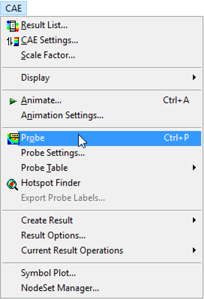

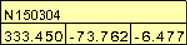

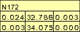

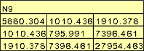

.. |image5| image:: icons/Probe.jpg

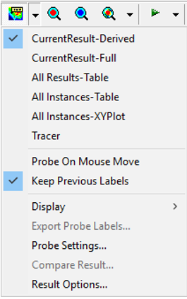

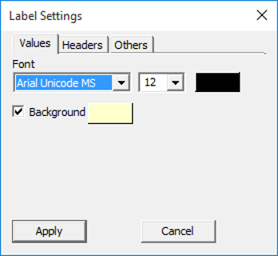

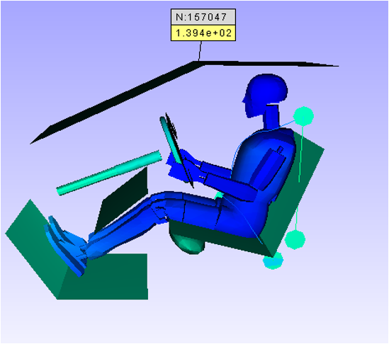

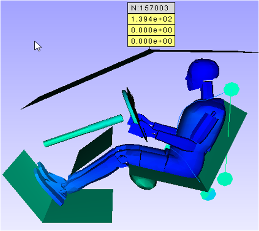

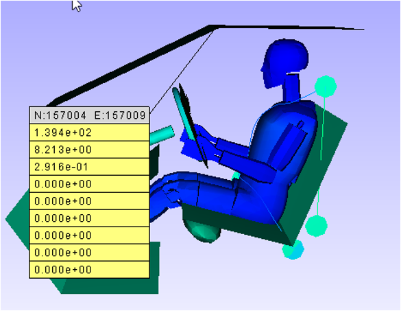

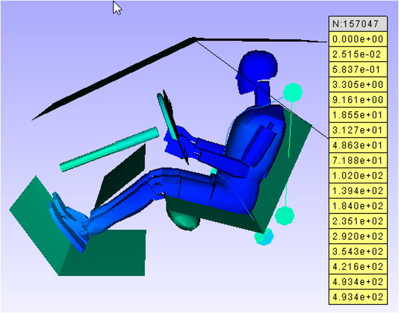

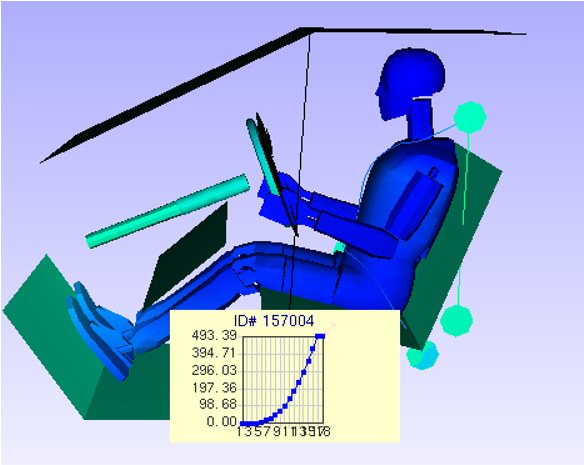

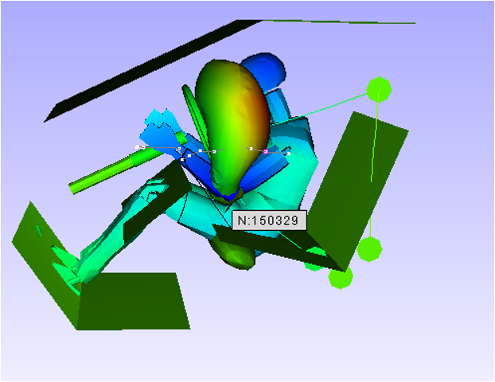

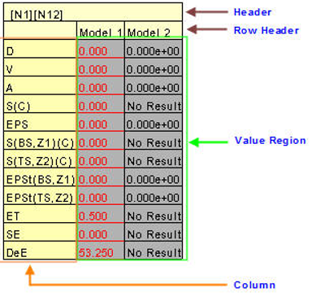

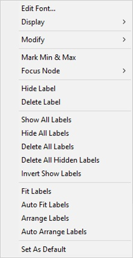

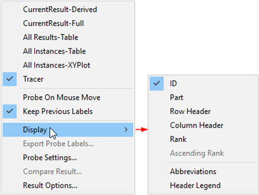

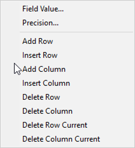

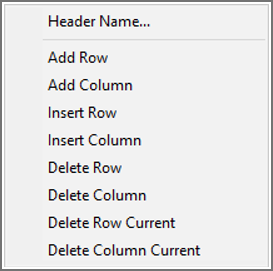

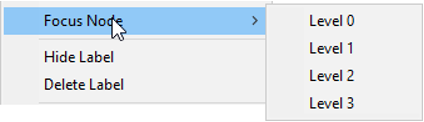

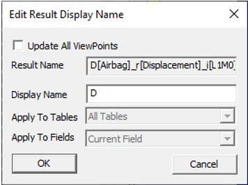

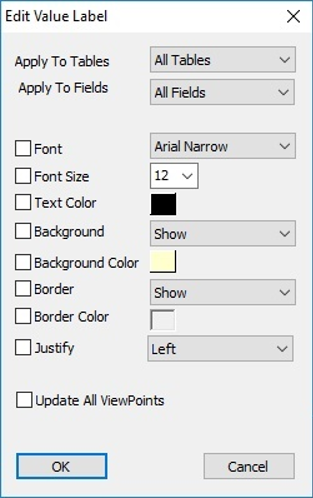

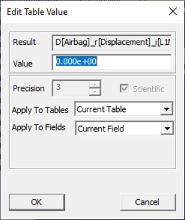
 
