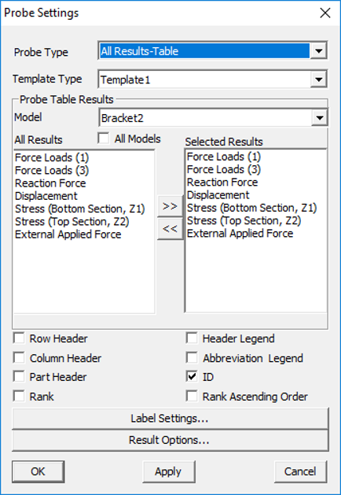
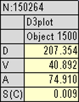
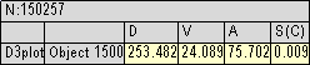
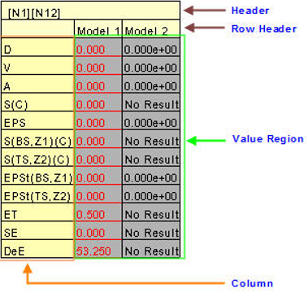

Probe Settings
===============

VCollab Pro users can control probe label display attributes using the
Probe Settings tool .

Probe Settings Panel
--------------------

Click **CAE|Probe Settings**

|image1|

The various fields and options available under the Probe Settings panel
are explained below.

+--------------------------+------------------------------------------+
| **Probe Type**           | Set a probe type to be queried.          |
+--------------------------+------------------------------------------+
| **Template Type**        | Select a display template type.          |
+--------------------------+------------------------------------------+
| **Model**                | Select a model. This option will be      |
|                          | enabled only when two or more **models   |
|                          | are merged**.                            |
+--------------------------+------------------------------------------+
| **All models**           | Ensures that selection is considered for |
|                          | all models.                              |
+--------------------------+------------------------------------------+
| **All Results**          | Lists all available results for the      |
|                          | selected model.                          |
+--------------------------+------------------------------------------+
| **Selected Results**     | Lists all results selected by the user   |
|                          | to display.                              |
+--------------------------+------------------------------------------+
| **>> (Select)**          | Copies item selection and appends to     |
|                          | Selected Result list.                    |
+--------------------------+------------------------------------------+
| **<< (Deselect)**        | Removes user selection from selected     |
|                          | results.                                 |
+--------------------------+------------------------------------------+
| **Row Header**           | Enables row header.                      |
+--------------------------+------------------------------------------+
| **Column Header**        | Enables column header.                   |
+--------------------------+------------------------------------------+
| **Part Header.**         | Enables part header.                     |
+--------------------------+------------------------------------------+
| **Header Legend**        | Shows/Hides header legend label.         |
+--------------------------+------------------------------------------+
| **Abbreviation Legend.** | Shows/Hides the result short name and    |
|                          | full name table.                         |
+--------------------------+------------------------------------------+
| **ID**                   | Shows ID in the label.                   |
+--------------------------+------------------------------------------+
| **Rank**                 | Shows rank based on label values.        |
+--------------------------+------------------------------------------+
| **Rank Ascending Order** | Ranks either in ascending or descending  |
|                          | order.                                   |
+--------------------------+------------------------------------------+
| **Label Settings...**    | Link to common label settings            |
+--------------------------+------------------------------------------+
| **Result Options...**    | Link to Result Options dialog.           |
+--------------------------+------------------------------------------+

.. note::

   -  Result selection will be enabled only for **'All Results-Table**'   probe type.

Template Types
**************

 **Template 1:** Columns refer to model and part names and rows refer to CAE results.

  |image2|

 **Template 2:** Columns refer to CAE results and rows refer to model and part names.

  |image3|

**Selection of Results**

All results are selected for displaying by default. This is applicable
for All Result -Table probe type.

Use **<<** to remove the unwanted result names for user display.

Use **>>** to add result for display.

Probe Label - Cell Classification
*********************************

Probe Label cells are classified as follows.

1. **Header** *:* It contains node or element ID. In case of merging
   more than one model, this header contains more than one ID and
   each ID refers to one column in the value region.

2. **Row Header\ :**\ This refers to the model name of the column data.
   It is useful when comparing multiple models.

3. **Column Header\ :**\ Displays a list of result names. It contains
   only abbreviations of results. For e.g, D is for displacement.
   Users can view the abbreviation table if necessary.

4. **Value Region:** Displays the values that correspond to column and
   row headers.

   |image4|

**Steps to select the same set of results for all models**

-  Remove unwanted results using << button.

-  Add results of interests using the **>>** button.

-  Select **All Models**.

-  Click **Apply**.

-  Select any other model. Selected results will have the same set of
   results if the other model has all those results. If not, it will
   have the common results between available and selected list.

