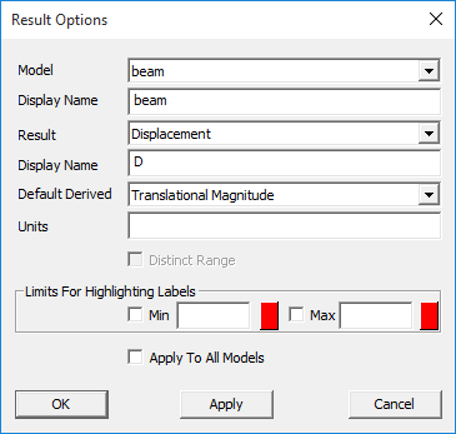
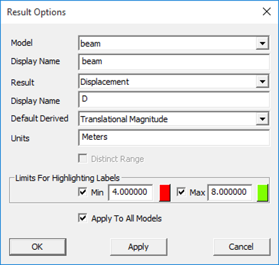
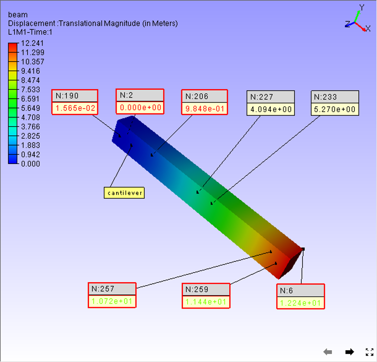

Result Options
================

VCollab Pro users can set and modify CAE model and result display names,
result units and result legend type using the **Result Options** under
CAE menu.

**Result Options Panel**

Click **CAE|Result Options**

|image1|

The various fields appearing in the Result Options panel are explained
below.

+----------------------------------+----------------------------------+
| **Model**                        | A drop down that lists all CAE   |
|                                  | model names.                     |
+----------------------------------+----------------------------------+
| **Display Name**                 | Set the model display name       |
+----------------------------------+----------------------------------+
| **Result**                       | A drop down that lists all the   |
|                                  | results of the selected CAE      |
|                                  | model.                           |
+----------------------------------+----------------------------------+
| **Display Name**                 | Set the result display name.     |
+----------------------------------+----------------------------------+
| **Default Derived**              | Select and set the default       |
|                                  | derived name for the selected    |
|                                  | result.                          |
+----------------------------------+----------------------------------+
| **Units**                        | Set the selected result’s units. |
+----------------------------------+----------------------------------+
| **Distinct Range**               | Set the result contour to        |
|                                  | distinct type.                   |
+----------------------------------+----------------------------------+
| **Limits for Highlighting        | Set the min and max range values |
| Labels**                         | for the selected result to       |
|                                  | highlight labels beyond this     |
|                                  | range.                           |
+----------------------------------+----------------------------------+
| **Apply To All Models**          | Apply the selected options to    |
|                                  | all CAE models.                  |
+----------------------------------+----------------------------------+
| **Apply**                        | Apply the modifications.         |
+----------------------------------+----------------------------------+

**Distinct Range**

If the number of unique result values is less than 32, then the result
is a valid distinct result where contours and legends can be mapped to
unique colors.

**Steps to modify and set the options**

-  Select a CAE **Model** from the drop down list.

-  Modify the model **Display name** that will be used in probe labels.

-  Select a **Result** of interest from the result drop down list.

-  Modify the result **display name** that will be used in probe labels.

-  Select a **Derived type** of result name to set it as default.

-  Provide or modify the **units**.

-  Check the **Distinct range** option if the result is a valid distinct
   result.

-  Set the **min and max** values for the result to highlight the labels
   beyond the range .

-  Check **Apply To All Models** option to carry all modifications done
   to all CAE models.

-  Click **Apply** and observe the changes in CAE legend and probe
   labels.

|image2|

Corresponding changes in viewer. (Legend and Probe/Hotspot labels)

|image3|

