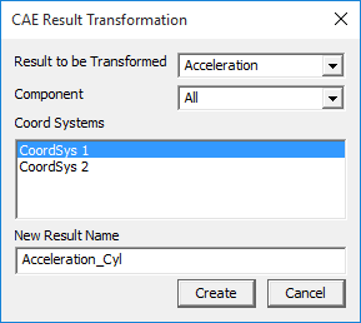

Create Results Using Coord System
==================================

VCollab Pro users can create a new CAE result from existing results in
two ways- using Expressions and using Coordinate Systems.

For vector and tensor results, users can create a CAE result by
transforming an existing result to a coordinate system defined by them.
This is not applicable for scalar results.

**Computation of New Result**

The new result is computed by transforming the current vector / tensor
result to a new coordinate system.

    **[New Result Vector / Tensor ] = [Coordinate Transformation] x   
    [Current Result Vector / Tensor]**                                

**Result Transformation Panel**

|image1|

The various fields and options that appear in this panel are explained
below.

+---------------------+-----------------------------------------------+
| **Result**          | Select the result to be transformed. This     |
|                     | lists all vector and tensor results. Scalar   |
|                     | results are not listed                        |
+---------------------+-----------------------------------------------+
| **Component**       | Lists all possible components and an option   |
|                     | to transform all components.                  |
+---------------------+-----------------------------------------------+
| **Coord Systems**   | Lists all user defined coordinate systems and |
|                     | allows users to select one UCS for result     |
|                     | transformation.                               |
+---------------------+-----------------------------------------------+
| **New Result Name** | A default new result name is constructed      |
|                     | based on selection. However users can edit    |
|                     | it.                                           |
+---------------------+-----------------------------------------------+
| **Create**          | Creates a new result into UCS.                |
+---------------------+-----------------------------------------------+

..

   **Note:** Click here to learn how to create new coordinate systems.

**Steps to create a new result using User Defined Coordinate System**

-  Make sure that at least one coordinate system is available for result
   transformation.

-  Click **CAE \| Create Result \| Using Coord Systems…** to open the
   result transformation panel

-  Select a **Result**, **component** and a **user defined coordinate
   system** from the list.

-  Edit the new result name, if necessary.

-  Click **Create**.

-  If successful, the following message will be shown.

|image2|

-  The new result will be added to the result list dialog.    

