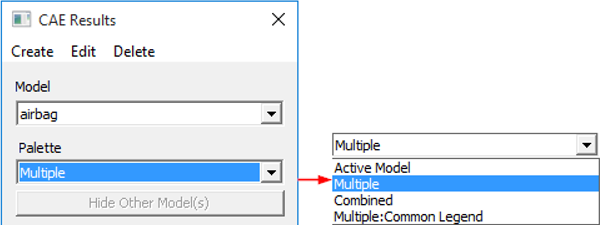

Result List
===========

The Result List option found under CAE Menu allows the user to select a
result, derived type and instance (load case and mode cases) for all the
CAE models.

.. Quick links

.. -  `Steps to select a Result`_

.. -  `Steps to set and view deform result for vector types`_

.. -  `Selection of results and Its effects on Legend and model contour`_

.. -  `Steps to utilize Combined Palette option`_

.. -  `Steps to delete Result or Instances`_

Result List Panel
-----------------
The CAE Results Panel, shown below, is the first panel that appears on
clicking **Result List**

   |image1|

Create Menu                                                  
***********
                                                                   
Helps to create new results based on the current result and current model. 

 |image2|
   
 The various options available under Create Menu are explained below.   
                                                                        
 +----------------------------------+----------------------------------+
 | **Create Result...**             | Opens the **CAE \| Create        |
 |                                  | Result** dialog box              |
 +==================================+==================================+
 | **Create Max. Von Mises          | Creates stress tensor using Von  |
 | Harmonic**                       | Mises maximum Eigen angle. This  |
 |                                  | option is enabled only for       |
 |                                  | complex eigen stress results.    |
 |                                  |                                  |
 |                                  | Angle for the tensor is computed |
 |                                  | for maximum Von Mises stress.    |
 |                                  | Von Mises stress attains maximum |
 |                                  | for two angles between 0 to 360  |
 |                                  | degrees. Out of these two        |
 |                                  | angles, VCollab considers the    |
 |                                  | angle which results in greater   |
 |                                  | maximum principal value.         |
 +----------------------------------+----------------------------------+
 | **Max Envelope Result**          | Creates a result which is        |
 |                                  | computed for maximum result      |
 |                                  | value of all instances of        |
 |                                  | current result at each node. The |
 |                                  | result name is of the form       |
 |                                  | Max_Envelope_[Result             |
 |                                  | Name]_[Derived_Result_Name]. For |
 |                                  | example, if the derived type is  |
 |                                  | 'Resultant' of Displacement      |
 |                                  | result, then the result name     |
 |                                  | will be                          |
 |                                  | Max                              |
 |                                  | Envelope_Displacement_Resultant. |
 |                                  | This is applicable only for      |
 |                                  | transient results.               |
 +----------------------------------+----------------------------------+
 | **Min Envelope Result**          | Creates an instance result which |
 |                                  | is computed for minimum result   |
 |                                  | value of all instances at each   |
 |                                  | node. The instance name is of    |
 |                                  | the form Min_Envelope_[Result    |
 |                                  | Name]_[Derived_Result_Name]. For |
 |                                  | example, if the derived type is  |
 |                                  | 'Resultant' of Displacement      |
 |                                  | result, then the instance name   |
 |                                  | will be Min                      |
 |                                  | Envelope_Displacement_Resultant. |
 |                                  | This is applicable only for      |
 |                                  | transient results.               |
 +----------------------------------+----------------------------------+

Edit Menu
*********

 |image3|

 The options available under the Edit Menu are explained below

 +--------------------------+------------------------------------------+
 | **Options...**           | Opens the Result Options dialog box      |
 +--------------------------+------------------------------------------+
 | **Apply Distinct Range** | Sets current result as distinct range.   |
 +--------------------------+------------------------------------------+
 | **Set As Deform Result** | Sets selected/ current vector result as  |
 |                          | deformation data.                        |
 +--------------------------+------------------------------------------+

Delete Menu
***********

 |image4|

 The Delete options available under Delete Menu are explained below.  

 +---------------------------+------------------------------------------+                                                                      
 | **Delete Result**   Deletes current or selected result.              |
 +---------------------------+------------------------------------------+   
 | **Delete Instance** Deletes selected instances of current result.    |
 +--------------------------+-------------------------------------------+
                                                                      
 Delete Instance option opens up the following dialog for user selection.                                                           
                                                                      
    |image5|                                                         

The other options available under CAE Results Panel are:             
                                                                      
    |image6|                                                        
                                                                      
 -  **Model:** lists all the CAE models available in the scene. It will contain more than one dataset if more models have been merged into the scene.                                                                        
 -  **Results:** Lists all the results for the selected data set. Users can select any one of the results listed. The first result in the list is selected by default.                                                                                           
 -  **Instance:** Lists load cases and mode cases. "L1M1" is referred as Load Case 1 and Mode Case1.                                
                                                                      
 -  **Derived Type**: Lists all possible derived types based on the  result type selected in the Result List Box.                   
                                                                      
 Default selection is,                                                
                                                                      
 -  "Translational Magnitude" for vectors                             
                                                                      
 -  "Von Mises Stress" for Tensors and                                
                                                                      
 -  None for Scalar result                                            
                                                                      
 -  **Complex Type:** This is enabled only for complex eigen data and lists the following complex components.                        
                                                                      
    -  Real                                                           
                                                                      
    -  Imaginary                                                      
                                                                      
    -  Magnitude                                                      
                                                                      
    -  Phase                                                          
                                                                      
    -  Angle (User has to enter phase angle value).                   
                                                                      
 -  **Angle in Degrees:** Refers to user defined phase angle value.  This is applicable for complex eigen results. Default angle is zero.                                                          
                                                                      
Palette Options
***************

Three additional options will be enabled if two or more models exist 
or have been merged.                                             
                                                                      
    |image7|                                                         
                                                                      
 1. Active Model  
 
       Only the current model is active. A single color palette    
       for the active model is displayed. The active model is         
       displayed with color plot and all other models are displayed   
       in part color.                                                 
                                                                      
 2. Multiple    
 
       Multiple models are active. Each model is displayed with    
       its own color palette and result. This option is default for   
       the merged model case.                                         
                                                                      
 3. Combined  
 
       In this mode all models are displayed using a current model 
       palette and results. Only the common palette is displayed. The 
       result list displays only common results. The changes to       
       palette/legend parameters are applied to all models. Result    
       considered for this legend, across all models, is the same.    
                                                                      
 4. Multiple: Common Legend    
 
        A single legend is applied across multiple models. Result    
        considered for this legend may not be the same for all       
        models. However, it is the same in case of Combined palette. 
                                                                      
 -  **Hide Other Model(s)** : 
    This option hides all other models existing in the scene.                                         
                                                                      
 -  **Combined Palette option**                                       
                                                                      
    -  Responds to all models for 'CAE Results' dialog events, usually not.                                                
                                                                      
    -  Applies current model palette on the existing all models.      
                                                                      
    -  Applies No-Result value, if user clicked result is not available for other models.                                 
                                                                      
    -  Animates both models for common result selected.               
                                                                      
    -  If any model does not contain user selected result, no linear animation exists for the model.                             
                                                                      
    -  Allows users to probe all models.                              
                                                                      
    -  Allows users to save this state into viewpoint states.         
                                                                      
                                                                                                                                   
    **Benefits**
                                                                      
          -  Users can merge two datasets with similar geometry and compare the CAE results.                                               
                                                                      
          -  Visualize the differences on CAE design through linear and  transient animations.                                          
                                                                      
          -  Users can probe both models and compare nodal results.            
                                                                      
          -  Users can save the compared results into CAX as viewpoint states. 
                                                                      
**Selection of results and Its effects on Legend and model contour** 

                                                                      
 VCollab Pro computes CAE result values for visible parts only, while 
 changing the result. If the user hides one part and applies a new    
 result to the model, Legend is computed for visible parts alone.     
 Computed color information is applied to the model for contour       
 values.                                                              
                                                                      
**Steps to select a Result**
 
                                                                      
 -  Load an input file. E.g., barcket2.cax.                           
                                                                      
 -  Click **CAE \| Results**.                                         
                                                                     
 -  Select **Stress** from the result list.                           
                                                                      
 -  Select **L1M1** instance from the Instance drop down list.       
                                                                      
 -  Select **Mean Stress** derived type from the **Derived Type** drop down list.                                                
                                                                      
 -  Observe the changes in the model as well as in the text           
    information in the viewer as below.                            
                                                                      
 |image8|                                                            
                                                                      
 **Context Menu Within the Panel**                                    
                                                                      
 Right click on any result from the list to open the context menu as  
 shown below                                                          
                                                                     
    |image9|                                                         
                                                                      
 -  **Set As Deform Result :**                                        
                                                                      
   *CAE \| Display \| Deform Mesh* command applies deformed result for Displacement vector.  Users can set this deform result to any vector type result. When any of the following vector type results is selected, the deform result is changed to current selection automatically.                                  
                                                                      
  -  Displacement                                                      
                                                                      
  -  Displacement - Vibration Mode                                     
                                                                      
  -  Deformation                                                       
                                                                      
 -  **Delete Result:** deletes the currently selected result. It      
    prompts for confirmation.                                      
                                                                      
 -  **Delete Instances:** deletes a set of instances across all       
    results or from a selected result.                             
                                                                      
**Steps to set and view deform result for vector types**
            
                                                                      
 -  Load a CAX file                                                   
                                                                      
 -  Open **CAE \| Result List** menu                                  
                                                                      
 -  Default deformation result is **Displacement**                    
                                                                      
 -  Select any other vector type result.                              
                                                                      
 |image10|                                                            
                                                                      
 -  Observe that the deform result is still **Displacement**, even    
    though a different result is selected.                         
                                                                      
 -  Select **Set As Deform Result** from the context menu of current  
    selection.                                                     
                                                                      
 |image11|                                                            
                                                                      
 -  The deformed result for current selection of result.              
                                                                      
**Steps to utilize Combined Palette option** 
                      
                                                                      
 -  Load a CAX file, which contains a CAE dataset.                    
                                                                      
 -  Merge another CAX file, which contains the same geometry but      
    different CAE dataset results.                                 
                                                                      
 -  If both model geometries coincide in scene, move one of them away 
    using **Transform** option in the product tree context menu.   
                                                                      
 |image12|                                                            
                                                                      
 -  Click **CAE \| Result List**                                      
                                                                      
 -  Select **Combined** option to apply current palette for both      
    datasets.                                                      
                                                                      
 |image13|                                                            
                                                                      
 Users can now do all the CAE operations on both the models to        
 compare CAE results. For example, probe the same node in both the    
 models and compare the nodal results.                                
                                                                      
**Steps to delete Result or Instances**  
                          
                                                                      
 -  Load a model and click **CAE\| Result List**                      
                                                                      
 -  Select a result from the list.                                    
                                                                      
 -  Click **Delete**.                                                 
                                                                      
 -  Select Delete Result from the drop down menu.                     
                                                                      
 -  Confirm the deletion when prompted.                               
                                                                   
                                                                      
    |image14|                                                         
                                                                      
 -  To delete an instance, select Delete Instances option from the    
    delete menu.                                                   
                                                                      
 -  The CAE Result Instances dialog box opens as shown below.         

    |image15|                                                         
 -  The result name selected by the user is shown.                    
                                                                      
 -  Select multiple instances using shift or control key.             
                                                                      
 -  Check **Delete in All Results** option to delete the selected     
    instances in all results where it is present.                  
                                                                     
 -  Uncheck **Delete in All Results** option to delete instances for  
    the selected result only.     
                                 
 -  Click **Delete** to continue or **Cancel** to cancel the process. 

.. |image1| image:: JPGImages/cae_CAE_Result_Panel.png

.. |image3| image:: JPGImages/cae_CAE_Result_EditMenu.png

.. |image5| image:: JPGImages/cae_CAE_Result_Instance.png

.. |image6| image:: JPGImages/cae_CAE_Result_Panel.png

.. |image8| image:: JPGImages/cae_CAE_Result_DerivedType_Mean.png

.. |image9| image:: JPGImages/cae_Result_Context MenuWithinthePanel.png

.. |image10| image:: JPGImages/cae_CAE_Result_vectortypes.png

.. |image11| image:: JPGImages/cae_CAE_Result_SetAsDeformResult .png

.. |image12| image:: JPGImages/cae_CAE_Result_CombinedPaletteOption.png

.. |image13| image:: JPGImages/cae_CAE_Result_CompareCAEresults.png

.. |image14| image:: JPGImages/cae_CAE_Result_DeletePanel.png

.. |image15| image:: JPGImages/cae_CAE_Result_ResultInstances.png

