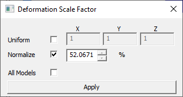
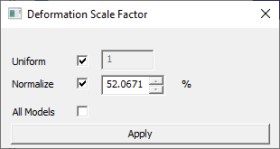
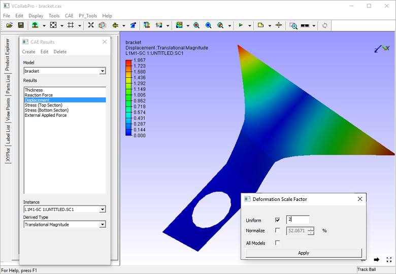
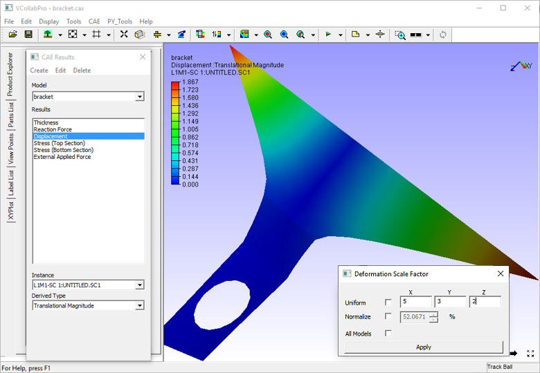
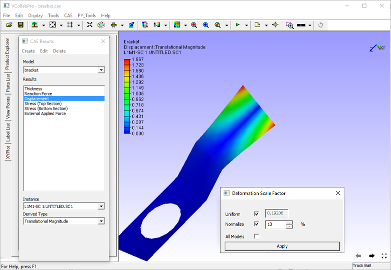
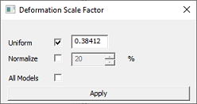

Deformation Scale Factor
========================

The Scale Factor option (within CAE Menu) enables the user to scale  
CAE deformation of the model so that the deformation is visible and  
easy to understand.                                                  
                                                                      
Existence of deformation is not found when **deformation value of a  
node** is,                                                           
                                                                      
 -  Very large compared to other nodes. In this case the user may not be able to identify 
    what collapsed the model                   
                                                                      
 -  Very small. In this case, the user may not be able to identify    
    much difference in the deformation of the model.               
                                                                      
Scale factor option helps to understand the deformation in the above cases.                                                               

Deformation Scale Factor Panel
------------------------------

 |image1|

 The various fields and options available in the Deformation Scale Factor panel are explained below.

 +---------------+-----------------------------------------------------+
 | **Uniform**   | By checking this option,the scale value entered by  |
 |               | the user will be applied to all X, Y and Z          |
 |               | directions.                                         |
 +---------------+-----------------------------------------------------+
 | **Normalize** | With this option, a user can scale up/down in terms |
 |               | of model bounding percentage. By default,           |
 |               | deformation is scaled to 10% of model bounding      |
 |               | radius. The actual scale factor is updated          |
 |               | according to the scale percentage.                  |
 +---------------+-----------------------------------------------------+
 | **All Models**| Applies  Scale factor to all CAE models.            |
 +---------------+-----------------------------------------------------+
 | **Apply**     | The modified scale factor will be applied to        |
 |               | deformation.                                        |
 +---------------+-----------------------------------------------------+

 Deformation is normalized (max - normalization) and mapped with model bounding sphere radius. 
 
 By default normalized deformation is scaled to 10 percent of bounding sphere radius. 
 
 To apply true scale, check **Uniform** option and set the scale factor as 1. 
 
 Uniform means, constant scaling in X,Y and Z directions. 
 
 if **Uniform** option is unchecked, the dialog shows its X, Y and Z factors as below. here scaling will vary in each direction.

  |image2|

.. note::
 
   - If the model is one or two dimensional, check **Uniform** option for better visualization of deformation.
   
   - If more than one model exists, any change in scale factor is applicable to the current model.

**Steps for scaling a model uniformly**

-  Click **CAE \| Scale Factor** to open the Deformation Scale Factor
   dialog.

   |image3|

-  Check the **Uniform** option, which provides modified dialog as
   below.

   |image4|

-  Enter a different scale value, say 2 in the edit box.

-  Click **Apply** and observe the scaled deformation in the viewer.

   |image5|

**Steps for scaling a model in each axis**

-  Click **CAE \| Scale Factor** to open the **Deformation Scale
   Factor** dialog.

-  Enter different scale values for each axis in the corresponding edit
   boxes.

-  Leave the Uniform and Normalize checkboxes unchecked

-  Click **Apply** and observe the scaled deformation in the viewer as
   below.

   |image6|

**Steps for scaling deformation for Mode case animation data**

-  Load a mode case CAX file.

-  Click **CAE \| Animate**.

-  Click **CAE \| Scale Factor**

-  In the Deformation Scale Factor panel, check the Normalize option,
   enter 10 percent and apply.

   |image7|

-  Change the value to 20 % and click apply.

   |image8|

-  Notice the change.

-  Uncheck **Normalize** option.

   |image9|

-  Usual scale factor option will be enabled. Enter 1 and click apply
   for true scale.

.. |image1| image:: JPGImages/cae_DeformationScaleFactor_Panel.png

.. |image2| image:: JPGImages/cae_Scale_Factor_Uniform.png

.. |image8| image:: JPGImages/cae_Scale_Factor_Example4.png

