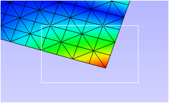
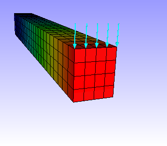

Symbol Plot
==============

VCollab Pro users can add and display symbols at selected locations on
the CAE model for **Vector** results , **Tensor** results, SPC and
Pressure using the **Symbol Plot** option. The symbols can be displayed
either in 2D or 3D as shown below

Symbol Plot Types
-----------------

+-----------------+--------------------+-------------+-----------+
| **Result Type** | **Condition**      | 3D          | 2D        |
+-----------------+--------------------+-------------+-----------+
| **Vector**      | Appears if CAE     | |image1|    | |image2|  |
|                 | model contains at  |             |           |
|                 | least one vector   |             |           |
|                 | result.            |             |           |
+-----------------+--------------------+-------------+-----------+
| **Tensor**      | Appears if CAE     | Tensile     | |image4|  |
|                 | model contains at  |             |           |
|                 | least one tensor   | |image3|    | |image6|  |
|                 | result.            |             |           |
|                 |                    | Compression |           |
|                 |                    |             |           |
|                 |                    | |image5|    |           |
+-----------------+--------------------+-------------+-----------+
| **SPC**         | Single Point       | |image7|    | |image8|  |
|                 | Constraint plot    |             |           |
|                 | appears if CAE     |             |           |
|                 | model contains any |             |           |
|                 | SPC data.          |             |           |
+-----------------+--------------------+-------------+-----------+
| **Pressure**    | Appears if CAE     | |image9|    | |image10| |
|                 | model contains     |             |           |
|                 | "Pressure Loads"   |             |           |
|                 | result             |             |           |
+-----------------+--------------------+-------------+-----------+

Symbol Plot in CAE Menu
***********************

 Click **CAE|Symbol Plot** to open the Symbol plot manager panel.

 |image11|

 Symbol Plot Manager Panel

 |image12|

 The various fields and options seen in the Symbol Plot Manager panel are
 explained below

 +----------------+----------------------------------------------------+
 | **Model**      | Select a CAE model.                                |
 +----------------+----------------------------------------------------+
 | **Plot Type**  | Select a plot type.                                |
 +----------------+----------------------------------------------------+
 | **Result**     | Lists the results based on plot type selected.     |
 +----------------+----------------------------------------------------+
 | **Instance**   | Lists the instances based on result selected.      |
 +----------------+----------------------------------------------------+
 | **Derived**    | Lists the derived vector for tensor results.       |
 +----------------+----------------------------------------------------+
 | **Complex**    | Select a complex component and edit angle.         |
 |                | Applicable only for complex results.               |
 +----------------+----------------------------------------------------+
 | **Positions**  | Displays different user interfaces for node        |
 |                | selection.                                         |
 +----------------+----------------------------------------------------+
 | **Pick**       | Pick a vertex (node based) on the model.           |
 +----------------+----------------------------------------------------+
 | **Rect**       | Select multiple nodes/vertices by rectangular      |
 |                | selection.                                         |
 +----------------+----------------------------------------------------+
 | **Hotspot**    | Select nodes/vertices from hotspot labels.         |
 +----------------+----------------------------------------------------+
 | **All IDs**    | Selects all valid CAE Node IDs from the visible    |
 |                | parts for selected result.                         |
 +----------------+----------------------------------------------------+
 | **Nodes**      | Lists all the nodes selected for the current       |
 |                | symbol plot.                                       |
 +----------------+----------------------------------------------------+
 | **Clear**      | Clears the nodes entered in the textbox.           |
 +----------------+----------------------------------------------------+
 | **Plot Name**  | Enter the name of the plot to be created.          |
 +----------------+----------------------------------------------------+
 | **Create**     | Creates the symbol plot associated with [Plot      |
 |                | Name] and appends the name to the plot list box    |
 |                | below.                                             |
 +----------------+----------------------------------------------------+
 | **Delete**     | Deletes the selected or current symbol plot.       |
 +----------------+----------------------------------------------------+
 | **Options...** | Opens up a dialog which allows users to control    |
 |                | the size and color of the arrow.                   |
 +----------------+----------------------------------------------------+

SPC (Single Point Constraint)
*****************************

 This function creates multiple symbol plots based on the constraint
 type. It groups nodes or elements based on constraint type the node or
 element has. Then it creates a symbol plot with the name "Constraint
 Type_T[xyz]_R[xyz]".
 
 There are 63 combinations of Translational and Rotational constraints.
 
 For example,
 
 T[x]_R[z] - "Translation is fixed only in X direction and Rotation is
 fixed only in Z direction".
 
 T[xyz] - "No Translation in all 3 degrees of freedom".
 
 R[xyz] - "No Rotation in all 3 degrees of freedom".
 
 T[xyz]_R[xyz] - "Completely constrained in all 6 degrees of freedom".
 
 |image13|

Symbol Plot Options
*******************

After creating the Symbol plot, click on **Options** to open the
**Symbol Plot Options** panel as shown below.

|image14|

The various fields appearing in the Symbol Plot Options panel are
explained below.

+------------------+--------------------------------------------------+
| **Symbol Type**  | Lists all available symbols.                     |
+------------------+--------------------------------------------------+
| **Scale Factor** | Allows user to control the size of the symbol    |
+------------------+--------------------------------------------------+
| **Length**       | Allows users to control the length or height of  |
|                  | the symbol.                                      |
+------------------+--------------------------------------------------+
| **Width**        | Allows users to control the width of the symbol. |
+------------------+--------------------------------------------------+
| **View Mode**    | Provides options to display the symbols. Auto,   |
|                  | From Position, To Position and Resultant. These  |
|                  | functions are applicable only for Vector type    |
|                  | symbols.                                         |
+------------------+--------------------------------------------------+
| **Color**        | Allows users to change the color of all symbols. |
+------------------+--------------------------------------------------+
| **Apply**        | Applies the modifications done to the symbols.   |
+------------------+--------------------------------------------------+

.. note::
   
      All the options will effect only for the current symbol plot selected.

**Steps to create a Symbol Plot**

-  Click **CAE \| Symbol Plot..** to open the dialog as shown below

   |image15|

 -  Select a CAE model name from the drop down list.                  
                                                                      
 -  Select a Plot Type from the drop down list, which lists valid     
    plot types based on the CAE model results.                     
                                                                      
 -  Symbol Direction Definition:                                    
    CAE Result data is required for symbol direction. Result     
    Information will be updated based on the plot type selected. 
                                                                      
    -  Select a Result                                                
                                                                      
    -  Select an Instance.                                            
                                                                      
    -  Select a derived vector for tensor type.                       
                                                                      
    -  Select complex components if necessary.                        
                                                                      
 -   Symbol Position Definition: Users can skip this if the plot     
     type is of SPC or Pressure, in which case they can click the 
     **Create** button directly without defining symbol           
     positions.                                                   
     In other cases, symbol positions are defined by Nodes. There 
     are various options to select nodes,                         
                                                                      
    -  Enable **Pick** option and click on the model to select nodes. 

   |image16|

   Nodes text box will be appended with nodes after each selection.

-  Enable **Rect** option to select nodes by region or window in the
   viewer.

   |image17|

 -  Click **Hotspots** option to use current hotspot labels for       
    symbol position.                                              
                                                                      
 -  Click **All IDs** option to use all Valid IDs for the selected    
    results.                                                       
                                                                      
 -  Node selection is not necessary for SPC and Pressure plots.       
                                                                      
 -  Symbol Plot Name: Default name is provided by application based   
    on the number of plots exists. Change the plot name if         
    necessary.                                                     
                                                                      
 -  Symbol Plot Creation: Click the Create button to create symbol    
    plot. Created symbol plot name is appended to the list box     
    below the **Create** button.                                   
                                                                      
 -  Symbol Plot List and Visibility: All created symbol plots are     
    listed in the box with a check box to enable/disable plot      
    visibility. Users can hide some symbol plots to avoid messy    
    visualization. Uncheck the plot names in the list box to hide  
    it.                                                            
                                                                      
 -  Symbol Plot Deletion: Select a plot in the list. Click the Delete 
    button. The plot selected will be deleted from the viewer as   
    well as from the list box.                                     
                                                                      
   Using *Symbol Plot options* option user can,                
                                                                      
    -  toggle between Symbol display type between 2D and 3D.             

    -  scale the symbol length and width.                                

    -  enter a specific scale factor in the given text boxes.            

    -  change the color of symbols                                       
                                                                      
.. note::

   All the options are applicable only for the current symbol plot selected.                                                       
                                                                      
 ..
 
 **Steps to scale, change color and dimension of the symbols**
                                                                      
 -  Define plot type, results and positions.                          
                                                                      
 -  Click **Create**, which applies and displays the symbols.         

    |image18|

 -  Click the **Options** button, which opens up symbol plot options  
    dialog. This UI allows user to control length/height, width    
    and color of symbols.                                          
                                                                                                                                         
                                                                      
    The following image displays the symbols after modifying the      
    symbol size and color.                                            

    |image19|

 -  Users can change the symbols into 2D. Select symbol type as 2D    
    Symbol.                                                       

    |image20|

    Users can select different view modes, only for Vector Type symbols in options dialog.

 -  View mode: **Auto** is default one, which makes all symbols visible
    on the outer surface of the model.

    |image21|

    View mode : **From Position** makes all symbols start from vertices.

    |image22|

    View mode : **To Position** makes all vector symbols end at vertices.

    |image23|

    View mode : **Resultant** computes a single symbol by averaging all symbols and displays the resultant.

    |image24|

Users can create multiple plots in a single CAE model and classify them
with color and size.

.. |image1| image:: JPGImages/cae_Symbol_Plot._Vector3D.png

.. |image2| image:: JPGImages/cae_Symbol_Plot_vector2D.png
 

.. |image4| image:: JPGImages/cae_Symbol_Plot_Tensile2D.png

.. |image10| image:: JPGImages/cae_Symbol_Plot_Pressure2D.png

.. |image11| image:: JPGImages/cae_Symbol_Plot_CAE_Menu.png

.. |image12| image:: JPGImages/cae_Symbol_Plot_SymbolPlotManagerPanel.png

.. |image14| image:: JPGImages/cae_Symbol_Plot_SymbolPlotOptions.png

.. |image15| image:: JPGImages/cae_Symbol_Plot_SymbolPlotManagerPanel.png

.. |image18| image:: JPGImages/CAE_Symbol_Plot.jpg

.. |image20| image:: JPGImages/CAE_SymbolPlot_2D.gif

.. |image21| image:: JPGImages/Symbol_ViewMode_Auto.png

.. |image22| image:: JPGImages/Symbol_ViewMode_FromPosition.png

.. |image24| image:: JPGImages/Symbol_ViewMode_Resultant.png

